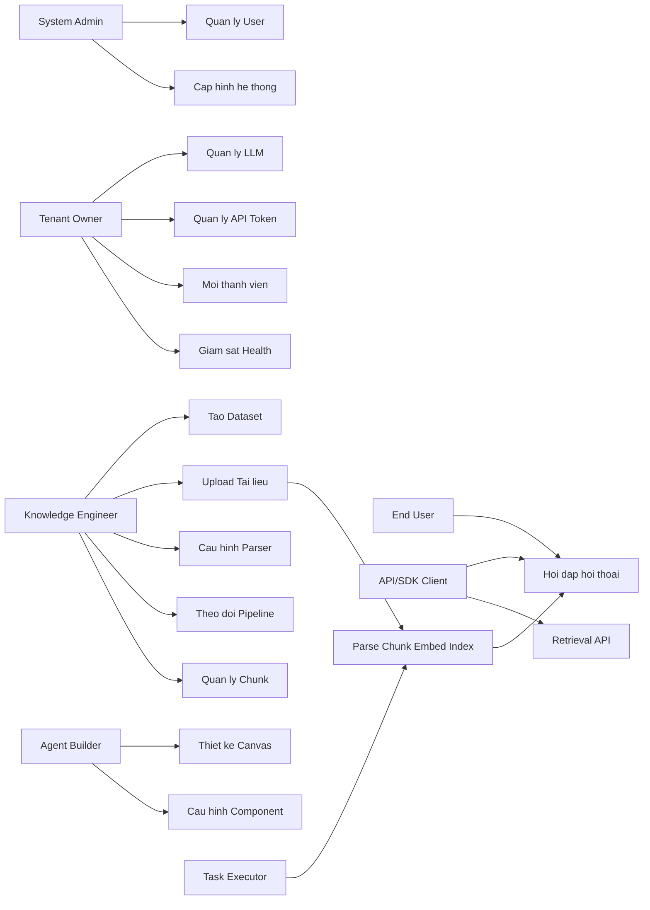

# BA-01: Phân tích yêu cầu hệ thống RAGFlow
# BA-01: Phân tích yêu cầu hệ thống RAGFlow

> **Phạm vi**: Tài liệu này phân rã đầy đủ yêu cầu chức năng theo từng tính năng nhỏ, phục vụ BA và QA.
> **Nguồn**: Phân tích từ source code `api/apps/`, `api/db/services/`, `api/db/db_models.py`.

---

## 1. Mục tiêu nghiệp vụ

RAGFlow là nền tảng hỗ trợ doanh nghiệp xây dựng ứng dụng hỏi đáp dựa trên tri thức nội bộ:

| Nhóm năng lực | Mô tả chi tiết |
|---|---|
| Quản trị tri thức | Tạo dataset, upload tài liệu đa định dạng, cấu hình parser/chunking |
| Truy vấn RAG | Hỏi đáp hội thoại có trích dẫn nguồn, stream response |
| Pipeline xử lý | Bất đồng bộ parse → chunk → embed → index, retry, status tracking |
| Quản trị hệ thống | Tenant/user/role, LLM model, API token, health & monitoring |
| Tích hợp nâng cao | Agent workflow, MCP server, connector data source, evaluation |

---

## 2. Tác nhân (Actors)

| Actor | Mô tả | Quyền chính |
|---|---|---|
| **System Admin** | Quản trị toàn hệ thống, tạo user, reset password | Full access |
| **Tenant Owner** | Chủ sở hữu tenant, quản lý LLM, API token, thành viên | Tenant-wide |
| **Tenant Member** | Thành viên trong tenant | Dataset, dialog, document |
| **Knowledge Engineer** | Tạo dataset, upload/parse tài liệu | KB + Document |
| **End User** | Giao tiếp qua chat UI hoặc API | Dialog/Conversation |
| **API/SDK Consumer** | Ứng dụng ngoài gọi REST API / Python SDK | Theo API token |
| **Task Executor** | Worker nội bộ xử lý pipeline | Internal only |
| **Connector Sync** | Worker đồng bộ data source ngoài | Internal only |

---

## 3. Sơ đồ use case tổng quát

---

## 4. Use case mức cao

| Mã UC | Tên use case | Actor | Kết quả nghiệp vụ |
|---|---|---|---|
| UC-01 | Quản lý tài khoản & xác thực | Admin, Owner, Member | Đăng nhập/SSO, profile, đổi mật khẩu |
| UC-02 | Quản lý tenant & thành viên | Owner | Tenant hoạt động, phân quyền thành viên |
| UC-03 | Quản lý dataset (knowledge base) | KE, Owner | Dataset sẵn sàng nhận tài liệu |
| UC-04 | Upload & xử lý tài liệu | KE | Tài liệu được parse/chunk/index đầy đủ |
| UC-05 | Quản lý chunk & nội dung | KE | Chunk chính xác, có thể chỉnh sửa thủ công |
| UC-06 | Cấu hình & quản lý LLM model | Owner | Hệ thống có model/token hoạt động |
| UC-07 | Tạo & quản lý dialog (assistant) | Owner, KE | Dialog cấu hình đúng KB & prompt |
| UC-08 | Hỏi đáp hội thoại RAG | End User, API | Câu trả lời kèm tham chiếu tài liệu |
| UC-09 | Agent / Canvas workflow | Owner, KE | Pipeline agent tự động chạy được |
| UC-10 | Connector & đồng bộ data source | Owner | Tài liệu từ nguồn ngoài được ingest |
| UC-11 | Đánh giá chất lượng RAG | Owner, KE | Dataset đánh giá và kết quả chấm điểm |
| UC-12 | Giám sát & vận hành hệ thống | Admin, Owner | Hệ thống healthy, observable |

---

## 5. Yêu cầu chức năng chi tiết

### UC-01: Quản lý tài khoản & xác thực

> **Source**: `api/apps/user_app.py`, `api/apps/auth/`

| Mã F | Tên chức năng | Mô tả chi tiết | Điều kiện tiên quyết | Kết quả |
|---|---|---|---|---|
| F-01-01 | Đăng ký tài khoản | Nhập email + password, hệ thống validate độ mạnh password, gửi email xác nhận (nếu cấu hình) | Email chưa tồn tại trong DB | Tài khoản được tạo, JWT trả về |
| F-01-02 | Đăng nhập email/password | POST `/login`, hệ thống xác minh hash password bcrypt, trả JWT + set cookie session | Tài khoản tồn tại, status=1 | JWT token hợp lệ |
| F-01-03 | Đăng nhập OAuth GitHub | Redirect đến GitHub OAuth, callback nhận code, tạo/cập nhật user | Cấu hình OAUTH_GITHUB_CLIENT_ID | JWT token |
| F-01-04 | Đăng nhập OIDC | Redirect đến OIDC provider, xử lý callback, tạo user từ claim | Cấu hình OIDC endpoint | JWT token |
| F-01-05 | Đăng xuất | Xóa session Redis, invalidate JWT | Đã đăng nhập | Session hết hạn |
| F-01-06 | Lấy thông tin user hiện tại | GET `/user/info`, trả về profile (name, email, avatar, tenant info) | Đã đăng nhập | User profile JSON |
| F-01-07 | Cập nhật profile | PUT thông tin user: tên, ngôn ngữ, timezone, color_schema | Đã đăng nhập | Profile được cập nhật |
| F-01-08 | Đổi mật khẩu | Xác minh mật khẩu cũ, validate mật khẩu mới, cập nhật hash | Đã đăng nhập | Mật khẩu thay đổi |
| F-01-09 | Upload avatar | POST ảnh avatar, resize và lưu vào MinIO hoặc DB | File ảnh hợp lệ | URL avatar cập nhật |
| F-01-10 | Quản lý API token cá nhân | Tạo/xem/xóa API token gắn với user (bảng `APIToken`) | Đã đăng nhập | Token dùng cho SDK/API |
| F-01-11 | Lấy danh sách tenant | Trả về tất cả tenant mà user đang thuộc | Đã đăng nhập | Danh sách tenant + role |
| F-01-12 | Admin quản lý user | Tạo user mới, đặt lại mật khẩu, xóa user (chỉ System Admin) | Role admin | User được tạo/xóa/cập nhật |

---

### UC-02: Quản lý tenant & thành viên

> **Source**: `api/apps/tenant_app.py`, `api/db/services/user_service.py`

| Mã F | Tên chức năng | Mô tả chi tiết | Điều kiện tiên quyết | Kết quả |
|---|---|---|---|---|
| F-02-01 | Xem thông tin tenant | GET cấu hình tenant: tên, LLM mặc định, parse engine, avatar | Đã đăng nhập | Thông tin tenant JSON |
| F-02-02 | Cập nhật thông tin tenant | PUT: tên, description, LLM chat/embedding/asr/rerank/tts mặc định | Owner | Tenant được cập nhật |
| F-02-03 | Liệt kê thành viên | GET danh sách user trong tenant, kèm role (owner/member) | Owner | Danh sách thành viên |
| F-02-04 | Mời thành viên | POST email mời, hệ thống tạo invitation code, gửi email | Owner, email chưa có | Invitation code được tạo |
| F-02-05 | Chấp nhận lời mời | User nhận link + code, xác nhận tham gia tenant | Link hợp lệ, chưa hết hạn | User gia nhập tenant |
| F-02-06 | Xóa thành viên | Gỡ user khỏi tenant | Owner, không xóa owner | UserTenant bị xóa |
| F-02-07 | Chuyển ownership | Đặt thành viên khác làm owner | Owner | Role thay đổi |
| F-02-08 | Quản lý Langfuse | Cấu hình public key/secret key Langfuse cho observability LLM | Owner | Langfuse tracking active |

---

### UC-03: Quản lý Dataset (Knowledge Base)

> **Source**: `api/apps/kb_app.py`, `api/db/services/knowledgebase_service.py`

| Mã F | Tên chức năng | Mô tả chi tiết | Điều kiện tiên quyết | Kết quả |
|---|---|---|---|---|
| F-03-01 | Tạo dataset | POST tên, chunk method, embedding model, Language, parser config | Tenant có embedding model | Dataset được tạo (trạng thái rỗng) |
| F-03-02 | Liệt kê dataset | GET danh sách KB của tenant: tên, doc count, token count, status | Đã đăng nhập | Danh sách dataset |
| F-03-03 | Xem chi tiết dataset | GET metadata đầy đủ + config parser + cấu hình retrieval | Dataset tồn tại + có quyền | Dataset detail JSON |
| F-03-04 | Cập nhật config dataset | PUT: tên, mô tả, chunk method, embedding model, retrieval params (top-k, threshold, rerank...) | Owner dataset | Config được cập nhật |
| F-03-05 | Xóa dataset | DELETE dataset + toàn bộ document, chunk, file liên kết | Owner dataset | Dataset + doc bị xóa |
| F-03-06 | Xem thống kê dataset | GET: số lượng doc, chunk, token đã index; dung lượng storage | Đã đăng nhập | Số liệu thống kê |
| F-03-07 | Cấu hình parser | Chọn parser type (naive/paper/book/Q&A/...), embedding model, chunk size, overlap, delimiter | Owner dataset | Parser config lưu vào DB |
| F-03-08 | Cấu hình Retrieval | Cấu hình similarity threshold, vector weight, top-k, rerank model | Owner dataset | Retrieval config lưu |
| F-03-09 | Cấu hình pipeline nâng cao | Bật/tắt GraphRAG, RAPTOR, Mindmap cho dataset | Owner dataset | Pipeline mode cập nhật |
| F-03-10 | Kết nối dataset với connector | Liên kết KB với data source bên ngoài | Owner dataset + connector | Connector ↔ KB mapping |

---

### UC-04: Upload & xử lý tài liệu

> **Source**: `api/apps/document_app.py`, `api/apps/file_app.py`, `api/apps/file2document_app.py`, `rag/svr/task_executor.py`

| Mã F | Tên chức năng | Mô tả chi tiết | Điều kiện tiên quyết | Kết quả |
|---|---|---|---|---|
| F-04-01 | Upload file | POST multipart file(s) lên KB; hỗ trợ PDF, DOCX, XLSX, PPTX, TXT, MD, HTML, JSON, EML, Audio | Dataset tồn tại | File lưu MinIO, Document record tạo |
| F-04-02 | Upload từ URL/link | POST URL tài liệu web, hệ thống crawl và ingest | URL public | Document record tạo |
| F-04-03 | Upload từ File Manager | Liên kết file đã có trong File Manager vào KB | File tồn tại trong hệ thống | File2Document mapping tạo |
| F-04-04 | Liệt kê tài liệu | GET danh sách document trong KB: tên, kích thước, parser, status, progress | Dataset tồn tại | Danh sách document |
| F-04-05 | Xem tiến độ parse | Theo dõi progress % của document, trạng thái (pending/processing/done/failed) | Document tồn tại | Progress + status + error message |
| F-04-06 | Kích hoạt parse | PUT run=1 trên document(s), tạo task vào Redis queue | Document uploaded | Task được đẩy vào queue |
| F-04-07 | Dừng parse | PUT run=2, cancel task đang chạy hoặc đang queue | Document đang processing | Task bị cancel |
| F-04-08 | Re-index document | Xóa chunk cũ và chạy lại toàn bộ pipeline | Document đã index | Task mới được tạo, chunk cũ xóa |
| F-04-09 | Đổi tên document | PUT name mới cho document record | Document tồn tại | Tên được cập nhật |
| F-04-10 | Xóa document | DELETE document + chunk + file khỏi DB, doc engine và MinIO | Document tồn tại | Document bị xóa hoàn toàn |
| F-04-11 | Thay đổi parser của document | PUT parser_id mới; cần re-index lại nếu muốn áp dụng | Document tồn tại | Parser config cập nhật |
| F-04-12 | Tải xuống tài liệu gốc | GET download file gốc từ MinIO về client | Document tồn tại + có quyền | File stream |
| F-04-13 | Worker nhận task từ Redis | Consumer group `rag_flow`, worker poll task, xử lý theo thứ tự ưu tiên | Worker đang chạy | Task được nhận và xử lý |
| F-04-14 | Parse tài liệu (worker) | Đọc file từ MinIO → chọn parser theo loại file → extract text/bảng/ảnh | Task hợp lệ, file tồn tại | Text blocks extracted |
| F-04-15 | Chunking (worker) | Chia text thành chunks theo cấu hình (size, overlap, delimiter, method) | Text extracted | Danh sách chunks |
| F-04-16 | Embedding (worker) | Gửi chunks cho embedding model, lấy vector | Embedding model configured | Vectors |
| F-04-17 | Index vào doc engine (worker) | Upsert chunks + vectors vào Elasticsearch hoặc Infinity | Doc engine running | Chunks có thể search |
| F-04-18 | Cập nhật progress (worker) | Ghi % tiến độ vào DB + Redis, broadcast cho UI | Task running | UI thấy progress cập nhật |
| F-04-19 | Xử lý lỗi & retry | Khi parse thất bại, ghi error message, cho phép retry thủ công | Task failed | Error log, trạng thái failed |

**Các loại parser được hỗ trợ:**

| Parser Type | Định dạng chính | Mô tả |
|---|---|---|
| `naive` | PDF, DOCX, TXT, MD, HTML | Chia chunk đơn giản theo độ dài |
| `paper` | PDF khoa học | Nhận diện section, abstract, references |
| `book` | PDF sách | Phân tích chương, mục lớn |
| `presentation` | PPTX | Mỗi slide = 1 chunk |
| `laws` | Văn bản pháp luật | Nhận diện điều, khoản, mục |
| `qa` | TXT/XLSX dạng Q&A | Pair câu hỏi - câu trả lời |
| `table` | XLSX, CSV | Mỗi hàng/nhóm hàng = chunk |
| `resume` | PDF/DOCX CV | Extract theo trường thông tin |
| `picture` | Ảnh, hình vẽ | OCR + mô tả ảnh |
| `audio` | MP3, WAV | Speech-to-text rồi ingest |
| `email` | EML | Extract header + body + attachment |
| `one` | Mọi loại | Toàn bộ document = 1 chunk |
| `tag` | Manual | Chunk gắn tag thủ công |

---

### UC-05: Quản lý Chunk & nội dung

> **Source**: `api/apps/chunk_app.py`, `api/db/services/document_service.py`

| Mã F | Tên chức năng | Mô tả chi tiết | Điều kiện tiên quyết | Kết quả |
|---|---|---|---|---|
| F-05-01 | Liệt kê chunks của document | GET danh sách chunk: ID, content preview, token count, trang, enabled | Document đã index | Danh sách chunk |
| F-05-02 | Xem nội dung chunk | GET full content + metadata của chunk | Chunk tồn tại | Chunk detail |
| F-05-03 | Tạo chunk thủ công | POST chunk mới với content, KB sẽ embed và index | Document đã index | Chunk mới được tạo + index |
| F-05-04 | Cập nhật nội dung chunk | PUT content mới cho chunk; re-embed và update index | Chunk tồn tại | Chunk cập nhật, vector mới |
| F-05-05 | Xóa chunk | DELETE chunk khỏi DB và doc engine | Chunk tồn tại | Chunk bị xóa |
| F-05-06 | Bật/tắt chunk | Toggle `enabled` flag; chunk tắt không dùng trong retrieval | Chunk tồn tại | Chunk active/inactive |
| F-05-07 | Tìm kiếm trong KB | GET keyword/vector search trong dataset, trả chunk liên quan + score | Dataset indexed | Danh sách chunk + score |
| F-05-08 | Xem ảnh/figure của chunk | GET ảnh được extract từ tài liệu (figure_id) | Chunk có hình ảnh | Image bytes |

---

### UC-06: Cấu hình & quản lý LLM model

> **Source**: `api/apps/llm_app.py`, `api/db/services/llm_service.py`, `api/db/services/tenant_llm_service.py`

| Mã F | Tên chức năng | Mô tả chi tiết | Điều kiện tiên quyết | Kết quả |
|---|---|---|---|---|
| F-06-01 | Liệt kê LLM factory | GET danh sách providers: OpenAI, Anthropic, Ollama, Zhipu, DeepSeek... | Đã đăng nhập | Danh sách factory + logo |
| F-06-02 | Cấu hình LLM tenant | POST API key + model name + base URL cho provider; test kết nối | Là Tenant Owner | TenantLLM record tạo |
| F-06-03 | Liệt kê model đã cấu hình | GET tất cả model đã thêm vào tenant theo loại (chat/embedding/rerank...) | Đã đăng nhập | Danh sách model |
| F-06-04 | Xóa model | DELETE model khỏi tenant | Owner + model không dùng | Model bị xóa |
| F-06-05 | Đặt model mặc định | Chọn model mặc định cho từng loại tác vụ: chat, embedding, ASR, TTS, rerank, image2text | Owner | Default model cập nhật |
| F-06-06 | Test kết nối model | Gửi ping đến LLM endpoint với API key, trả kết quả thành công/thất bại | Model config tồn tại | OK / Error message |
| F-06-07 | Xem model khả dụng từ factory | GET danh sách tất cả model mà factory hỗ trợ | Đã đăng nhập | Danh sách model names |
| F-06-08 | Cấu hình embedding model local | Cài đặt model embedding offline (Ollama, HuggingFace) với base URL | Đã đăng nhập | Model local working |

---

### UC-07: Tạo & quản lý Dialog (Assistant)

> **Source**: `api/apps/dialog_app.py`, `api/apps/conversation_app.py`, `api/db/services/dialog_service.py`

| Mã F | Tên chức năng | Mô tả chi tiết | Điều kiện tiên quyết | Kết quả |
|---|---|---|---|---|
| F-07-01 | Tạo dialog | POST tên, mô tả, icon, chọn KB(s), LLM model, prompt template | Có KB indexed + LLM model | Dialog được tạo |
| F-07-02 | Cấu hình prompt | Edit system prompt, variables, empty_response, opener message | Dialog tồn tại | Prompt config lưu |
| F-07-03 | Cấu hình retrieval | Top-N, similarity threshold, rerank model, keyword weight, vector weight | Dialog tồn tại | Retrieval config lưu |
| F-07-04 | Cấu hình model params | temperature, top-p, presence_penalty, frequency_penalty, max_tokens | Dialog tồn tại | LLM params lưu |
| F-07-05 | Liệt kê dialog | GET tất cả dialog trong tenant | Đã đăng nhập | Danh sách dialog |
| F-07-06 | Xem chi tiết dialog | GET config đầy đủ của dialog | Dialog tồn tại + có quyền | Dialog detail |
| F-07-07 | Cập nhật dialog | PUT bất kỳ trường config nào của dialog | Owner dialog | Config được cập nhật |
| F-07-08 | Xóa dialog | DELETE dialog + toàn bộ conversation liên quan | Owner dialog | Dialog + history bị xóa |
| F-07-09 | Lấy API token cho dialog | GET token để nhúng dialog vào ứng dụng ngoài | Owner dialog | Embedded token |

---

### UC-08: Hỏi đáp hội thoại RAG

> **Source**: `api/apps/conversation_app.py`, `api/db/services/conversation_service.py`, `rag/app/`

| Mã F | Tên chức năng | Mô tả chi tiết | Điều kiện tiên quyết | Kết quả |
|---|---|---|---|---|
| F-08-01 | Tạo conversation (session) | POST tạo session mới trong dialog | Dialog tồn tại | Conversation ID + welcome message |
| F-08-02 | Gửi tin nhắn | POST câu hỏi vào conversation; hệ thống chạy retrieval + LLM | Conversation tồn tại | Câu trả lời + references |
| F-08-03 | Stream response | POST câu hỏi với `stream=true`, hệ thống stream từng token qua SSE | LLM hỗ trợ streaming | Token-by-token response |
| F-08-04 | Xem lịch sử trò chuyện | GET messages của conversation theo thứ tự thời gian | Conversation tồn tại | Danh sách message |
| F-08-05 | Xem references của câu trả lời | GET chunk sources được trích dẫn trong câu trả lời | Message có references | Danh sách chunk + score + location |
| F-08-06 | Liệt kê conversation | GET tất cả conversation trong dialog + tenant | Dialog tồn tại | Danh sách conversation |
| F-08-07 | Xóa conversation | DELETE conversation + toàn bộ message history | Owner hoặc có quyền | Conversation bị xóa |
| F-08-08 | Rename conversation | PUT tên mới cho conversation | Owner | Tên được cập nhật |
| F-08-09 | Feedback tin nhắn | POST like/dislike cho câu trả lời | End user | Feedback lưu vào DB |
| F-08-10 | API completion cho SDK | POST /completion qua API token, không cần session UI | API token hợp lệ | Response JSON hoặc stream |
| F-08-11 | Dify retrieval API | GET chunks từ KB theo query (tích hợp Dify) | API key hợp lệ | Danh sách chunk JSON |

**Quy trình xử lý mỗi câu hỏi:**

1. Kiểm tra dialog config + conversation history.
2. Rewrite query (nếu bật multi-turn follow-up).
3. Vector search + keyword search trong KB(s).
4. Rerank kết quả (nếu bật).
5. Xây dựng prompt = system prompt + context chunks + history.
6. Gọi LLM (stream hoặc batch).
7. Parse answer, extract references.
8. Lưu message + references vào DB.

---

### UC-09: Agent / Canvas workflow

> **Source**: `api/apps/canvas_app.py`, `agent/canvas.py`, `agent/component/`

| Mã F | Tên chức năng | Mô tả chi tiết | Điều kiện tiên quyết | Kết quả |
|---|---|---|---|---|
| F-09-01 | Tạo canvas agent | POST tên + template hoặc blank canvas | Đã đăng nhập | Canvas record tạo |
| F-09-02 | Chọn template | GET danh sách template agent sẵn có, apply template | Đã đăng nhập | Canvas có default config |
| F-09-03 | Thiết kế luồng node | PUT cấu trúc đồ thị: nodes (Begin, LLM, Retrieval, Categorize, ...) + edges kết nối | Canvas tồn tại | Canvas JSON lưu |
| F-09-04 | Cấu hình node LLM | Chọn model, system prompt, input variables | Node tồn tại | Node config lưu |
| F-09-05 | Cấu hình node Retrieval | Chọn KB, top-k, threshold cho retrieval step | Node tồn tại | Node config lưu |
| F-09-06 | Cấu hình node Tool | Gán tool (Tavily, Wikipedia, SQL, Code Exec...) cho agent step | Tool tồn tại | Node config lưu |
| F-09-07 | Chạy canvas thử | POST input, chạy pipeline từ Begin → Exit, trả output + trace | Canvas valid | Output + intermediate results |
| F-09-08 | Chat qua canvas | POST message, canvas chạy như dialog với history | Canvas published | Response + trace |
| F-09-09 | Lưu phiên bản canvas | POST snapshot version canvas hiện tại | Canvas tồn tại | Version record tạo |
| F-09-10 | Khôi phục phiên bản | GET/Apply version cũ của canvas | Version tồn tại | Canvas rollback |
| F-09-11 | Publish / export canvas | GET link chia sẻ hoặc export config JSON | Canvas published | Link/JSON |

**Các loại component agent:**

| Component | Vai trò |
|---|---|
| `Begin` | Điểm khởi đầu, nhận input |
| `LLM` | Gọi chat model |
| `Retrieval` | Tìm kiếm trong KB |
| `Categorize` | Phân loại điều kiện → branch |
| `Switch` | Switch-case điều hướng luồng |
| `Loop` / `Iteration` | Lặp lại bước xử lý |
| `AgentWithTools` | LLM tự lập kế hoạch + gọi tool |
| `Message` | Trả text ra output |
| `ExeSQL` | Thực thi SQL query |
| `Code` | Chạy Python/JS code |
| `Invoke` | Gọi canvas khác |
| `VariableAssigner` | Gán biến |
| `DataOperations` | Xử lý data |

---

### UC-10: Connector & đồng bộ data source

> **Source**: `api/apps/connector_app.py`, `common/data_source/`, `rag/svr/sync_data_source.py`

| Mã F | Tên chức năng | Mô tả chi tiết | Điều kiện tiên quyết | Kết quả |
|---|---|---|---|---|
| F-10-01 | Tạo connector | POST thông tin kết nối (loại source, credentials, config) | Đã đăng nhập | Connector record tạo |
| F-10-02 | Test kết nối | Kiểm tra xem credentials có hợp lệ và kết nối được không | Connector tồn tại | OK / Error |
| F-10-03 | Liệt kê connector | GET danh sách connector của tenant | Đã đăng nhập | Danh sách connector |
| F-10-04 | Kết nối connector với KB | Gán connector vào KB để sync nội dung | Connector + KB tồn tại | Connector2Kb mapping tạo |
| F-10-05 | Chạy sync | Trigger đồng bộ dữ liệu từ source vào KB | Connector2Kb tồn tại | Sync job chạy |
| F-10-06 | Xem log sync | GET lịch sử các lần sync, trạng thái, số doc đã add/update/delete | Connector tồn tại | SyncLogs danh sách |
| F-10-07 | Xóa connector | DELETE connector + mapping + log | Owner connector | Connector bị xóa |

**Các loại data source hỗ trợ:**

| Connector | Mô tả |
|---|---|
| Confluence | Wiki doanh nghiệp (Atlassian) |
| Notion | Workspace Notion |
| SharePoint | Microsoft SharePoint |
| GitHub / GitLab | Repository source code |
| Google Drive | Google Drive files |
| OneDrive / Blob | Azure storage |
| Jira | Ticket Jira |
| Slack / Teams / Discord | Tin nhắn |
| Gmail / IMAP | Email |
| Zendesk / Moodle | Support/LMS |
| Seafile / WebDAV | File server |
| RDBMS (SQL) | Database relation |
| Dingtalk AI Table | Bảng AI Dingtalk |

---

### UC-11: Đánh giá chất lượng RAG (Evaluation)

> **Source**: `api/apps/evaluation_app.py`, `api/db/services/evaluation_service.py`

| Mã F | Tên chức năng | Mô tả chi tiết | Điều kiện tiên quyết | Kết quả |
|---|---|---|---|---|
| F-11-01 | Tạo evaluation dataset | POST dataset đánh giá: tập câu hỏi + ground truth câu trả lời | Đã đăng nhập | EvaluationDataset tạo |
| F-11-02 | Thêm/sửa test case | POST/PUT EvaluationCase: question, ground_truth, expected_chunks | Dataset tồn tại | Test case được lưu |
| F-11-03 | Tạo evaluation run | POST EvaluationRun: chọn dialog + dataset + metrics | Dataset + dialog tồn tại | Run được tạo |
| F-11-04 | Chạy evaluation | Hệ thống gọi dialog API cho từng test case, so sánh output | Run tồn tại | EvaluationResult records |
| F-11-05 | Xem kết quả | GET điểm số từng case: RAGAS metrics (faithfulness, relevance, ...) | Run hoàn thành | Dashboard kết quả |
| F-11-06 | Export kết quả | Download báo cáo evaluation dạng CSV/XLSX | Run hoàn thành | File download |

---

### UC-12: Giám sát & vận hành hệ thống

> **Source**: `api/apps/system_app.py`, `api/apps/api_app.py`, `api/db/services/system_settings_service.py`

| Mã F | Tên chức năng | Mô tả chi tiết | Điều kiện tiên quyết | Kết quả |
|---|---|---|---|---|
| F-12-01 | Health check tổng thể | GET `/health`, kiểm tra kết nối MySQL, Redis, MinIO, Doc Engine | Dịch vụ đang chạy | OK + latency của từng service |
| F-12-02 | Xem trạng thái doc engine | GET loại doc engine đang dùng (ES/Infinity), version, cluster health | Đã đăng nhập | Doc engine status |
| F-12-03 | Liệt kê task executor | GET danh sách worker đang chạy + heartbeat gần nhất | Đã đăng nhập | Worker list + last_heartbeat |
| F-12-04 | Xem cấu hình hệ thống | GET system settings hiện tại (parser config, default models...) | Admin | Settings JSON |
| F-12-05 | Cập nhật cấu hình hệ thống | PUT system settings (default LLM, parser config, auth config) | Admin | Settings được cập nhật |
| F-12-06 | Xem phiên bản | GET version thông tin RAGFlow | Public | Version string |
| F-12-07 | Quản lý MCP server | Tạo/xóa MCP server endpoint, xem danh sách | Owner | MCPServer record |
| F-12-08 | Search fulltext nội bộ | Tìm kiếm qua nội dung đã index (search_app) | Đã đăng nhập | Kết quả search |
| F-12-09 | Pipeline operation log | Xem log chi tiết từng bước pipeline xử lý document | Admin/Owner | Log entries |
| F-12-10 | File Manager | Upload/quản lý file độc lập (chưa gán KB), tổ chức theo folder | Đã đăng nhập | File tree + file operations |

---

## 6. Ma trận yêu cầu phi chức năng

| NFR | Mô tả | Constraint |
|---|---|---|
| **Hiệu năng** | Xử lý bất đồng bộ, tối đa 5 task song song mỗi worker (`MAX_CONCURRENT_TASKS=5`) | Task queue Redis |
| **Khả dụng** | Health endpoint cho load balancer; retry tự động cho task thất bại | 3-retry trước khi mark failed |
| **Mở rộng** | Scale-out worker bằng cách tăng replica; multi-tenant isolation | Stateless worker |
| **Bảo mật** | JWT (itsdangerous), bcrypt password, API token per tenant, CSRF protection | Token expiry configurable |
| **Quan sát** | Log structured, heartbeat worker, Langfuse tracing LLM, pipeline operation log | Log level configurable |
| **Dung lượng** | MAX_CONTENT_LENGTH=1GB mỗi upload; MinIO cho blob storage | Configurable via env |
| **Phản hồi** | QUART_RESPONSE_TIMEOUT=600s; stream response cho chat | SSE support |
| **Đa ngôn ngữ** | Hỗ trợ UI tiếng Anh, tiếng Trung; user-level language preference | i18n frontend |

---

## 7. Ràng buộc và giả định

- Hệ thống yêu cầu MySQL 8.x, Redis/Valkey, MinIO, và ít nhất một doc engine (ES hoặc Infinity).
- Embedding model phải được cấu hình trước khi tạo dataset.
- Chat model phải được cấu hình trước khi tạo dialog.
- Chất lượng câu trả lời RAG phụ thuộc vào: chất lượng tài liệu gốc, cấu hình parser phù hợp định dạng, embedding model, retrieval threshold, và LLM model.
- GraphRAG và RAPTOR yêu cầu LLM model mạnh (GPT-4 class) để xây dựng đồ thị tri thức.
