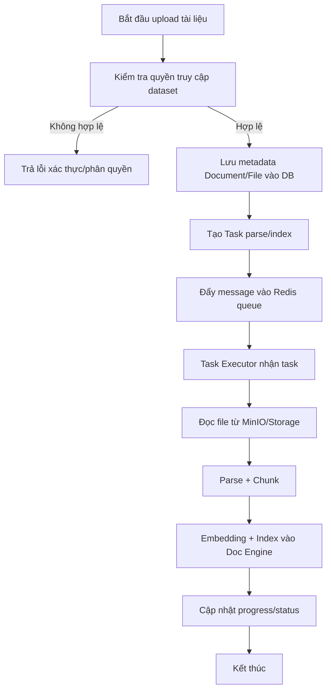
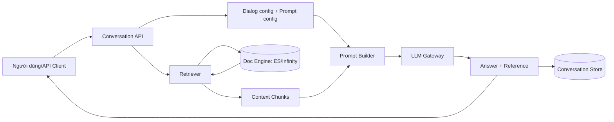
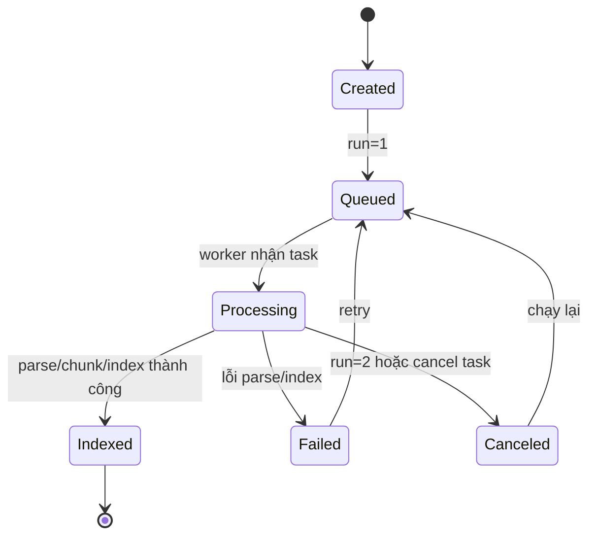
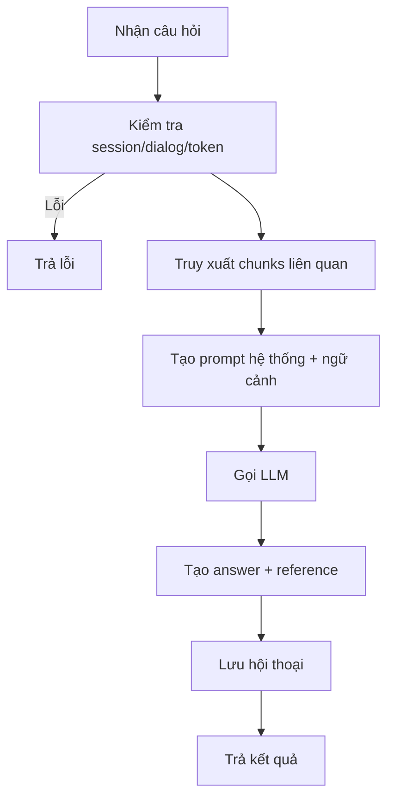

# BA-02: Use case chi tiết, Activity, Dataflow, State

## 1. Activity: Luồng ingest tài liệu

## 2. Dataflow: Luồng hỏi đáp RAG

## 3. State machine: Trạng thái tài liệu ingest

## 4. Activity: Luồng chat completion

## 5. Quy tắc nghiệp vụ chính

- Chỉ user thuộc tenant hợp lệ mới thao tác dataset/dialog/tokens.
- Mỗi tài liệu có vòng đời ingest riêng; trạng thái và tiến độ phải truy vết được.
- Luồng chat cần liên kết cấu hình dialog (LLM, top_k/top_n, similarity, rerank).
- Câu trả lời ưu tiên có trích dẫn/reference để tăng khả năng kiểm chứng.

## 6. Điểm kiểm soát rủi ro

- Sai cấu hình model key hoặc doc engine dẫn tới lỗi runtime.
- Dữ liệu ingest không chuẩn (file hỏng, parser mismatch) làm giảm chất lượng retrieval.
- Cần giám sát queue/worker heartbeat để phát hiện tắc nghẽn pipeline.
