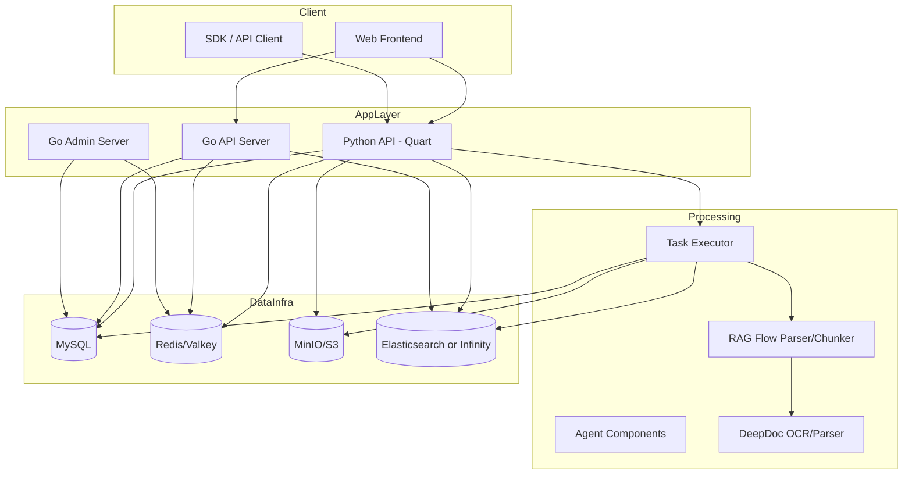

# DEV-01: Kiến trúc tổng thể

## 1. Tổng quan

RAGFlow là hệ thống đa thành phần gồm:
- **API Backend (Python Quart)**: cung cấp API cho web + SDK.
- **RAG Processing (Python workers)**: parse/chunk/embed/index và các pipeline nâng cao.
- **Go Services**: server/admin theo kiến trúc handler-service-dao.
- **Web Frontend (React + Vite)**: giao diện quản trị và vận hành.
- **Hạ tầng dữ liệu**: MySQL, Redis, MinIO, Elasticsearch/Infinity.

## 2. Sơ đồ kiến trúc logic

## 3. Các entrypoint quan trọng

- Python App bootstrap:
  - `api/ragflow_server.py`
  - `api/apps/__init__.py`
- Worker xử lý tác vụ:
  - `rag/svr/task_executor.py`
- Go servers:
  - `cmd/server_main.go`
  - `cmd/admin_server.go`
- Frontend:
  - `web/package.json` (Vite scripts)

## 4. Quy ước route

- API kiểu SDK/restful: prefix `/api/{API_VERSION}`.
- API theo module app: prefix `/{API_VERSION}/{page_name}`.
- Route đăng ký động từ `api/apps/*_app.py`, `api/apps/sdk/*.py`, `api/apps/restful_apis/*.py`.

## 5. Thành phần xử lý tài liệu

- `DocumentService` quản lý metadata và tiến độ document.
- Worker đọc task từ Redis consumer group.
- Parser factory theo `ParserType` (naive/paper/book/presentation/...)
- Chunk + embedding + cập nhật index/search engine.
- Cập nhật `Task` và `Document.progress` trong DB.

## 6. Khuyến nghị mở rộng

- Tách riêng autoscaling worker cho ingest nặng.
- Bổ sung tracing xuyên service (API -> queue -> worker -> doc engine).
- Chuẩn hóa contract API giữa Python và Go nếu dùng song song trong production.
