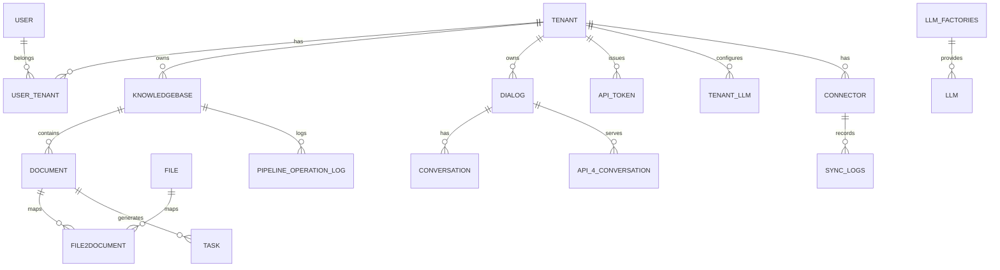
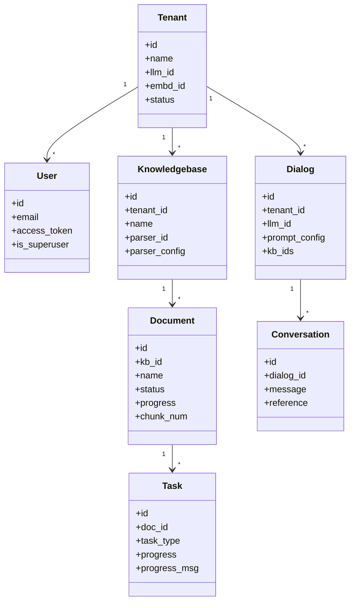

# DEV-03: Database, ERD và Class View

## 1. Tổng quan persistence

Hệ thống dùng MySQL làm nguồn dữ liệu giao dịch chính, với các bảng trọng yếu:
- Identity/tenant: `user`, `tenant`, `user_tenant`, `invitation_code`
- Model config: `llm`, `llm_factories`, `tenant_llm`, `tenant_langfuse`
- Tri thức: `knowledgebase`, `document`, `file`, `file2document`, `task`
- Hội thoại: `dialog`, `conversation`, `api_token`, `api_4_conversation`
- Canvas/Agent: `user_canvas`, `canvas_template`, `user_canvas_version`, `mcp_server`
- Monitoring/pipeline: `pipeline_operation_log`, `sync_logs`
- Evaluation/memory/system: `evaluation_*`, `memory`, `system_settings`

## 2. ERD mức khái niệm

## 3. Class diagram mức miền nghiệp vụ

## 4. Ghi chú thiết kế

- Nhiều bảng dùng `status` để soft-delete/invalid hóa record.
- Các trường `JSONField` dùng cho cấu hình động (prompt, parser_config, metrics, dsl...).
- `Task` + `PipelineOperationLog` là lõi theo dõi vận hành ingest/pipeline.
- `content_hash` trong `document` phục vụ phát hiện thay đổi nội dung.

## 5. Chỉ mục và tối ưu truy vấn

- Các khóa tra cứu nghiệp vụ (`tenant_id`, `kb_id`, `dialog_id`, `status`) đã có index.
- Cần ưu tiên query có điều kiện tenant + status để giảm full scan.
- Dữ liệu lịch sử conversation/evaluation nên có chiến lược archive theo thời gian.
