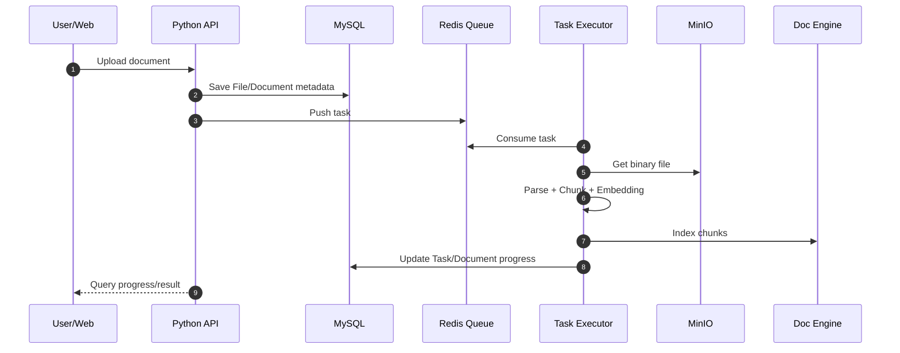
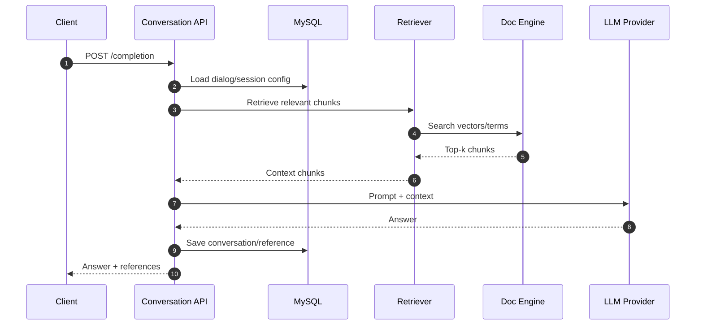
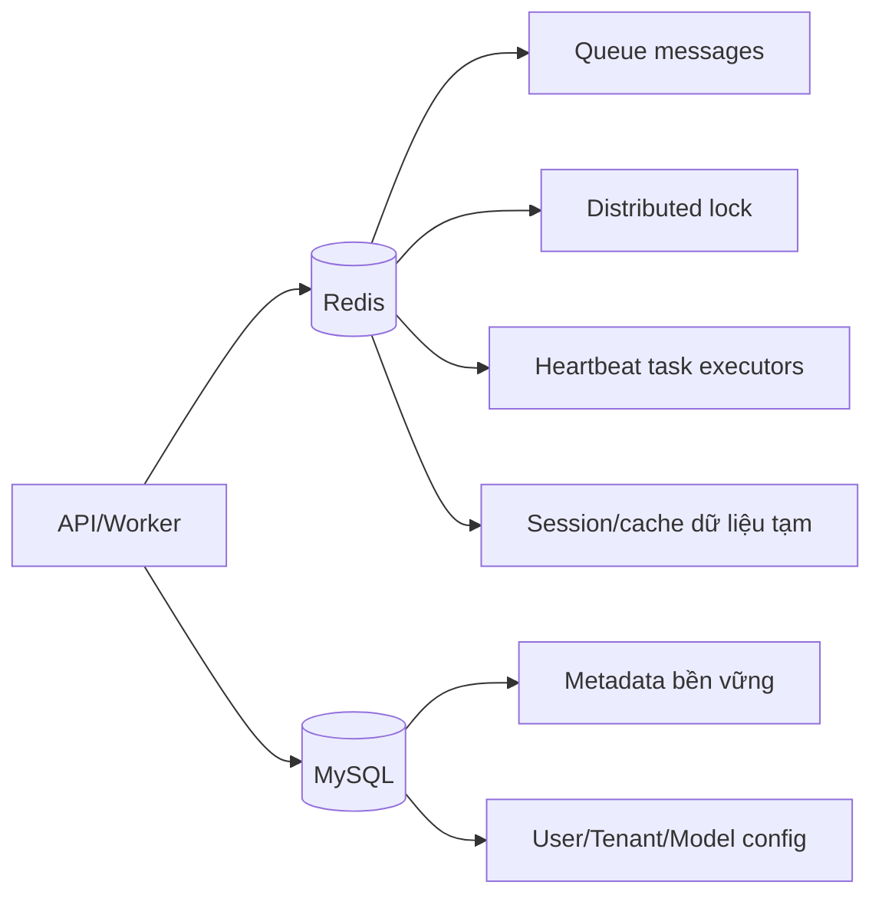
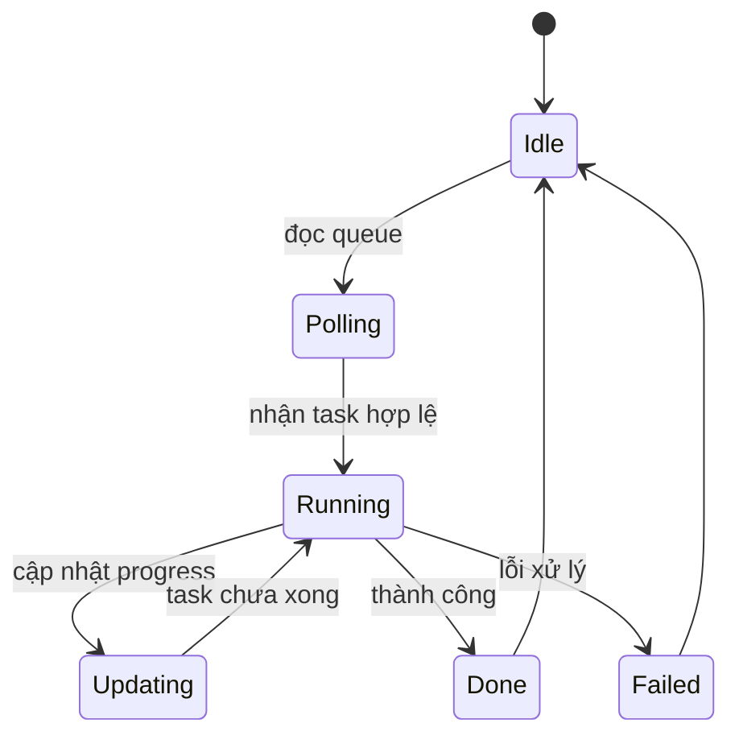

# DEV-04: Sequence, Runtime và Cache

## 1. Sequence: Ingest tài liệu

## 2. Sequence: Chat completion

## 3. Kiến trúc cache/runtime config

## 4. State runtime của task executor

## 5. Các điểm kỹ thuật quan trọng

- Worker sử dụng giới hạn đồng thời (`MAX_CONCURRENT_TASKS`, limiter semaphore).
- Có cơ chế distributed lock cho một số luồng cập nhật định kỳ.
- Tiến độ task ghi ngược về DB giúp UI/API hiển thị realtime gần đúng.
- Hàng đợi và heartbeat trong Redis là chìa khóa phát hiện worker bất thường.
