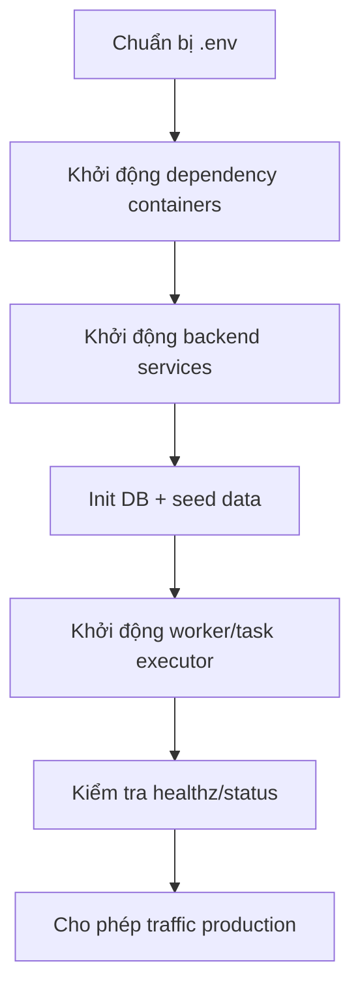

# DEV-05: Triển khai và vận hành

## 1. Thành phần hạ tầng (docker compose)

Các dịch vụ chính theo cấu hình mặc định:
- `mysql`
- `redis` (valkey)
- `minio`
- `es01` (hoặc `infinity` theo `DOC_ENGINE`)
- dịch vụ ứng dụng RAGFlow (Python/Go tùy mode triển khai)

## 2. Deployment flow

## 3. Biến môi trường quan trọng

- `DOC_ENGINE`: `elasticsearch` hoặc `infinity`
- `MYSQL_HOST`, `MYSQL_PORT`, `MYSQL_PASSWORD`
- `REDIS_HOST`, `REDIS_PORT`, `REDIS_PASSWORD`
- `MINIO_HOST`, `MINIO_PORT`, `MINIO_USER`, `MINIO_PASSWORD`
- `QUART_RESPONSE_TIMEOUT`, `QUART_BODY_TIMEOUT`
- `MAX_CONCURRENT_TASKS` (worker)

## 4. Checklist vận hành

- Health checks:
  - `/healthz`
  - `/status`
  - Redis ping, MySQL ping, MinIO live check, Doc engine check.
- Theo dõi:
  - task executor heartbeats
  - queue lag
  - tỉ lệ task failed
  - thời gian parse/index trung bình

## 5. Sự cố thường gặp

- **Không truy vấn được**: doc engine chưa sẵn sàng hoặc index chưa build.
- **Upload thành công nhưng không có kết quả chat**: task ingest lỗi hoặc bị cancel.
- **Timeout completion**: model backend chậm, cần tăng timeout hoặc tối ưu prompt/retrieval.
- **Lỗi quyền truy cập**: user/token không thuộc tenant hợp lệ.

## 6. Đề xuất hardening

- Tách worker autoscaling theo hàng đợi ingest.
- Bổ sung dashboard metrics cho queue, latency, lỗi theo module.
- Thiết lập backup/restore định kỳ cho MySQL + MinIO + doc engine index.
