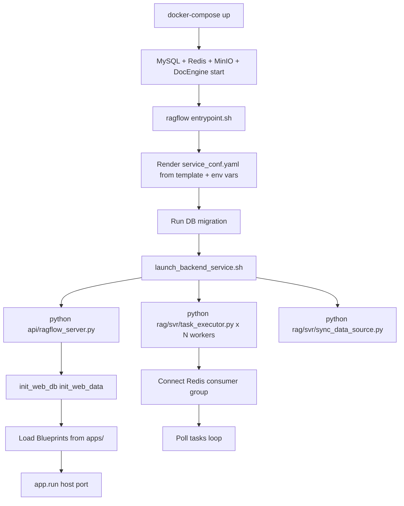

# DEV-06: Kiến trúc cây thư mục dự án RAGFlow

> **Mục đích**: Giải thích chi tiết vai trò, ý nghĩa của từng thư mục / file trong dự án và
> chức năng nghiệp vụ nào chúng phục vụ.
> **Nguồn**: Phân tích trực tiếp từ source code.

---

## 1. Cây thư mục tổng thể

```
ragflow/
├── api/                        # ← Backend API chính (Python Quart)
│   ├── apps/                   # ← Tất cả Blueprint xử lý HTTP request
│   │   ├── __init__.py         # App factory, auth middleware, Blueprint auto-register
│   │   ├── sdk/                # SDK-style REST endpoints (prefix /api/v1)
│   │   ├── restful_apis/       # RESTful resource endpoints (prefix /api/v1)
│   │   ├── auth/               # OAuth / OIDC / GitHub auth handlers
│   │   ├── services/           # Services dùng riêng trong apps/
│   │   ├── api_app.py          # API token management
│   │   ├── canvas_app.py       # Agent canvas CRUD + run
│   │   ├── chunk_app.py        # Chunk management
│   │   ├── connector_app.py    # Connector data source
│   │   ├── conversation_app.py # Conversation / message history
│   │   ├── dialog_app.py       # Dialog (assistant) config
│   │   ├── document_app.py     # Document upload + parse control
│   │   ├── evaluation_app.py   # Evaluation dataset + run + result
│   │   ├── file2document_app.py# Mapping file -> document
│   │   ├── file_app.py         # File manager (upload/folder/tree)
│   │   ├── kb_app.py           # Knowledge base CRUD + config
│   │   ├── langfuse_app.py     # Langfuse observability config
│   │   ├── llm_app.py          # LLM factory + tenant model config
│   │   ├── mcp_server_app.py   # MCP server management
│   │   ├── plugin_app.py       # Plugin management
│   │   ├── search_app.py       # Fulltext / vector search UI
│   │   ├── system_app.py       # Health check, system config, version
│   │   ├── tenant_app.py       # Tenant profile + member management
│   │   └── user_app.py         # User register, login, profile, password
│   ├── common/                 # Shared utilities dùng trong api/
│   ├── db/                     # Database layer
│   │   ├── db_models.py        # Tất cả ORM model (Peewee)
│   │   ├── db_utils.py         # Connection pool, DB init helpers
│   │   ├── init_data.py        # Seed data khi khởi tạo hệ thống
│   │   ├── runtime_config.py   # Runtime config object từ DB
│   │   ├── reload_config_base.py # Hot-reload config base class
│   │   ├── joint_services/     # Services kết hợp nhiều bảng
│   │   └── services/           # Business logic layer (1 file/entity)
│   ├── ragflow_server.py       # ← Entry point khởi động server
│   ├── settings.py             # Env config + constants cho api/
│   ├── constants.py            # Constants dùng chung
│   └── validation.py          # Input validation helpers
│
├── rag/                        # ← Core RAG pipeline
│   ├── svr/                    # Worker services
│   │   ├── task_executor.py    # ← Worker chính: nhận task Redis, parse/embed/index
│   │   ├── cache_file_svr.py   # Cache file service
│   │   ├── sync_data_source.py # Worker đồng bộ connector data sources
│   │   └── discord_svr.py      # Discord bot service
│   ├── llm/                    # LLM model abstraction layer
│   │   ├── chat_model.py       # Chat completion adapter (OpenAI, Anthropic, Ollama...)
│   │   ├── embedding_model.py  # Embedding adapter
│   │   ├── rerank_model.py     # Rerank adapter
│   │   ├── ocr_model.py        # OCR model adapter
│   │   ├── cv_model.py         # Computer vision model (image caption)
│   │   ├── sequence2txt_model.py # ASR (Speech-to-text) adapter
│   │   ├── tts_model.py        # TTS (Text-to-speech) adapter
│   │   └── __init__.py         # Factory: tạo instance model theo provider
│   ├── flow/                   # Chunking & parsing pipeline
│   │   ├── pipeline.py         # Điều phối toàn bộ pipeline xử lý 1 document
│   │   ├── base.py             # Base class cho parser flow
│   │   ├── file.py             # Detect loại file, chọn parser
│   │   ├── parser/             # Pipeline-level parsers theo domain
│   │   ├── splitter/           # Chiến lược chia chunk (fixed, semantic, sentence...)
│   │   ├── extractor/          # Extract entity, keyword, summary
│   │   ├── hierarchical_merger/# Merge chunk theo cấu trúc phân cấp
│   │   └── tokenizer/          # Tokenizer wrappers
│   ├── graphrag/               # GraphRAG: xây dựng knowledge graph
│   │   ├── general/            # General-purpose graph builder
│   │   ├── light/              # Lightweight graph builder
│   │   ├── search.py           # Graph-aware search
│   │   └── entity_resolution.py# Merge duplicate entities
│   ├── advanced_rag/           # RAPTOR: tree-structured retrieval
│   │   └── tree_structured_query_decomposition_retrieval.py
│   ├── app/                    # RAG app entrypoints (naive, paper, book, qa, ...)
│   ├── nlp/                    # NLP utilities (tokenize, stopwords, ...)
│   ├── prompts/                # Prompt templates cho pipeline
│   ├── utils/                  # Misc utilities của rag/
│   ├── raptor.py               # RAPTOR implementation
│   └── settings.py             # Settings cho rag/ module
│
├── deepdoc/                    # ← Document parsing & OCR
│   ├── parser/                 # Parser theo định dạng file
│   │   ├── pdf_parser.py       # PDF: layout analysis, text + table + figure
│   │   ├── docx_parser.py      # Word DOCX parser
│   │   ├── excel_parser.py     # Excel XLSX/XLS parser
│   │   ├── ppt_parser.py       # PowerPoint PPTX parser
│   │   ├── html_parser.py      # HTML/web page parser
│   │   ├── markdown_parser.py  # Markdown parser
│   │   ├── txt_parser.py       # Plain text parser
│   │   ├── json_parser.py      # JSON structured data parser
│   │   ├── figure_parser.py    # Figure/image extractor
│   │   ├── docling_parser.py   # Docling-based advanced parser
│   │   ├── mineru_parser.py    # MinerU PDF parser
│   │   ├── paddleocr_parser.py # PaddleOCR integration
│   │   ├── tcadp_parser.py     # TCADP parser
│   │   ├── resume/             # CV/resume-specific parser
│   │   └── utils.py            # Parser utilities
│   └── vision/                 # Computer vision: layout detection, OCR
│       (models, table recognition, figure detection)
│
├── agent/                      # ← Agent / Canvas workflow engine
│   ├── canvas.py               # Canvas execution engine: chạy đồ thị DAG
│   ├── settings.py             # Settings cho agent/
│   ├── component/              # Các loại node trong canvas
│   │   ├── base.py             # Base component class
│   │   ├── begin.py            # Node Begin (input)
│   │   ├── llm.py              # Node LLM call
│   │   ├── categorize.py       # Node phân loại / routing
│   │   ├── switch.py           # Node switch-case
│   │   ├── loop.py/iteration.py# Node lặp
│   │   ├── agent_with_tools.py # Node LLM + tool calling (ReAct)
│   │   ├── invoke.py           # Node gọi canvas khác
│   │   ├── message.py          # Node output text
│   │   ├── data_operations.py  # Node xử lý dữ liệu
│   │   ├── excel_processor.py  # Node đọc/ghi Excel
│   │   ├── code_exec.py (qua tools) # Thực thi code
│   │   ├── string_transform.py # Xử lý chuỗi
│   │   ├── variable_assigner.py# Gán biến
│   │   ├── varaiable_aggregator.py # Tổng hợp output
│   │   └── fillup.py / list_operations.py / docs_generator.py
│   ├── tools/                  # Tool plugins cho Agent
│   │   ├── retrieval.py        # Tìm kiếm trong KB
│   │   ├── tavily.py           # Tavily web search
│   │   ├── wikipedia.py        # Wikipedia search
│   │   ├── duckduckgo.py       # DuckDuckGo search
│   │   ├── google.py / googlescholar.py
│   │   ├── arxiv.py / pubmed.py# Academic search
│   │   ├── exesql.py           # Thực thi SQL
│   │   ├── code_exec.py        # Chạy Python/JS code
│   │   ├── crawler.py          # Web crawl
│   │   ├── email.py            # Send email
│   │   ├── github.py           # GitHub API
│   │   ├── jin10.py / tushare.py / wencai.py / yahoofinance.py / akshare.py
│   │   ├── qweather.py         # Weather data
│   │   ├── deepl.py            # Translation
│   │   └── searxng.py          # SearXNG self-hosted search
│   ├── templates/              # Canvas templates (JSON) - các workflow mẫu
│   ├── plugin/                 # Plugin loader cho agent
│   ├── sandbox/                # Sandbox execution environment
│   └── test/                   # Tests cho agent
│
├── common/                     # ← Shared utilities toàn dự án
│   ├── settings.py             # Global config (DB, Redis, MinIO, etc.)
│   ├── connection_utils.py     # Tạo kết nối DB, Redis, MinIO
│   ├── config_utils.py         # Load & parse config files
│   ├── crypto_utils.py         # Mã hóa/giải mã, hash
│   ├── decorator.py            # Python decorators dùng chung
│   ├── exceptions.py           # Custom exception classes
│   ├── file_utils.py           # File I/O helpers
│   ├── float_utils.py          # Floating point utils
│   ├── http_client.py          # HTTP client wrapper
│   ├── log_utils.py            # Logging setup
│   ├── mcp_tool_call_conn.py   # MCP tool call connection
│   ├── metadata_utils.py       # Document metadata utils
│   ├── misc_utils.py           # Miscellaneous helpers
│   ├── parser_config_utils.py  # Parser config builder
│   ├── query_base.py           # Base query builder
│   ├── signal_utils.py         # OS signal handlers
│   ├── string_utils.py         # String manipulation
│   ├── text_utils.py           # Text processing
│   ├── time_utils.py           # Datetime helpers
│   ├── token_utils.py          # JWT / token utilities
│   ├── versions.py             # Version constants
│   ├── data_source/            # Connector implementations
│   │   ├── interfaces.py       # Abstract base connector
│   │   ├── connector_runner.py # Điều phối chạy connector
│   │   ├── confluence_connector.py
│   │   ├── notion_connector.py
│   │   ├── sharepoint_connector.py
│   │   ├── github/ gitlab_connector.py
│   │   ├── google_drive/ blob_connector.py
│   │   ├── jira/ zendesk_connector.py
│   │   ├── slack_connector.py / teams_connector.py / discord_connector.py
│   │   ├── gmail_connector.py / imap_connector.py
│   │   ├── rdbms_connector.py  # SQL database connector
│   │   ├── seafile_connector.py / webdav_connector.py
│   │   ├── moodle_connector.py # LMS connector
│   │   └── dingtalk_ai_table_connector.py
│   └── doc_store/              # Doc engine abstraction
│       ├── doc_store_base.py   # Abstract interface cho doc store
│       ├── es_conn_base.py / es_conn_pool.py      # Elasticsearch client
│       ├── infinity_conn_base.py / infinity_conn_pool.py  # Infinity client
│       └── ob_conn_base.py / ob_conn_pool.py      # OceanBase client
│
├── web/                        # ← Frontend React + Vite
│   ├── package.json            # Dependencies: React 18, Vite 7, TanStack Query, Zustand
│   ├── src/
│   │   ├── pages/              # Route-level components (KB, Chat, Agent, Settings...)
│   │   ├── components/         # Reusable UI components
│   │   ├── hooks/              # Custom React hooks
│   │   ├── stores/             # Zustand state stores
│   │   ├── services/ atau api/ # HTTP client calls tới backend
│   │   ├── locales/            # i18n strings (en, zh)
│   │   └── utils/              # Frontend utilities
│   └── ...config files         # vite.config.ts, tailwind.config.js, etc.
│
├── cmd/                        # ← Go service entrypoints
│   ├── server_main.go          # Go API server (Gin), handler-service-dao pattern
│   ├── admin_server.go         # Go Admin server, user/tenant admin ops
│   └── ragflow_cli.go          # CLI tool
│
├── internal/                   # ← Go internal packages
│   ├── handler/                # HTTP handlers (Gin controllers)
│   ├── service/                # Go business logic
│   ├── dao/                    # Data access objects (SQL queries)
│   ├── model/                  # Go struct models (mirror DB tables)
│   ├── router/                 # Gin router setup
│   ├── cache/                  # Redis cache layer
│   ├── storage/                # File storage abstraction
│   ├── tokenizer/              # Tokenizer integration
│   ├── engine/                 # Doc engine integration (Go)
│   ├── logger/                 # Structured logging
│   ├── server/                 # Server lifecycle
│   ├── admin/                  # Admin-specific logic
│   ├── binding/                # Request binding helpers
│   ├── cli/                    # CLI command implementations
│   ├── common/                 # Shared Go utilities
│   └── cpp/                    # CGo bindings (tokenizer, etc.)
│
├── mcp/                        # ← MCP (Model Context Protocol)
│   ├── client/                 # MCP client implementation
│   └── server/                 # MCP server implementation
│
├── sdk/                        # ← Python SDK
│   └── python/                 # Python SDK package
│       └── test/               # SDK integration tests
│
├── docker/                     # ← Docker & deployment configs
│   ├── docker-compose.yml      # Full stack deploy
│   ├── docker-compose-base.yml # Infrastructure: MySQL, Redis, MinIO, ES, Infinity
│   ├── docker-compose-CN-oc9.yml # China + OceanBase variant
│   ├── docker-compose-macos.yml # macOS variant
│   ├── service_conf.yaml.template # Backend service config template
│   ├── entrypoint.sh           # Container entrypoint
│   ├── launch_backend_service.sh # Start all Python services
│   ├── migration.sh            # DB migration script
│   ├── infinity_conf.toml      # Infinity config
│   ├── init.sql                # MySQL init SQL
│   └── nginx/                  # Nginx reverse proxy config
│
├── conf/                       # ← Static config files
│   ├── service_conf.yaml       # Service runtime config (loaded at startup)
│   ├── llm_factories.json      # LLM provider definitions + capabilities
│   ├── mapping.json / os_mapping.json # Elasticsearch index mapping (main)
│   ├── infinity_mapping.json / doc_meta_*.json # Infinity index mapping
│   └── system_settings.json    # Default system settings
│
├── test/                       # ← Backend tests
│   ├── test_api.py             # API integration tests
│   └── ...                     # Other test files
│
├── tools/                      # ← Dev/ops tools + scripts
├── example/                    # ← Example code: chat demo, HTTP, SDK usage
├── docs/                       # ← Documentation
│   └── tranphuc8a/             # ← Tài liệu nội bộ (file này)
│       ├── deploy_guide/
│       ├── docs_vi/
│       └── documentation/      # ← BA + Dev docs hiện tại
├── admin/                      # ← Admin CLI tool
│   ├── server/                 # Admin server source
│   └── client/                 # Admin CLI client
├── memory/                     # ← Memory module (long-term memory)
├── pyproject.toml              # Python project config + dependencies (uv)
├── go.mod                      # Go module dependencies
├── Dockerfile                  # Main Docker image build
├── Dockerfile.deps             # Base image with heavy deps
└── AGENTS.md / CLAUDE.md       # AI assistant context files
```

---

## 2. Phân tích chi tiết từng thư mục

### 2.1 `api/` — Python API Backend

**Vai trò**: Cung cấp toàn bộ REST API cho Web UI, SDK và ứng dụng tích hợp.
**Framework**: Quart (async Flask), Blueprint pattern.

#### `api/apps/__init__.py`
Đây là **trung tâm** của toàn bộ API server:

| Thành phần | Vai trò |
|---|---|
| `app = Quart(__name__)` | Khởi tạo Quart application |
| `CORS(app)` | Cho phép cross-origin request từ frontend |
| `QuartSchema(app)` | OpenAPI schema auto-generation |
| `app.session_interface` | Redis-backed session |
| `_load_user()` | Middleware: decode JWT → load user từ DB hoặc API token |
| `current_user` | LocalProxy cho user đang request |
| `login_required(func)` | Decorator bảo vệ endpoint cần xác thực |
| `search_pages_path()` | Tự động tìm `*_app.py`, `sdk/*.py`, `restful_apis/*.py` |
| `register_page(path)` | Import module, đăng ký Blueprint vào app |

#### `api/apps/*_app.py` — Blueprint modules

Mỗi file = 1 Blueprint = 1 nhóm chức năng:

| File | Prefix route | Chức năng | UC liên quan |
|---|---|---|---|
| `user_app.py` | `/v1/user` | Đăng ký, đăng nhập, profile, password, avatar | UC-01 |
| `tenant_app.py` | `/v1/tenant` | Thông tin tenant, thành viên, mời user | UC-02 |
| `kb_app.py` | `/v1/kb` | Tạo/sửa/xóa dataset, config parser | UC-03 |
| `document_app.py` | `/v1/document` | Upload, parse control, progress, delete | UC-04 |
| `chunk_app.py` | `/v1/chunk` | CRUD chunk, enable/disable, search | UC-05 |
| `llm_app.py` | `/v1/llm` | Factory list, add model, set default | UC-06 |
| `dialog_app.py` | `/v1/dialog` | Tạo/config dialog (assistant) | UC-07 |
| `conversation_app.py` | `/v1/conversation` | Tạo session, gửi message, history | UC-08 |
| `canvas_app.py` | `/v1/canvas` | Agent canvas CRUD, run, version | UC-09 |
| `connector_app.py` | `/v1/connector` | Data source connector | UC-10 |
| `evaluation_app.py` | `/v1/evaluation` | Eval dataset, run, result | UC-11 |
| `system_app.py` | `/v1/system` | Health, version, system settings | UC-12 |
| `file_app.py` | `/v1/file` | File manager, upload, folder | UC-12 |
| `api_app.py` | `/v1/api` | API token management | UC-01 |
| `search_app.py` | `/v1/search` | Search UI | UC-12 |
| `mcp_server_app.py` | `/v1/mcp_server` | MCP server management | UC-12 |
| `langfuse_app.py` | `/v1/langfuse` | Langfuse config | UC-02 |
| `plugin_app.py` | `/v1/plugin` | Plugin management | - |

#### `api/apps/sdk/` — SDK API endpoints

Prefix `/api/v1/` — thiết kế cho Python SDK và external integration:

| File | Endpoint nhóm | Mô tả |
|---|---|---|
| `agents.py` | `/api/v1/agents` | Tương tác với canvas agent qua API |
| `chat.py` | `/api/v1/chats` | CRUD dialog + completion qua SDK |
| `session.py` | `/api/v1/chats/{id}/sessions` | CRUD session + message via SDK |
| `doc.py` | `/api/v1/datasets/{id}/documents` | Upload/list/delete doc qua SDK |
| `files.py` | `/api/v1/files` | File operations qua SDK |
| `dify_retrieval.py` | `/api/v1/retrieval` | Retrieval API tương thích Dify |

#### `api/apps/restful_apis/` — RESTful resource APIs

| File | Mô tả |
|---|---|
| `dataset_api.py` | CRUD dataset theo chuẩn RESTful (`/api/v1/datasets`) |
| `memory_api.py` | Memory store API (`/api/v1/memories`) |

#### `api/db/db_models.py` — ORM Models

Tất cả bảng DB (Peewee ORM):

| Model | Bảng | Mô tả | UC |
|---|---|---|---|
| `User` | `user` | Tài khoản người dùng | UC-01 |
| `Tenant` | `tenant` | Workspace/Organization | UC-02 |
| `UserTenant` | `user_tenant` | Mapping user ↔ tenant + role | UC-02 |
| `InvitationCode` | `invitation_code` | Code mời thành viên | UC-02 |
| `LLMFactories` | `llm_factories` | Provider definitions | UC-06 |
| `LLM` | `llm` | Model definitions | UC-06 |
| `TenantLLM` | `tenant_llm` | Model config per tenant | UC-06 |
| `TenantLangfuse` | `tenant_langfuse` | Langfuse config | UC-02 |
| `Knowledgebase` | `knowledgebase` | Dataset | UC-03 |
| `Document` | `document` | Tài liệu upload | UC-04 |
| `File` | `file` | File vật lý trong File Manager | UC-12 |
| `File2Document` | `file2document` | Link file → document | UC-04 |
| `Task` | `task` | Parse task queue | UC-04 |
| `Dialog` | `dialog` | Assistant config | UC-07 |
| `Conversation` | `conversation` | Session hội thoại | UC-08 |
| `APIToken` | `api_token` | External API tokens | UC-01 |
| `API4Conversation` | `api4conversation` | Session cho API token | UC-08 |
| `UserCanvas` | `user_canvas` | Canvas agent definition | UC-09 |
| `CanvasTemplate` | `canvas_template` | Canvas templates | UC-09 |
| `UserCanvasVersion` | `user_canvas_version` | Version history canvas | UC-09 |
| `MCPServer` | `mcp_server` | MCP server config | UC-12 |
| `Search` | `search` | Search config | UC-12 |
| `Connector` | `connector` | Connector data source | UC-10 |
| `Connector2Kb` | `connector2kb` | Connector ↔ KB mapping | UC-10 |
| `SyncLogs` | `sync_logs` | Sync history | UC-10 |
| `EvaluationDataset` | `evaluation_dataset` | Eval dataset | UC-11 |
| `EvaluationCase` | `evaluation_case` | Eval test cases | UC-11 |
| `EvaluationRun` | `evaluation_run` | Eval run metadata | UC-11 |
| `EvaluationResult` | `evaluation_result` | Eval results per case | UC-11 |
| `Memory` | `memory` | Long-term memory | - |
| `SystemSettings` | `system_settings` | System-wide settings | UC-12 |

#### `api/db/services/` — Business Logic Services

Mỗi file service tương ứng 1 entity/domain:

| File | Mô tả | UC |
|---|---|---|
| `user_service.py` | CRUD user, password hash, login logic | UC-01 |
| `knowledgebase_service.py` | CRUD KB, statistics, parser config | UC-03 |
| `document_service.py` | Upload, parse trigger, progress update | UC-04 |
| `task_service.py` | Tạo/update task, queue management | UC-04 |
| `dialog_service.py` | Dialog CRUD + config validation | UC-07 |
| `conversation_service.py` | Session + message management | UC-08 |
| `canvas_service.py` | Canvas CRUD + version | UC-09 |
| `llm_service.py` | LLM factory + model config | UC-06 |
| `tenant_llm_service.py` | Tenant-specific LLM config | UC-06 |
| `connector_service.py` | Connector CRUD + sync trigger | UC-10 |
| `evaluation_service.py` | Eval dataset/run/result | UC-11 |
| `file_service.py` | File manager operations | UC-12 |
| `file2document_service.py` | File ↔ Document mapping | UC-04 |
| `system_settings_service.py` | System config CRUD | UC-12 |
| `api_service.py` | API token management | UC-01 |
| `search_service.py` | Search config | UC-12 |
| `memory_service.py` | Memory store operations | - |
| `pipeline_operation_log_service.py` | Log pipeline ops | UC-12 |
| `langfuse_service.py` | Langfuse config | UC-02 |
| `mcp_server_service.py` | MCP server management | UC-12 |
| `common_service.py` | Shared service utilities | - |

---

### 2.2 `rag/` — Core RAG Processing

**Vai trò**: Tất cả logic phân tích và xử lý tài liệu, embedding, indexing, và retrieval.

#### `rag/svr/task_executor.py` — Worker chính

```
Startup → Connect Redis/MySQL/MinIO/DocEngine
       → Tạo consumer group "rag_flow" trên Redis
       → Poll task mỗi 1 giây (collect())
       → Với mỗi task:
           ├── Đọc Document record từ MySQL
           ├── Đọc file từ MinIO
           ├── Chọn parser = FACTORY[document.parser_id]
           ├── parse() → chunks
           ├── embed() → vectors
           ├── index() → upsert vào doc engine
           └── update_progress() → MySQL + Redis
```

| Constant | Giá trị | Ý nghĩa |
|---|---|---|
| `MAX_CONCURRENT_TASKS` | 5 | Số task xử lý song song |
| `MAX_CONCURRENT_CHUNK_BUILDERS` | 1 | Số chunk builder song song |
| `CONSUMER_NAME` | `task_executor_{N}` | Định danh worker trong consumer group |
| `BATCH_SIZE` | 64 | Số message lấy từ Redis mỗi lần |

#### `rag/llm/` — LLM Abstraction

Mỗi file = 1 loại model task, hỗ trợ nhiều providers:

| File | Task | Providers |
|---|---|---|
| `chat_model.py` | Chat completion | OpenAI, Anthropic, Gemini, Ollama, DeepSeek, Zhipu, Qwen, Mistral, ... |
| `embedding_model.py` | Text embedding | OpenAI, Ollama, HuggingFace, Cohere, ... |
| `rerank_model.py` | Rerank kết quả | Cohere, JinaAI, BGE, ... |
| `ocr_model.py` | OCR ảnh | Hỗ trợ nhiều OCR backend |
| `cv_model.py` | Image caption | GPT-4V, ... |
| `sequence2txt_model.py` | Speech-to-text (ASR) | Whisper, ... |
| `tts_model.py` | Text-to-speech | OpenAI TTS, ... |

#### `rag/flow/` — Chunking Pipeline

| File/Dir | Vai trò |
|---|---|
| `pipeline.py` | Orchestrator: gọi các bước trong đúng thứ tự |
| `file.py` | Detect file MIME type → chọn parser đúng |
| `base.py` | Base class cho tất cả flow parsers |
| `parser/` | Parser cụ thể theo domain (paper, book, laws, qa...) |
| `splitter/` | Tách văn bản: fixed-length, sentence, semantic, regex |
| `extractor/` | Trích xuất entities, keywords, metadata |
| `hierarchical_merger/` | Gộp chunk nhỏ theo cấu trúc tài liệu |
| `tokenizer/` | Wrapper cho tokenizer (tiktoken, HuggingFace) |

#### `rag/graphrag/` — Knowledge Graph

Dùng khi bật chế độ GraphRAG trong dataset:

| File | Vai trò |
|---|---|
| `general/` | Xây KG từ nội dung tổng quát |
| `light/` | Lightweight KG cho tài liệu nhỏ |
| `entity_resolution.py` | Merge entity trùng lặp |
| `search.py` | Graph-traversal search |
| `utils.py` | KG utilities |

---

### 2.3 `deepdoc/` — Document Parsing Engine

**Vai trò**: Xử lý định dạng file ở tầng thấp: layout detection, OCR, table extraction.

#### `deepdoc/parser/` — Format-specific Parsers

| File | Định dạng | Kỹ thuật chính |
|---|---|---|
| `pdf_parser.py` | PDF | Layout analysis (bounding box), text extraction, table detection |
| `docx_parser.py` | DOCX | python-docx, extract paragraphs + tables + images |
| `excel_parser.py` | XLSX/XLS | openpyxl, multi-sheet, header detection |
| `ppt_parser.py` | PPTX | python-pptx, slide text + notes |
| `html_parser.py` | HTML/Web | BeautifulSoup, boilerplate removal |
| `markdown_parser.py` | Markdown | Markdown AST, section-aware |
| `txt_parser.py` | Plain text | Encoding detection, line processing |
| `json_parser.py` | JSON | Flatten nested JSON, extract values |
| `figure_parser.py` | Ảnh | OCR + caption extraction |
| `docling_parser.py` | Nhiều | Docling library integration |
| `mineru_parser.py` | PDF | MinerU advanced PDF parser |
| `paddleocr_parser.py` | Ảnh/PDF scan | PaddleOCR integration |
| `resume/` | CV/Resume | Structured field extraction |

#### `deepdoc/vision/` — Vision Models

- Layout detection (khu vực text, bảng, hình)
- Table structure recognition
- Figure detection & extraction
- OCR text recognition

---

### 2.4 `agent/` — Agent Workflow Engine

**Vai trò**: Thực thi DAG-based agent workflows (canvas).

#### `agent/canvas.py`

Engine chính để chạy canvas:
- Nhận đầu vào (user message hoặc API call)
- Load đồ thị từ `UserCanvas.dsl` (JSON config)
- Topo-sort các nodes
- Thực thi từng node → truyền output sang node tiếp theo
- Hỗ trợ loop, branch, và streaming output

#### `agent/component/` — Node Types

Mỗi node type là 1 class kế thừa từ `base.py`:

| Component | Mô tả | Tools dùng |
|---|---|---|
| `Begin` | Entry point, define input schema | - |
| `LLM` | Gọi chat model với prompt template | `rag/llm/chat_model.py` |
| `Retrieval` | Tìm kiếm trong KB | `doc_store`, embedding |
| `Categorize` | Phân loại text → routing | LLM |
| `Switch` | Branch theo điều kiện logic | - |
| `Loop`/`Iteration` | Lặp qua danh sách | - |
| `AgentWithTools` | ReAct agent: LLM + tool selection | `agent/tools/` |
| `Invoke` | Gọi canvas khác như sub-routine | `canvas.py` |
| `Message` | Output text ra kết quả | - |
| `ExeSQL` | Chạy SQL query | DB connector |
| `VariableAssigner` | Gán/transform biến | - |
| `DataOperations` | Filter/sort/map data | - |
| `ExcelProcessor` | Đọc/ghi Excel | openpyxl |
| `Crawler` | Crawl web page | httpx/playwright |

#### `agent/tools/` — Tool Plugins

External tool integrations cho `AgentWithTools`:

| Nhóm | Tools |
|---|---|
| Search | Google, DuckDuckGo, SearXNG, Tavily |
| Academic | ArXiv, PubMed, Google Scholar |
| Finance | YahooFinance, Tushare, Jin10, Akshare, Wencai |
| Data | Wikipedia, Qweather |
| Code | `code_exec.py` (Python/JS sandbox) |
| DB | `exesql.py` (SQL execution) |
| Web | `crawler.py` |
| Communication | `email.py` |
| Version control | `github.py` |
| Translation | `deepl.py` |
| RAG | `retrieval.py` (KB search) |

---

### 2.5 `common/` — Shared Utilities

**Vai trò**: Utilities và abstractions dùng chung cho toàn bộ dự án.

#### `common/data_source/` — Connector Implementations

| Interface | Class | Mô tả |
|---|---|---|
| `BaseConnector` | (interfaces.py) | Abstract: `list_files()`, `fetch_file()`, `sync()` |
| - | `ConfluenceConnector` | Confluence REST API |
| - | `NotionConnector` | Notion API |
| - | `SharePointConnector` | MS Graph API |
| - | `GitHubConnector` | GitHub API |
| - | `GoogleDriveConnector` | Google Drive API |
| - | `JiraConnector` | Jira REST API |
| - | `SlackConnector` | Slack API |
| - | `GmailConnector` | Gmail API |
| - | `RDBMSConnector` | SQLAlchemy multi-DB |

#### `common/doc_store/` — Doc Engine Abstraction

| File | Vai trò |
|---|---|
| `doc_store_base.py` | Abstract interface: `upsert()`, `search()`, `delete()` |
| `es_conn_base.py` | Elasticsearch 8.x client operations |
| `es_conn_pool.py` | Connection pool cho ES |
| `infinity_conn_base.py` | Infinity vector DB client |
| `infinity_conn_pool.py` | Connection pool cho Infinity |
| `ob_conn_base.py` | OceanBase client (variant CN) |

---

### 2.6 `cmd/` + `internal/` — Go Services

**Vai trò**: Go microservices xử lý một số request hiệu năng cao, quản lý admin.

#### `cmd/server_main.go`

Gin HTTP server với layer đầy đủ:
```
main() → initDB() → initRedis() → initStorage()
      → Khởi tạo services (user, kb, doc, chunk, llm, dialog, chat, ...)
      → router.Setup(services)
      → StartHeartbeat() → Admin server
      → gin.Run()
```

#### `cmd/admin_server.go`

Admin server nhận heartbeat từ Python workers:
- Track trạng thái task executor workers
- Quản lý admin operations (reset password, user list)

#### `internal/handler/` — Go HTTP Handlers

Tương đương `api/apps/` trong Python: nhận HTTP request, validate, gọi service.

#### `internal/service/` — Go Business Logic

Tương đương `api/db/services/` trong Python.

#### `internal/dao/` — Go Data Access

SQL queries trực tiếp với MySQL (không dùng ORM nặng).

---

### 2.7 `mcp/` — Model Context Protocol

**Vai trò**: Implement MCP protocol để RAGFlow có thể kết nối với Claude Desktop, AI editors.

| Dir | Vai trò |
|---|---|
| `mcp/server/` | MCP server: expose tools (KB search, dialog chat) qua MCP protocol |
| `mcp/client/` | MCP client: kết nối tới MCP server khác |

---

### 2.8 `conf/` — Static Configuration

| File | Nội dung | Load bởi |
|---|---|---|
| `service_conf.yaml` | Database URLs, Redis, MinIO, ES/Infinity endpoints, embedding/chat model defaults | `common/settings.py` khi startup |
| `llm_factories.json` | Danh sách provider: tên, logo, model list, capability flags | `api/db/init_data.py` |
| `mapping.json` | Elasticsearch index mapping cho document chunks | ES init code |
| `os_mapping.json` | ES mapping cho OS-level index | ES init code |
| `infinity_mapping.json` | Infinity index schema | Infinity init code |
| `doc_meta_es_mapping.json` | ES mapping cho document metadata | ES init code |
| `doc_meta_infinity_mapping.json` | Infinity mapping cho document metadata | Infinity init code |
| `system_settings.json` | Default system settings | `init_data.py` |

---

### 2.9 `docker/` — Deployment

| File | Vai trò | Chức năng |
|---|---|---|
| `docker-compose.yml` | Full stack deploy | Tất cả service kể cả frontend |
| `docker-compose-base.yml` | Infrastructure only | MySQL, Redis, MinIO, ES/Infinity |
| `service_conf.yaml.template` | Template config | Được render với env vars khi container start |
| `entrypoint.sh` | Container startup | Chạy migration, render config, start services |
| `launch_backend_service.sh` | Python services startup | Start task_executor, API server, sync workers |
| `migration.sh` | DB migration | Alembic migrations |
| `nginx/` | Reverse proxy | HTTPS, static files frontend, proxy tới backend |

---

## 3. Ma trận thư mục ↔ Use case

| Thư mục | UC-01 | UC-02 | UC-03 | UC-04 | UC-05 | UC-06 | UC-07 | UC-08 | UC-09 | UC-10 | UC-11 | UC-12 |
|---|:---:|:---:|:---:|:---:|:---:|:---:|:---:|:---:|:---:|:---:|:---:|:---:|
| `api/apps/user_app.py` | ✓ | | | | | | | | | | | |
| `api/apps/tenant_app.py` | | ✓ | | | | | | | | | | |
| `api/apps/kb_app.py` | | | ✓ | | | | | | | | | |
| `api/apps/document_app.py` | | | | ✓ | | | | | | | | |
| `api/apps/chunk_app.py` | | | | | ✓ | | | | | | | |
| `api/apps/llm_app.py` | | | | | | ✓ | | | | | | |
| `api/apps/dialog_app.py` | | | | | | | ✓ | | | | | |
| `api/apps/conversation_app.py` | | | | | | | | ✓ | | | | |
| `api/apps/canvas_app.py` | | | | | | | | | ✓ | | | |
| `api/apps/connector_app.py` | | | | | | | | | | ✓ | | |
| `api/apps/evaluation_app.py` | | | | | | | | | | | ✓ | |
| `api/apps/system_app.py` | | | | | | | | | | | | ✓ |
| `rag/svr/task_executor.py` | | | | ✓ | | | | | | | | |
| `rag/flow/` | | | | ✓ | | | | | | | | |
| `rag/llm/` | | | | ✓ | | ✓ | | ✓ | ✓ | | | |
| `deepdoc/parser/` | | | | ✓ | | | | | | | | |
| `agent/canvas.py` | | | | | | | | | ✓ | | | |
| `agent/tools/` | | | | | | | | | ✓ | | | |
| `common/data_source/` | | | | | | | | | | ✓ | | |
| `common/doc_store/` | | | ✓ | ✓ | ✓ | | | ✓ | | | | |

---

## 4. Luồng khởi động hệ thống



---

## 5. Quy ước đặt tên & code style

| Quy ước | Mô tả |
|---|---|
| `*_app.py` | Flask/Quart Blueprint module, tự động được register |
| `*_service.py` | Business logic layer, không trực tiếp handle HTTP |
| `*_model.py` trong Go | Go struct mapping tới DB table |
| `*_handler.go` | Go HTTP handler (tương đương `*_app.py`) |
| `*_dao.go` | Go Data Access Object (SQL queries) |
| `FACTORY` dict | Pattern dùng trong `task_executor.py` để map parser type → parser module |
| `manager = Blueprint(...)` | Tên chuẩn cho Blueprint object trong mỗi `*_app.py` |
| `@manager.route(path, methods=[...])` | Decorator đăng ký route cho Blueprint |
