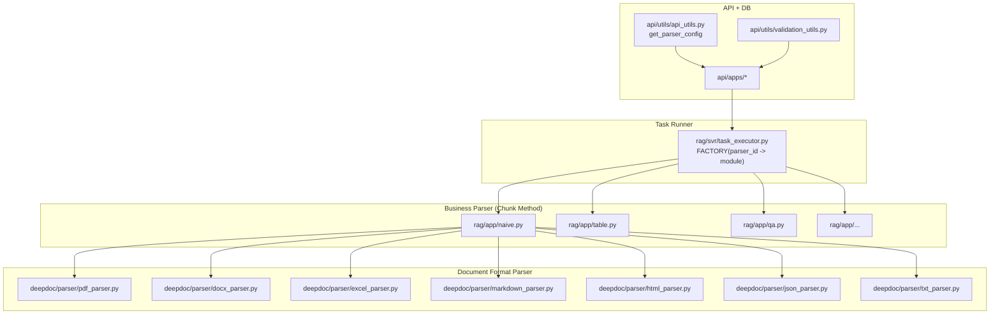

# 01. Kiến trúc tổng thể parser trong RAGFlow

## 1) Bức tranh 3 lớp

Trong pipeline ingest của RAGFlow, parser nằm ở 3 lớp chính:

1. **Lớp điều phối tác vụ**
   - File chính: `rag/svr/task_executor.py`
   - Vai trò: đọc task, chọn `parser_id` rồi gọi module chunk tương ứng qua `FACTORY`

2. **Lớp parser nghiệp vụ (chunk method)**
   - Cụm file: `rag/app/*.py` (`naive.py`, `qa.py`, `table.py`, ...)
   - Vai trò: áp dụng chiến lược chunk theo use-case

3. **Lớp parser định dạng tài liệu**
   - Cụm file: `deepdoc/parser/*.py`
   - Vai trò: bóc tách nội dung gốc theo từng định dạng (PDF, DOCX, XLSX, HTML, JSON, Markdown...)

---

## 2) Sơ đồ kiến trúc

---

## 3) Điểm vào quan trọng

- `common/constants.py`
  - Enum `ParserType`: `naive`, `qa`, `table`, `book`, `manual`, ...

- `rag/svr/task_executor.py`
  - Dict `FACTORY` map `parser_id -> rag.app.<module>`
  - Đây là điểm quyết định parser nghiệp vụ nào chạy

- `rag/app/naive.py`
  - Hàm `chunk(...)` là tuyến parse tổng quát nhất cho nhiều định dạng
  - Với PDF, chọn backend parse từ `parser_config.layout_recognize`

- `deepdoc/parser/__init__.py`
  - Export parser định dạng cơ bản: `PdfParser`, `DocxParser`, `ExcelParser`, `PptParser`, `HtmlParser`, `JsonParser`, `MarkdownParser`, `TxtParser`

---

## 4) Cấu hình parser

- `api/utils/api_utils.py::get_parser_config(...)`
  - Set default theo `chunk_method` (`parser_id`)
  - Ví dụ `naive`: mặc định `layout_recognize=DeepDOC`, `chunk_token_num=512`, `delimiter=\n`, có block `raptor` và `graphrag`

- `api/utils/validation_utils.py`
  - Kiểm tra schema `parser_config`
  - Validate `chunk_method` nằm trong tập cho phép

---

## 5) Kết luận ngắn

- Parser RAGFlow là **pipeline đa tầng**: điều phối task -> chunk method -> parser định dạng.
- `deepdoc` là lõi xử lý document format, đặc biệt PDF parser có độ phức tạp cao nhất.
- Khi mở rộng parser mới cần chạm **nhiều lớp**, không chỉ viết một class parser.
