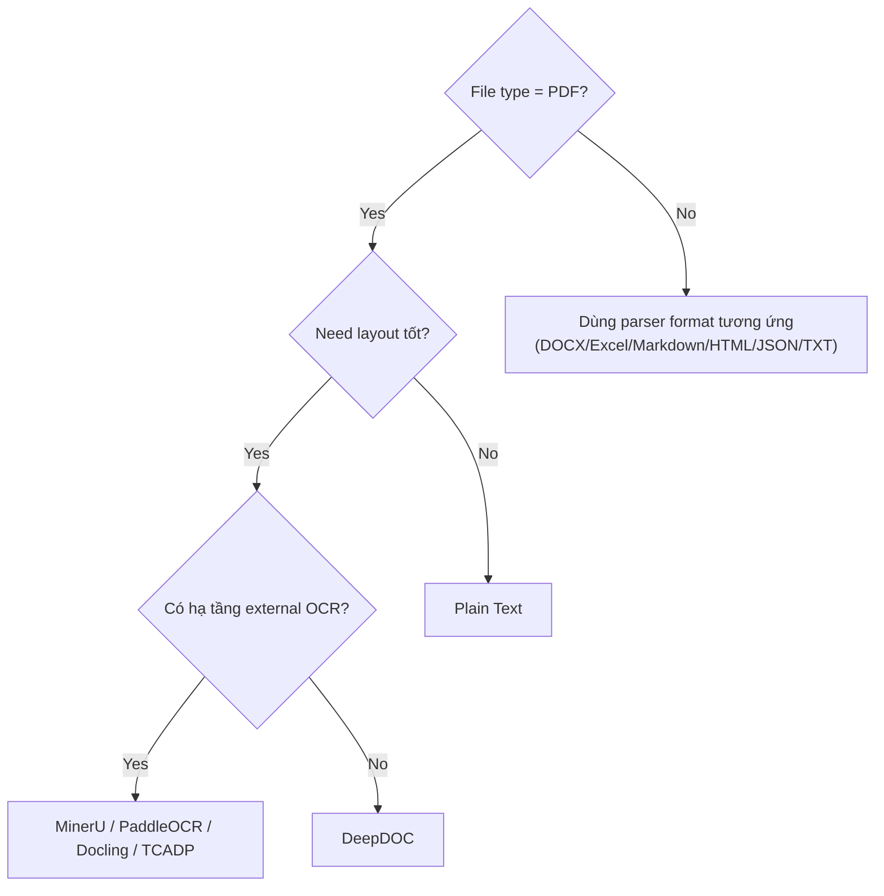

# 02. Danh mục parser và so sánh

## 1) Nhóm parser nghiệp vụ (`parser_id`)

Nguồn chuẩn: `common/constants.py::ParserType`, map chạy thực tế ở `rag/svr/task_executor.py::FACTORY`.

| parser_id | Module chính | Mục tiêu |
|---|---|---|
| `naive` | `rag/app/naive.py` | Parse đa định dạng tổng quát |
| `qa` | `rag/app/qa.py` | Tối ưu tài liệu dạng hỏi-đáp |
| `table` | `rag/app/table.py` | Tối ưu bảng dữ liệu |
| `paper` | `rag/app/paper.py` | Tài liệu học thuật |
| `book` | `rag/app/book.py` | Tài liệu dài dạng sách |
| `manual` | `rag/app/manual.py` | Tài liệu hướng dẫn/manual |
| `laws` | `rag/app/laws.py` | Văn bản luật/quy định |
| `presentation` | `rag/app/presentation.py` | Slide/presentation |
| `resume` | `rag/app/resume.py` | Hồ sơ CV |
| `picture` | `rag/app/picture.py` | Ảnh |
| `audio` | `rag/app/audio.py` | Audio |
| `email` | `rag/app/email.py` | Email |
| `one`, `tag`, `knowledge_graph` | module tương ứng | use-case đặc thù |

---

## 2) Nhóm parser định dạng trong `deepdoc/parser`

| File | Class chính | Đầu vào chính | Đầu ra chính |
|---|---|---|---|
| `pdf_parser.py` | `RAGFlowPdfParser` | PDF path/bytes | sections có vị trí + tables/figures |
| `docx_parser.py` | `RAGFlowDocxParser` | DOCX | đoạn văn + bảng |
| `excel_parser.py` | `RAGFlowExcelParser` | XLSX/CSV | text bảng/HTML bảng + ảnh sheet |
| `ppt_parser.py` | `RAGFlowPptParser` | PPT/PPTX | text theo slide |
| `txt_parser.py` | `RAGFlowTxtParser` | TXT/code text | chunk text theo delimiter/token |
| `markdown_parser.py` | `RAGFlowMarkdownParser` | Markdown | phần text + table markdown/html |
| `html_parser.py` | `RAGFlowHtmlParser` | HTML | block text + table |
| `json_parser.py` | `RAGFlowJsonParser` | JSON/JSONL | chunk JSON giữ cấu trúc |
| `docling_parser.py` | `DoclingParser` | PDF | section/table qua Docling |
| `mineru_parser.py` | `MinerUParser` | PDF | section/table qua MinerU |
| `paddleocr_parser.py` | `PaddleOCRParser` | PDF | section/table qua PaddleOCR API |
| `tcadp_parser.py` | `TCADPParser` | PDF/XLSX/CSV/PPT... | section/table qua Tencent CADP |

---

## 3) So sánh parser PDF backend trong `naive`

Trong `rag/app/naive.py`, PDF parse chọn theo `parser_config.layout_recognize` (đã normalize).

| layout_recognize | Hàm gọi | Ưu điểm | Hạn chế |
|---|---|---|---|
| `DeepDOC` | `by_deepdoc` | Nội bộ, giữ vị trí tốt, tích hợp sâu | Nặng tính toán với PDF khó |
| `Plain Text` | `by_plaintext` | Nhanh, ít phụ thuộc | Mất cấu trúc layout |
| `Docling` | `by_docling` | Chất lượng tốt với tài liệu khó | Phụ thuộc server/package docling |
| `MinerU` | `by_mineru` | OCR/layout mạnh ở một số tài liệu scan | Phụ thuộc model/service MinerU |
| `PaddleOCR` | `by_paddleocr` | Tốt cho OCR API external | Cần API URL/token |
| `TCADP Parser` | `by_tcadp` | Hỗ trợ cloud parser + spreadsheet | Phụ thuộc Tencent Cloud API |

---

## 4) Tiêu chí chọn parser

1. **Định dạng đầu vào**: PDF, DOCX, XLSX, JSON...
2. **Mục tiêu chunking**: semantic chunk, bảng, QA, resume...
3. **Yêu cầu vị trí/crop ảnh**: cần hay không cần tọa độ
4. **Chi phí vận hành**: local model vs external API
5. **Độ ổn định**: fallback khi parser external lỗi

---

## 5) Sơ đồ quyết định nhanh

