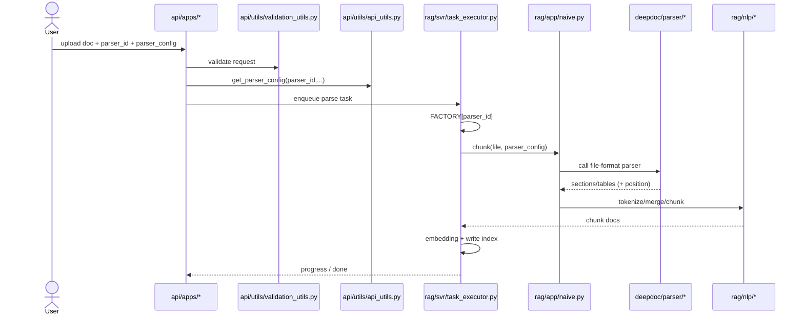

# 03. Luồng thực thi parser end-to-end

## 1) Luồng từ API đến chunk

### Bước A - tạo/cập nhật cấu hình parser

- API nhận `parser_id` + `parser_config`.
- `api/utils/api_utils.py::get_parser_config` merge default theo `parser_id`.
- `api/utils/validation_utils.py` kiểm tra hợp lệ `chunk_method` và schema `parser_config`.

### Bước B - task executor chọn parser nghiệp vụ

- `rag/svr/task_executor.py` đọc task.
- Lấy module qua `FACTORY[task["parser_id"].lower()]`.
- Gọi `chunk(...)` của module được chọn.

### Bước C - parser nghiệp vụ chọn parser định dạng

- Ví dụ `rag/app/naive.py::chunk`:
  - Phân nhánh theo extension file
  - PDF: đọc `parser_config.layout_recognize` -> chọn backend parse (`DeepDOC`, `Docling`, `MinerU`, `PaddleOCR`, `TCADP`, `Plain Text`)
  - DOCX/XLSX/Markdown/HTML/JSON/TXT: gọi parser tương ứng trong `deepdoc/parser`

### Bước D - tokenize + indexing

- Kết quả sections/tables đi qua `rag/nlp/*` để tokenize/chunk.
- Task executor embedding và ghi vào document store.

---

## 2) Sơ đồ sequence

---

## 3) Điểm dễ lỗi trong thực tế

1. `parser_id` hợp lệ nhưng `parser_config` thiếu key quan trọng.
2. PDF external parser (MinerU/PaddleOCR/TCADP/Docling) lỗi môi trường/API.
3. Input xấu (font encoding hỏng) -> OCR fallback cần hoạt động tốt.
4. Không đồng bộ giữa giá trị UI (`layout_recognize`) và backend normalize.

---

## 4) Best practices khi vận hành

- Luôn log rõ parser backend đang dùng (`layout_recognize`, model name).
- Giữ fallback an toàn về `Plain Text` hoặc `DeepDOC` khi parser external lỗi.
- Với tài liệu bảng nặng, kiểm tra `html4excel`, `table_context_size`, `image_context_size`.
- Với parser mới, thêm test ít nhất cho:
  - chọn parser đúng theo config
  - parse thành công case cơ bản
  - fallback khi parser không sẵn sàng
