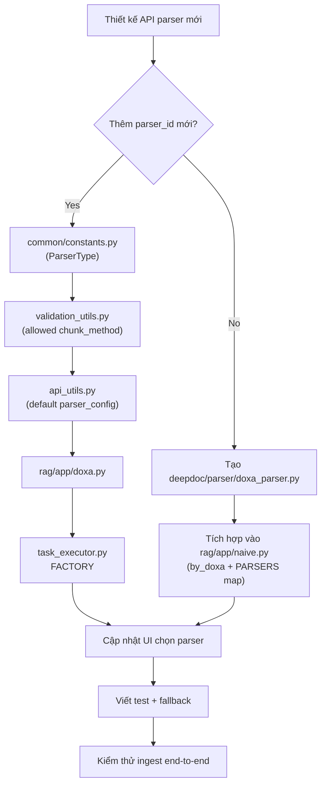

# 04. Thêm parser mới `doxa_parser` cần cập nhật gì?

Tài liệu này mô tả checklist kỹ thuật nếu muốn thêm một parser mới tên `doxa_parser` vào hệ thống hiện tại.

## 1) Quyết định trước khi code

Bạn cần chốt `doxa_parser` thuộc loại nào:

1. **Parser nghiệp vụ mới** (thêm `parser_id` mới, ví dụ `doxa` ngang hàng `naive/table/qa`)
2. **Backend parse PDF mới** trong `naive` (thêm lựa chọn cho `layout_recognize`, ví dụ `Doxa` ngang hàng `DeepDOC/MinerU/...`)

Trong đa số trường hợp OCR/layout PDF, chọn hướng (2) là phù hợp hơn.

---

## 2) Checklist backend (bắt buộc)

### 2.1 Nếu là parser nghiệp vụ mới (`parser_id=doxa`)

1. **Khai báo enum**
   - File: `common/constants.py`
   - Thêm vào `ParserType`

2. **Cho phép validate API**
   - File: `api/utils/validation_utils.py`
   - Mở rộng `allowed` trong `validate_chunk_method`

3. **Thêm default config**
   - File: `api/utils/api_utils.py`
   - Thêm key `"doxa": {...}` trong `key_mapping`

4. **Thêm module chunk**
   - Tạo file: `rag/app/doxa.py` (hàm `chunk(...)`)

5. **Đăng ký trong task executor**
   - File: `rag/svr/task_executor.py`
   - Import `doxa` và thêm vào `FACTORY`

### 2.2 Nếu là backend parse PDF mới trong `naive`

1. **Implement parser class**
   - Ví dụ tạo: `deepdoc/parser/doxa_parser.py`
   - Chuẩn API nên tương tự: `check_installation()`, `parse_pdf(...)`, `crop(...)` (nếu cần)

2. **Tích hợp vào `rag/app/naive.py`**
   - Thêm hàm `by_doxa(...)`
   - Thêm vào dict `PARSERS = { ..., "doxa": by_doxa }`
   - Đảm bảo mapping từ `layout_recognize` đến key `"doxa"` (lowercase)

3. **(Tuỳ chọn) normalize tên parser**
   - File: `common/parser_config_utils.py`
   - Nếu dùng alias kiểu `model@doxa`, thêm logic normalize tương tự MinerU/PaddleOCR

---

## 3) Checklist frontend (nếu cần chọn từ UI)

1. File: `web/src/components/layout-recognize-form-field.tsx`
   - Thêm option hiển thị parser mới trong `ParseDocumentType`

2. File: `web/src/pages/dataset/dataset-setting/form-schema.ts`
   - Thêm field cấu hình riêng (nếu `doxa_parser` có tham số)

3. File: `web/src/pages/dataset/dataset-setting/index.tsx`
   - Thêm default values cho các field `doxa_*`

4. Các form parser cho agent/pipeline
   - `web/src/pages/agent/form/parser-form/*`
   - Nếu parser mới có UI riêng cho PDF/spreadsheet, bổ sung condition render field

---

## 4) Sơ đồ thay đổi khi thêm `doxa_parser`



---

## 5) Mẫu khung code tối thiểu

```python
# deepdoc/parser/doxa_parser.py
class DoxaParser:
    def __init__(self, **kwargs):
        ...

    def check_installation(self):
        return True, ""

    def parse_pdf(self, filepath, binary=None, callback=None, **kwargs):
        sections = []
        tables = []
        return sections, tables
```

```python
# rag/app/naive.py
def by_doxa(filename, binary=None, callback=None, **kwargs):
    parser = DoxaParser(...)
    sections, tables = parser.parse_pdf(filepath=filename, binary=binary, callback=callback, **kwargs)
    return sections, tables, parser

PARSERS = {
    ...,
    "doxa": by_doxa,
}
```

---

## 6) Danh sách test đề xuất

1. Unit test chọn parser đúng theo `layout_recognize`.
2. Unit test parse thành công file PDF mẫu.
3. Unit test fallback khi `check_installation=False`.
4. Integration test tạo task -> parse -> chunk -> write index.
