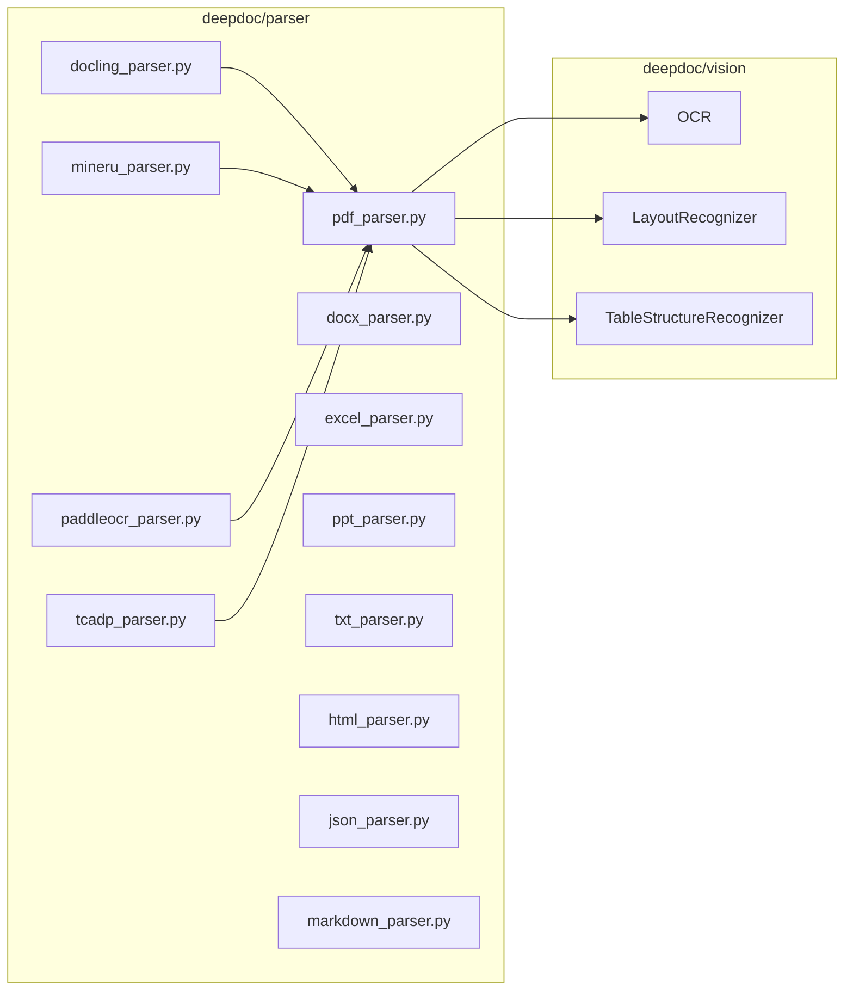

# DeepDOC 01 - Tổng quan

## 1) DeepDOC là gì trong RAGFlow?

`deepdoc` là lớp parser định dạng tài liệu, chịu trách nhiệm chuyển tài liệu thô thành dữ liệu có cấu trúc để chunk/index.

Thành phần chính:

- `deepdoc/vision/*`: OCR, layout recognition, table structure recognition
- `deepdoc/parser/*`: parser theo định dạng và parser mở rộng OCR/API

---

## 2) Vai trò của `deepdoc/parser/__init__.py`

File này export parser chuẩn dùng phổ biến:

- `PdfParser` (`RAGFlowPdfParser`)
- `PlainParser`
- `DocxParser`
- `ExcelParser`
- `PptParser`
- `HtmlParser`
- `JsonParser`
- `MarkdownParser`
- `TxtParser`

Đây là API nhập khẩu gọn cho lớp ứng dụng (`rag/app/*`).

---

## 3) Đầu ra chuẩn của parser DeepDOC

Tuỳ định dạng nhưng thường có:

1. `sections`: danh sách đoạn text (thường kèm position tag với PDF)
2. `tables`: dữ liệu bảng, có thể kèm ảnh/caption/ngữ cảnh
3. metadata phụ trợ (trong một số parser external)

Với PDF, vị trí thường được biểu diễn bằng tag dạng:

`@@page\tleft\tright\ttop\tbottom##`

---

## 4) Sơ đồ module DeepDOC

---

## 5) Điểm mạnh / hạn chế của DeepDOC

### Điểm mạnh

- Tích hợp chặt với pipeline chunk của RAGFlow
- Hỗ trợ nhiều định dạng tài liệu
- PDF parser có cơ chế OCR fallback cho text lỗi mã hóa font

### Hạn chế

- PDF parser nội bộ khá phức tạp, khó bảo trì nếu không nắm pipeline
- Một số parser external phụ thuộc hạ tầng ngoài (API/server/model)
