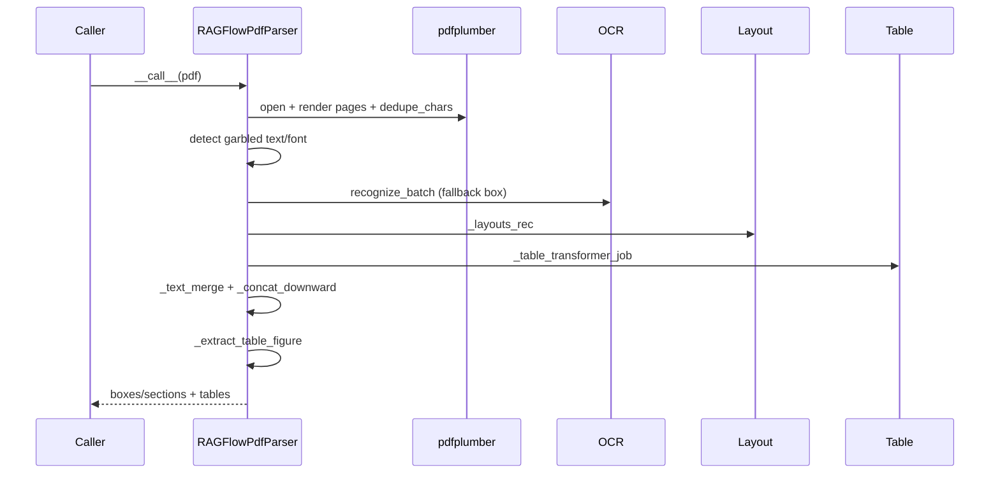

# DeepDOC 02 - PDF parser chi tiết (trọng tâm)

## 1) Class lõi

File: `deepdoc/parser/pdf_parser.py`

Class trung tâm: `RAGFlowPdfParser`

Thành phần chính trong `__init__`:

- `self.ocr = OCR()`
- `self.layouter = LayoutRecognizer(...)` hoặc `AscendLayoutRecognizer(...)`
- `self.tbl_det = TableStructureRecognizer()`
- `self.updown_cnt_mdl = xgboost model` để hỗ trợ ghép text theo chiều dọc/ngữ cảnh

---

## 2) Pipeline xử lý PDF

Luồng chính trong `__call__`:

1. `__images__` - đọc trang, render ảnh, thu chars (pdfplumber), OCR theo box
2. `_layouts_rec` - nhận diện layout (text/title/table/figure/...)
3. `_table_transformer_job` - trích xuất/cấu trúc bảng
4. `_text_merge` + `_concat_downward` + `_filter_forpages` - hợp nhất text và chuẩn hoá
5. `_extract_table_figure` - trả dữ liệu bảng/hình

---

## 3) Cơ chế OCR fallback thông minh

Điểm nổi bật của parser này là phát hiện text trích xuất hỏng và fallback OCR:

- `_is_garbled_text(...)`:
  - phát hiện CID pattern `(cid:123)`
  - phát hiện ký tự private use / replacement / control bất thường

- `_is_garbled_by_font_encoding(...)`:
  - phát hiện lỗi mapping font subset (thường PDF CJK cũ)
  - nếu text có đặc trưng hỏng -> xoá chars để ép OCR

Hệ quả: parser bền hơn với PDF chất lượng font kém.

---

## 4) Cơ chế layout + merge text

### `_layouts_rec`

- Dùng `layouter` để gán `layout_type`, `layoutno`, box semantics.
- Chuẩn hóa toạ độ theo cumulative page height.

### `_assign_column`

- Dùng KMeans trên `x0` để ước lượng số cột theo trang.
- Gán `col_id` cho box, hỗ trợ merge theo cột.

### `_text_merge`

- Merge ngang các box liền kề cùng layout/cột/trang.

### `_naive_vertical_merge` / `_concat_downward`

- Merge dọc theo heuristic + model feature.
- Loại bỏ dòng rác, cải thiện reading order.

---

## 5) Position tag và crop

Hai API rất quan trọng cho downstream:

- `remove_tag(txt)`
  - xoá marker vị trí khỏi text

- `crop(text, need_position=False)`
  - dựa trên tag `@@...##` để cắt vùng ảnh tương ứng
  - dùng cho hiển thị/snippet hình ở truy vấn sau này

---

## 6) Các parser PDF liên quan trong cùng file

- `PlainParser`
  - chỉ đọc text tuyến tính từ `pypdf`
  - nhanh nhưng không giữ layout sâu

- `VisionParser(RAGFlowPdfParser)`
  - parse theo ảnh trang bằng vision LLM
  - phù hợp trường hợp OCR/describe theo trang

---

## 7) Sequence nội bộ DeepDOC PDF

---

## 8) Ưu và nhược điểm PDF parser DeepDOC

### Ưu điểm

- Giữ vị trí rất tốt (tag + crop)
- Có OCR fallback khi font encoding hỏng
- Có phân tích layout/bảng/hình chi tiết

### Nhược điểm

- Logic dày đặc, khó onboard nhanh
- Phụ thuộc nhiều bước nên độ trễ có thể cao với file lớn
- Cần tuning theo ngôn ngữ/chất lượng scan
