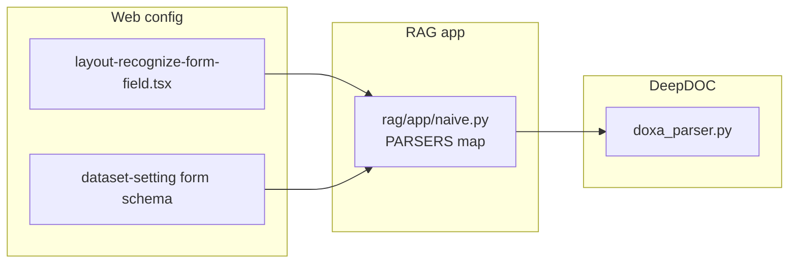

# DeepDOC 04 - Điểm mở rộng và tích hợp parser mới

## 1) Mục tiêu mở rộng

Khi thêm parser mới (ví dụ `doxa_parser`) vào lớp định dạng, mục tiêu là:

- Cắm parser mới vào nhánh PDF trong `naive.chunk`
- Không phá API đầu ra hiện có (`sections`, `tables`)
- Hỗ trợ fallback và log rõ ràng

---

## 2) Hợp đồng (contract) nên giữ

Để tương thích tối đa với pipeline hiện tại, parser mới nên cung cấp:

1. `check_installation()`
2. `parse_pdf(filepath, binary=None, callback=None, **kwargs)`
3. (nếu có vị trí) hỗ trợ tag/crop hoặc API tương đương

Đầu ra nên theo chuẩn gần giống parser PDF hiện tại:

- `sections`: list tuple text + tag/metadata
- `tables`: list tuple bảng/hình

---

## 3) Điểm tích hợp cụ thể trong mã nguồn

### Bước 1 - tạo parser class

- Tạo file mới `deepdoc/parser/doxa_parser.py`

### Bước 2 - nối vào `rag/app/naive.py`

- Thêm hàm `by_doxa(...)`
- Đăng ký `"doxa": by_doxa` trong dict `PARSERS`

### Bước 3 - cập nhật UI lựa chọn parser

- `web/src/components/layout-recognize-form-field.tsx`
  - thêm item hiển thị parser mới

### Bước 4 - thêm parser-specific config (nếu có)

- `web/src/pages/dataset/dataset-setting/form-schema.ts`
- `web/src/pages/dataset/dataset-setting/index.tsx`
- backend merge/default ở `api/utils/api_utils.py` (nếu cần)

---

## 4) Sơ đồ tích hợp `doxa_parser`

---

## 5) Khuyến nghị triển khai an toàn

1. Luôn có fallback nếu parser mới unavailable.
2. Không thay đổi format output hiện hữu trừ khi cập nhật toàn bộ downstream.
3. Log đầy đủ parser backend, thời gian parse, số section/table.
4. Thêm test cho cả nhánh thành công và thất bại.
