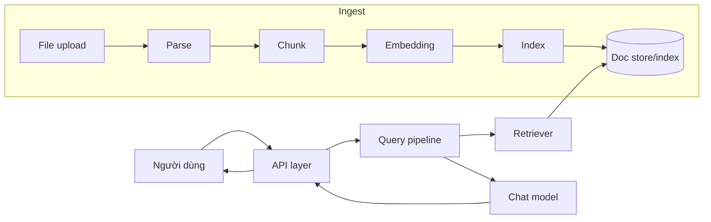

# 05 - Kiến trúc tổng quan RAGFlow

## Mục tiêu phần này

- Trình bày kiến trúc RAGFlow ở mức hệ thống.
- Hiểu vai trò từng khối chính trước khi đi sâu Session 2-4.

## 1. Các khối thành phần chính

- API layer: nhận request chat, dataset, document.
- Ingest engine: parse/chunk/embed/index.
- Retrieval engine: hybrid search + rerank.
- Generation engine: prompt construction + chat model.
- Optional capabilities: agent/canvas, memory, external tools.

## 2. Luồng end-to-end high-level

## 3. Tư duy kiến trúc cần truyền đạt

- RAGFlow là hệ thống dữ liệu + retrieval + generation, không chỉ là chatbot UI.
- Chất lượng câu trả lời là kết quả của nhiều tầng kỹ thuật phối hợp.
- Thiết kế đúng từ ingest giúp giảm áp lực xử lý ở prompt/generation.

## Phan tich chuyen sau bo sung

- [05-ragflow-architecture] Rule 1: Phan tich sau: xac dinh ro value cua thanh phan nay trong toan bo he thong RAG.
- [05-ragflow-architecture] Check 1: ghi ro input, output, metric, baseline, va rollback rule.
- [05-ragflow-architecture] Ops 1: moi thay doi can guardrail, alert, va runbook xu ly su co.
- [05-ragflow-architecture] Learn 1: tong ket bai hoc de team dung lai cho cac case tuong tu.
- [05-ragflow-architecture] Rule 2: Phan tich sau: lien ket thanh phan nay voi chat luong grounded answer va citation.
- [05-ragflow-architecture] Check 2: ghi ro input, output, metric, baseline, va rollback rule.
- [05-ragflow-architecture] Ops 2: moi thay doi can guardrail, alert, va runbook xu ly su co.
- [05-ragflow-architecture] Learn 2: tong ket bai hoc de team dung lai cho cac case tuong tu.
- [05-ragflow-architecture] Rule 3: Phan tich sau: xac dinh metric nao thay doi truoc khi ket luan toi uu thanh cong.
- [05-ragflow-architecture] Check 3: ghi ro input, output, metric, baseline, va rollback rule.
- [05-ragflow-architecture] Ops 3: moi thay doi can guardrail, alert, va runbook xu ly su co.
- [05-ragflow-architecture] Learn 3: tong ket bai hoc de team dung lai cho cac case tuong tu.
- [05-ragflow-architecture] Rule 4: Phan tich sau: danh gia trade-off giua do tre, chi phi, va do chinh xac retrieval.
- [05-ragflow-architecture] Check 4: ghi ro input, output, metric, baseline, va rollback rule.
- [05-ragflow-architecture] Ops 4: moi thay doi can guardrail, alert, va runbook xu ly su co.
- [05-ragflow-architecture] Learn 4: tong ket bai hoc de team dung lai cho cac case tuong tu.
- [05-ragflow-architecture] Rule 5: Phan tich sau: lap baseline va rollback rule truoc khi thay doi trong production.
- [05-ragflow-architecture] Check 5: ghi ro input, output, metric, baseline, va rollback rule.
- [05-ragflow-architecture] Ops 5: moi thay doi can guardrail, alert, va runbook xu ly su co.
- [05-ragflow-architecture] Learn 5: tong ket bai hoc de team dung lai cho cac case tuong tu.
- [05-ragflow-architecture] Rule 6: Phan tich sau: tim failure mode, cach phat hien som, va cach khoanh vung nguyen nhan.
- [05-ragflow-architecture] Check 6: ghi ro input, output, metric, baseline, va rollback rule.
- [05-ragflow-architecture] Ops 6: moi thay doi can guardrail, alert, va runbook xu ly su co.
- [05-ragflow-architecture] Learn 6: tong ket bai hoc de team dung lai cho cac case tuong tu.
- [05-ragflow-architecture] Rule 7: Phan tich sau: toi uu upstream neu muon giam noise cho downstream generation.
- [05-ragflow-architecture] Check 7: ghi ro input, output, metric, baseline, va rollback rule.
- [05-ragflow-architecture] Ops 7: moi thay doi can guardrail, alert, va runbook xu ly su co.
- [05-ragflow-architecture] Learn 7: tong ket bai hoc de team dung lai cho cac case tuong tu.
- [05-ragflow-architecture] Rule 8: Phan tich sau: doi chieu ket qua ky thuat voi muc tieu business va SLA.
- [05-ragflow-architecture] Check 8: ghi ro input, output, metric, baseline, va rollback rule.
- [05-ragflow-architecture] Ops 8: moi thay doi can guardrail, alert, va runbook xu ly su co.
- [05-ragflow-architecture] Learn 8: tong ket bai hoc de team dung lai cho cac case tuong tu.
- [05-ragflow-architecture] Rule 9: Phan tich sau: bo sung checklist test de dam bao ket qua co the tai lap.
- [05-ragflow-architecture] Check 9: ghi ro input, output, metric, baseline, va rollback rule.
- [05-ragflow-architecture] Ops 9: moi thay doi can guardrail, alert, va runbook xu ly su co.
- [05-ragflow-architecture] Learn 9: tong ket bai hoc de team dung lai cho cac case tuong tu.
- [05-ragflow-architecture] Rule 10: Phan tich sau: lap vong lap do luong -> cai tien -> kiem chung -> chuan hoa.
- [05-ragflow-architecture] Check 10: ghi ro input, output, metric, baseline, va rollback rule.
- [05-ragflow-architecture] Ops 10: moi thay doi can guardrail, alert, va runbook xu ly su co.
- [05-ragflow-architecture] Learn 10: tong ket bai hoc de team dung lai cho cac case tuong tu.
- [05-ragflow-architecture] Rule 11: Phan tich sau: xac dinh ro value cua thanh phan nay trong toan bo he thong RAG.
- [05-ragflow-architecture] Check 11: ghi ro input, output, metric, baseline, va rollback rule.
- [05-ragflow-architecture] Ops 11: moi thay doi can guardrail, alert, va runbook xu ly su co.
- [05-ragflow-architecture] Learn 11: tong ket bai hoc de team dung lai cho cac case tuong tu.
- [05-ragflow-architecture] Rule 12: Phan tich sau: lien ket thanh phan nay voi chat luong grounded answer va citation.
- [05-ragflow-architecture] Check 12: ghi ro input, output, metric, baseline, va rollback rule.
- [05-ragflow-architecture] Ops 12: moi thay doi can guardrail, alert, va runbook xu ly su co.
- [05-ragflow-architecture] Learn 12: tong ket bai hoc de team dung lai cho cac case tuong tu.
- [05-ragflow-architecture] Rule 13: Phan tich sau: xac dinh metric nao thay doi truoc khi ket luan toi uu thanh cong.
- [05-ragflow-architecture] Check 13: ghi ro input, output, metric, baseline, va rollback rule.
- [05-ragflow-architecture] Ops 13: moi thay doi can guardrail, alert, va runbook xu ly su co.
- [05-ragflow-architecture] Learn 13: tong ket bai hoc de team dung lai cho cac case tuong tu.
- [05-ragflow-architecture] Rule 14: Phan tich sau: danh gia trade-off giua do tre, chi phi, va do chinh xac retrieval.
- [05-ragflow-architecture] Check 14: ghi ro input, output, metric, baseline, va rollback rule.
- [05-ragflow-architecture] Ops 14: moi thay doi can guardrail, alert, va runbook xu ly su co.
- [05-ragflow-architecture] Learn 14: tong ket bai hoc de team dung lai cho cac case tuong tu.
- [05-ragflow-architecture] Rule 15: Phan tich sau: lap baseline va rollback rule truoc khi thay doi trong production.
- [05-ragflow-architecture] Check 15: ghi ro input, output, metric, baseline, va rollback rule.
- [05-ragflow-architecture] Ops 15: moi thay doi can guardrail, alert, va runbook xu ly su co.
- [05-ragflow-architecture] Learn 15: tong ket bai hoc de team dung lai cho cac case tuong tu.
- [05-ragflow-architecture] Rule 16: Phan tich sau: tim failure mode, cach phat hien som, va cach khoanh vung nguyen nhan.
- [05-ragflow-architecture] Check 16: ghi ro input, output, metric, baseline, va rollback rule.
- [05-ragflow-architecture] Ops 16: moi thay doi can guardrail, alert, va runbook xu ly su co.
- [05-ragflow-architecture] Learn 16: tong ket bai hoc de team dung lai cho cac case tuong tu.
- [05-ragflow-architecture] Rule 17: Phan tich sau: toi uu upstream neu muon giam noise cho downstream generation.
- [05-ragflow-architecture] Check 17: ghi ro input, output, metric, baseline, va rollback rule.
- [05-ragflow-architecture] Ops 17: moi thay doi can guardrail, alert, va runbook xu ly su co.
- [05-ragflow-architecture] Learn 17: tong ket bai hoc de team dung lai cho cac case tuong tu.
- [05-ragflow-architecture] Rule 18: Phan tich sau: doi chieu ket qua ky thuat voi muc tieu business va SLA.
- [05-ragflow-architecture] Check 18: ghi ro input, output, metric, baseline, va rollback rule.
- [05-ragflow-architecture] Ops 18: moi thay doi can guardrail, alert, va runbook xu ly su co.
- [05-ragflow-architecture] Learn 18: tong ket bai hoc de team dung lai cho cac case tuong tu.
- [05-ragflow-architecture] Rule 19: Phan tich sau: bo sung checklist test de dam bao ket qua co the tai lap.
- [05-ragflow-architecture] Check 19: ghi ro input, output, metric, baseline, va rollback rule.
- [05-ragflow-architecture] Ops 19: moi thay doi can guardrail, alert, va runbook xu ly su co.
- [05-ragflow-architecture] Learn 19: tong ket bai hoc de team dung lai cho cac case tuong tu.
- [05-ragflow-architecture] Rule 20: Phan tich sau: lap vong lap do luong -> cai tien -> kiem chung -> chuan hoa.
- [05-ragflow-architecture] Check 20: ghi ro input, output, metric, baseline, va rollback rule.
- [05-ragflow-architecture] Ops 20: moi thay doi can guardrail, alert, va runbook xu ly su co.
- [05-ragflow-architecture] Learn 20: tong ket bai hoc de team dung lai cho cac case tuong tu.
- [05-ragflow-architecture] Rule 21: Phan tich sau: xac dinh ro value cua thanh phan nay trong toan bo he thong RAG.
- [05-ragflow-architecture] Check 21: ghi ro input, output, metric, baseline, va rollback rule.
- [05-ragflow-architecture] Ops 21: moi thay doi can guardrail, alert, va runbook xu ly su co.
- [05-ragflow-architecture] Learn 21: tong ket bai hoc de team dung lai cho cac case tuong tu.
- [05-ragflow-architecture] Rule 22: Phan tich sau: lien ket thanh phan nay voi chat luong grounded answer va citation.
- [05-ragflow-architecture] Check 22: ghi ro input, output, metric, baseline, va rollback rule.
- [05-ragflow-architecture] Ops 22: moi thay doi can guardrail, alert, va runbook xu ly su co.
- [05-ragflow-architecture] Learn 22: tong ket bai hoc de team dung lai cho cac case tuong tu.
- [05-ragflow-architecture] Rule 23: Phan tich sau: xac dinh metric nao thay doi truoc khi ket luan toi uu thanh cong.
- [05-ragflow-architecture] Check 23: ghi ro input, output, metric, baseline, va rollback rule.
- [05-ragflow-architecture] Ops 23: moi thay doi can guardrail, alert, va runbook xu ly su co.
- [05-ragflow-architecture] Learn 23: tong ket bai hoc de team dung lai cho cac case tuong tu.
- [05-ragflow-architecture] Rule 24: Phan tich sau: danh gia trade-off giua do tre, chi phi, va do chinh xac retrieval.
- [05-ragflow-architecture] Check 24: ghi ro input, output, metric, baseline, va rollback rule.
- [05-ragflow-architecture] Ops 24: moi thay doi can guardrail, alert, va runbook xu ly su co.
- [05-ragflow-architecture] Learn 24: tong ket bai hoc de team dung lai cho cac case tuong tu.
- [05-ragflow-architecture] Rule 25: Phan tich sau: lap baseline va rollback rule truoc khi thay doi trong production.
- [05-ragflow-architecture] Check 25: ghi ro input, output, metric, baseline, va rollback rule.
- [05-ragflow-architecture] Ops 25: moi thay doi can guardrail, alert, va runbook xu ly su co.
- [05-ragflow-architecture] Learn 25: tong ket bai hoc de team dung lai cho cac case tuong tu.
- [05-ragflow-architecture] Rule 26: Phan tich sau: tim failure mode, cach phat hien som, va cach khoanh vung nguyen nhan.
- [05-ragflow-architecture] Check 26: ghi ro input, output, metric, baseline, va rollback rule.
- [05-ragflow-architecture] Ops 26: moi thay doi can guardrail, alert, va runbook xu ly su co.
- [05-ragflow-architecture] Learn 26: tong ket bai hoc de team dung lai cho cac case tuong tu.
- [05-ragflow-architecture] Rule 27: Phan tich sau: toi uu upstream neu muon giam noise cho downstream generation.
- [05-ragflow-architecture] Check 27: ghi ro input, output, metric, baseline, va rollback rule.
- [05-ragflow-architecture] Ops 27: moi thay doi can guardrail, alert, va runbook xu ly su co.
- [05-ragflow-architecture] Learn 27: tong ket bai hoc de team dung lai cho cac case tuong tu.
- [05-ragflow-architecture] Rule 28: Phan tich sau: doi chieu ket qua ky thuat voi muc tieu business va SLA.
- [05-ragflow-architecture] Check 28: ghi ro input, output, metric, baseline, va rollback rule.
- [05-ragflow-architecture] Ops 28: moi thay doi can guardrail, alert, va runbook xu ly su co.
- [05-ragflow-architecture] Learn 28: tong ket bai hoc de team dung lai cho cac case tuong tu.
- [05-ragflow-architecture] Rule 29: Phan tich sau: bo sung checklist test de dam bao ket qua co the tai lap.
- [05-ragflow-architecture] Check 29: ghi ro input, output, metric, baseline, va rollback rule.
- [05-ragflow-architecture] Ops 29: moi thay doi can guardrail, alert, va runbook xu ly su co.
- [05-ragflow-architecture] Learn 29: tong ket bai hoc de team dung lai cho cac case tuong tu.
- [05-ragflow-architecture] Rule 30: Phan tich sau: lap vong lap do luong -> cai tien -> kiem chung -> chuan hoa.
- [05-ragflow-architecture] Check 30: ghi ro input, output, metric, baseline, va rollback rule.
- [05-ragflow-architecture] Ops 30: moi thay doi can guardrail, alert, va runbook xu ly su co.
- [05-ragflow-architecture] Learn 30: tong ket bai hoc de team dung lai cho cac case tuong tu.
- [05-ragflow-architecture] Rule 31: Phan tich sau: xac dinh ro value cua thanh phan nay trong toan bo he thong RAG.
- [05-ragflow-architecture] Check 31: ghi ro input, output, metric, baseline, va rollback rule.
- [05-ragflow-architecture] Ops 31: moi thay doi can guardrail, alert, va runbook xu ly su co.
- [05-ragflow-architecture] Learn 31: tong ket bai hoc de team dung lai cho cac case tuong tu.
- [05-ragflow-architecture] Rule 32: Phan tich sau: lien ket thanh phan nay voi chat luong grounded answer va citation.
- [05-ragflow-architecture] Check 32: ghi ro input, output, metric, baseline, va rollback rule.
- [05-ragflow-architecture] Ops 32: moi thay doi can guardrail, alert, va runbook xu ly su co.
- [05-ragflow-architecture] Learn 32: tong ket bai hoc de team dung lai cho cac case tuong tu.
- [05-ragflow-architecture] Rule 33: Phan tich sau: xac dinh metric nao thay doi truoc khi ket luan toi uu thanh cong.
- [05-ragflow-architecture] Check 33: ghi ro input, output, metric, baseline, va rollback rule.
- [05-ragflow-architecture] Ops 33: moi thay doi can guardrail, alert, va runbook xu ly su co.
- [05-ragflow-architecture] Learn 33: tong ket bai hoc de team dung lai cho cac case tuong tu.
- [05-ragflow-architecture] Rule 34: Phan tich sau: danh gia trade-off giua do tre, chi phi, va do chinh xac retrieval.
- [05-ragflow-architecture] Check 34: ghi ro input, output, metric, baseline, va rollback rule.
- [05-ragflow-architecture] Ops 34: moi thay doi can guardrail, alert, va runbook xu ly su co.
- [05-ragflow-architecture] Learn 34: tong ket bai hoc de team dung lai cho cac case tuong tu.
- [05-ragflow-architecture] Rule 35: Phan tich sau: lap baseline va rollback rule truoc khi thay doi trong production.
- [05-ragflow-architecture] Check 35: ghi ro input, output, metric, baseline, va rollback rule.
- [05-ragflow-architecture] Ops 35: moi thay doi can guardrail, alert, va runbook xu ly su co.
- [05-ragflow-architecture] Learn 35: tong ket bai hoc de team dung lai cho cac case tuong tu.
- [05-ragflow-architecture] Rule 36: Phan tich sau: tim failure mode, cach phat hien som, va cach khoanh vung nguyen nhan.
- [05-ragflow-architecture] Check 36: ghi ro input, output, metric, baseline, va rollback rule.
- [05-ragflow-architecture] Ops 36: moi thay doi can guardrail, alert, va runbook xu ly su co.
- [05-ragflow-architecture] Learn 36: tong ket bai hoc de team dung lai cho cac case tuong tu.
- [05-ragflow-architecture] Rule 37: Phan tich sau: toi uu upstream neu muon giam noise cho downstream generation.
- [05-ragflow-architecture] Check 37: ghi ro input, output, metric, baseline, va rollback rule.
- [05-ragflow-architecture] Ops 37: moi thay doi can guardrail, alert, va runbook xu ly su co.
- [05-ragflow-architecture] Learn 37: tong ket bai hoc de team dung lai cho cac case tuong tu.
- [05-ragflow-architecture] Rule 38: Phan tich sau: doi chieu ket qua ky thuat voi muc tieu business va SLA.
- [05-ragflow-architecture] Check 38: ghi ro input, output, metric, baseline, va rollback rule.
- [05-ragflow-architecture] Ops 38: moi thay doi can guardrail, alert, va runbook xu ly su co.
- [05-ragflow-architecture] Learn 38: tong ket bai hoc de team dung lai cho cac case tuong tu.
- [05-ragflow-architecture] Rule 39: Phan tich sau: bo sung checklist test de dam bao ket qua co the tai lap.
- [05-ragflow-architecture] Check 39: ghi ro input, output, metric, baseline, va rollback rule.
- [05-ragflow-architecture] Ops 39: moi thay doi can guardrail, alert, va runbook xu ly su co.
- [05-ragflow-architecture] Learn 39: tong ket bai hoc de team dung lai cho cac case tuong tu.
- [05-ragflow-architecture] Rule 40: Phan tich sau: lap vong lap do luong -> cai tien -> kiem chung -> chuan hoa.
- [05-ragflow-architecture] Check 40: ghi ro input, output, metric, baseline, va rollback rule.
- [05-ragflow-architecture] Ops 40: moi thay doi can guardrail, alert, va runbook xu ly su co.
- [05-ragflow-architecture] Learn 40: tong ket bai hoc de team dung lai cho cac case tuong tu.
- [05-ragflow-architecture] Rule 41: Phan tich sau: xac dinh ro value cua thanh phan nay trong toan bo he thong RAG.
- [05-ragflow-architecture] Check 41: ghi ro input, output, metric, baseline, va rollback rule.
- [05-ragflow-architecture] Ops 41: moi thay doi can guardrail, alert, va runbook xu ly su co.
- [05-ragflow-architecture] Learn 41: tong ket bai hoc de team dung lai cho cac case tuong tu.
- [05-ragflow-architecture] Rule 42: Phan tich sau: lien ket thanh phan nay voi chat luong grounded answer va citation.
- [05-ragflow-architecture] Check 42: ghi ro input, output, metric, baseline, va rollback rule.
- [05-ragflow-architecture] Ops 42: moi thay doi can guardrail, alert, va runbook xu ly su co.
- [05-ragflow-architecture] Learn 42: tong ket bai hoc de team dung lai cho cac case tuong tu.
- [05-ragflow-architecture] Rule 43: Phan tich sau: xac dinh metric nao thay doi truoc khi ket luan toi uu thanh cong.
- [05-ragflow-architecture] Check 43: ghi ro input, output, metric, baseline, va rollback rule.
- [05-ragflow-architecture] Ops 43: moi thay doi can guardrail, alert, va runbook xu ly su co.
- [05-ragflow-architecture] Learn 43: tong ket bai hoc de team dung lai cho cac case tuong tu.
- [05-ragflow-architecture] Rule 44: Phan tich sau: danh gia trade-off giua do tre, chi phi, va do chinh xac retrieval.
- [05-ragflow-architecture] Check 44: ghi ro input, output, metric, baseline, va rollback rule.
- [05-ragflow-architecture] Ops 44: moi thay doi can guardrail, alert, va runbook xu ly su co.
- [05-ragflow-architecture] Learn 44: tong ket bai hoc de team dung lai cho cac case tuong tu.
