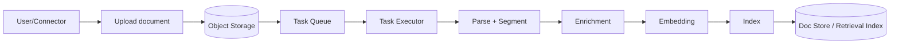

# 01 - Tổng quan Ingest Pipeline trong hệ RAG

## Mục tiêu phần này

- Hiểu ingest pipeline không chỉ là "upload và parse", mà là một chuỗi đảm bảo chất lượng cho retrieval.
- Nắm vai trò từng bước trong pipeline để biết điểm nào cần tối ưu trước.

## 1. Ingest pipeline là gì trong ngữ cảnh RAG

Trong hệ RAG production, ingest pipeline đóng vai trò ETL cho dữ liệu không cấu trúc:

- **Extract**: nhận file từ user hoặc connector, lưu vào object storage.
- **Transform**: parse tài liệu, chunking, enrichment (keywords/questions/metadata), embedding.
- **Load**: index chunks vào doc store để phục vụ truy vấn nhanh.

Điểm khác với ETL truyền thống:
- Dữ liệu đầu vào đa định dạng, nhiều layout khó (PDF scan, bảng, ảnh).
- Chất lượng transform ảnh hưởng trực tiếp chất lượng câu trả lời của LLM.
- Chuỗi này thường chạy bất đồng bộ qua task queue để scale.

## 2. Vì sao ingest là "quality gate"

Nếu ingest kém:
- Chunk không đúng nghĩa -> retrieval trả về ngữ cảnh nhiễu.
- Thiếu metadata/cấu trúc -> khó lọc theo ngữ cảnh nghiệp vụ.
- Embedding không phù hợp -> truy vấn semantic kém chính xác.

Nếu ingest tốt:
- Retrieval có cả recall và precision tốt hơn.
- Prompt gọn hơn vì context sạch hơn.
- Citation rõ hơn vì chunk chứa vị trí/tài liệu nguồn rõ ràng.

## 3. Ingest pipeline trong RAGFlow (bức tranh lớn)

Các điểm neo kỹ thuật chính:
- `rag/svr/task_executor.py`: thực thi parse/chunk/enrich/embed/index theo task.
- `rag/flow/pipeline.py`: hỗ trợ orchestratable dataflow pipeline.
- `api/utils/validation_utils.py`: validate mode parser/chunk/pipeline.
- `api/utils/api_utils.py`: merge default parser config.

## 4. KPI kỹ thuật cần theo dõi trong ingest

- Tỉ lệ parse thành công theo định dạng file.
- Thời gian ingest trung bình mỗi tài liệu.
- Số chunk/tài liệu và phân phối độ dài chunk.
- Tỉ lệ chunk "rỗng nghĩa" hoặc chunk lặp.
- Chi phí embedding token.
- Tác động downstream: hit rate retrieval, answer groundedness.

## 5. Anti-pattern thường gặp

- Dùng một cấu hình chunk cho mọi loại dữ liệu.
- Bỏ qua metadata/position khiến citation yếu.
- Tối ưu tốc độ ingest nhưng bỏ qua chất lượng parse.
- Không đánh giá ingest bằng chỉ số downstream (retrieval/answer).

## 6. Kết luận phần

Ingest không phải bước tiền xử lý phụ. Trong RAGFlow, ingest là hệ thống con quyết định nền chất lượng cho toàn bộ query pipeline.

## Phan tich chuyen sau bo sung

- [01-ingest-overview] Rule 1: Phan tich sau: xac dinh ro value cua thanh phan nay trong toan bo he thong RAG.
- [01-ingest-overview] Check 1: ghi ro input, output, metric, baseline, va rollback rule.
- [01-ingest-overview] Ops 1: moi thay doi can guardrail, alert, va runbook xu ly su co.
- [01-ingest-overview] Learn 1: tong ket bai hoc de team dung lai cho cac case tuong tu.
- [01-ingest-overview] Rule 2: Phan tich sau: lien ket thanh phan nay voi chat luong grounded answer va citation.
- [01-ingest-overview] Check 2: ghi ro input, output, metric, baseline, va rollback rule.
- [01-ingest-overview] Ops 2: moi thay doi can guardrail, alert, va runbook xu ly su co.
- [01-ingest-overview] Learn 2: tong ket bai hoc de team dung lai cho cac case tuong tu.
- [01-ingest-overview] Rule 3: Phan tich sau: xac dinh metric nao thay doi truoc khi ket luan toi uu thanh cong.
- [01-ingest-overview] Check 3: ghi ro input, output, metric, baseline, va rollback rule.
- [01-ingest-overview] Ops 3: moi thay doi can guardrail, alert, va runbook xu ly su co.
- [01-ingest-overview] Learn 3: tong ket bai hoc de team dung lai cho cac case tuong tu.
- [01-ingest-overview] Rule 4: Phan tich sau: danh gia trade-off giua do tre, chi phi, va do chinh xac retrieval.
- [01-ingest-overview] Check 4: ghi ro input, output, metric, baseline, va rollback rule.
- [01-ingest-overview] Ops 4: moi thay doi can guardrail, alert, va runbook xu ly su co.
- [01-ingest-overview] Learn 4: tong ket bai hoc de team dung lai cho cac case tuong tu.
- [01-ingest-overview] Rule 5: Phan tich sau: lap baseline va rollback rule truoc khi thay doi trong production.
- [01-ingest-overview] Check 5: ghi ro input, output, metric, baseline, va rollback rule.
- [01-ingest-overview] Ops 5: moi thay doi can guardrail, alert, va runbook xu ly su co.
- [01-ingest-overview] Learn 5: tong ket bai hoc de team dung lai cho cac case tuong tu.
- [01-ingest-overview] Rule 6: Phan tich sau: tim failure mode, cach phat hien som, va cach khoanh vung nguyen nhan.
- [01-ingest-overview] Check 6: ghi ro input, output, metric, baseline, va rollback rule.
- [01-ingest-overview] Ops 6: moi thay doi can guardrail, alert, va runbook xu ly su co.
- [01-ingest-overview] Learn 6: tong ket bai hoc de team dung lai cho cac case tuong tu.
- [01-ingest-overview] Rule 7: Phan tich sau: toi uu upstream neu muon giam noise cho downstream generation.
- [01-ingest-overview] Check 7: ghi ro input, output, metric, baseline, va rollback rule.
- [01-ingest-overview] Ops 7: moi thay doi can guardrail, alert, va runbook xu ly su co.
- [01-ingest-overview] Learn 7: tong ket bai hoc de team dung lai cho cac case tuong tu.
- [01-ingest-overview] Rule 8: Phan tich sau: doi chieu ket qua ky thuat voi muc tieu business va SLA.
- [01-ingest-overview] Check 8: ghi ro input, output, metric, baseline, va rollback rule.
- [01-ingest-overview] Ops 8: moi thay doi can guardrail, alert, va runbook xu ly su co.
- [01-ingest-overview] Learn 8: tong ket bai hoc de team dung lai cho cac case tuong tu.
- [01-ingest-overview] Rule 9: Phan tich sau: bo sung checklist test de dam bao ket qua co the tai lap.
- [01-ingest-overview] Check 9: ghi ro input, output, metric, baseline, va rollback rule.
- [01-ingest-overview] Ops 9: moi thay doi can guardrail, alert, va runbook xu ly su co.
- [01-ingest-overview] Learn 9: tong ket bai hoc de team dung lai cho cac case tuong tu.
- [01-ingest-overview] Rule 10: Phan tich sau: lap vong lap do luong -> cai tien -> kiem chung -> chuan hoa.
- [01-ingest-overview] Check 10: ghi ro input, output, metric, baseline, va rollback rule.
- [01-ingest-overview] Ops 10: moi thay doi can guardrail, alert, va runbook xu ly su co.
- [01-ingest-overview] Learn 10: tong ket bai hoc de team dung lai cho cac case tuong tu.
- [01-ingest-overview] Rule 11: Phan tich sau: xac dinh ro value cua thanh phan nay trong toan bo he thong RAG.
- [01-ingest-overview] Check 11: ghi ro input, output, metric, baseline, va rollback rule.
- [01-ingest-overview] Ops 11: moi thay doi can guardrail, alert, va runbook xu ly su co.
- [01-ingest-overview] Learn 11: tong ket bai hoc de team dung lai cho cac case tuong tu.
- [01-ingest-overview] Rule 12: Phan tich sau: lien ket thanh phan nay voi chat luong grounded answer va citation.
- [01-ingest-overview] Check 12: ghi ro input, output, metric, baseline, va rollback rule.
- [01-ingest-overview] Ops 12: moi thay doi can guardrail, alert, va runbook xu ly su co.
- [01-ingest-overview] Learn 12: tong ket bai hoc de team dung lai cho cac case tuong tu.
- [01-ingest-overview] Rule 13: Phan tich sau: xac dinh metric nao thay doi truoc khi ket luan toi uu thanh cong.
- [01-ingest-overview] Check 13: ghi ro input, output, metric, baseline, va rollback rule.
- [01-ingest-overview] Ops 13: moi thay doi can guardrail, alert, va runbook xu ly su co.
- [01-ingest-overview] Learn 13: tong ket bai hoc de team dung lai cho cac case tuong tu.
- [01-ingest-overview] Rule 14: Phan tich sau: danh gia trade-off giua do tre, chi phi, va do chinh xac retrieval.
- [01-ingest-overview] Check 14: ghi ro input, output, metric, baseline, va rollback rule.
- [01-ingest-overview] Ops 14: moi thay doi can guardrail, alert, va runbook xu ly su co.
- [01-ingest-overview] Learn 14: tong ket bai hoc de team dung lai cho cac case tuong tu.
- [01-ingest-overview] Rule 15: Phan tich sau: lap baseline va rollback rule truoc khi thay doi trong production.
- [01-ingest-overview] Check 15: ghi ro input, output, metric, baseline, va rollback rule.
- [01-ingest-overview] Ops 15: moi thay doi can guardrail, alert, va runbook xu ly su co.
- [01-ingest-overview] Learn 15: tong ket bai hoc de team dung lai cho cac case tuong tu.
- [01-ingest-overview] Rule 16: Phan tich sau: tim failure mode, cach phat hien som, va cach khoanh vung nguyen nhan.
- [01-ingest-overview] Check 16: ghi ro input, output, metric, baseline, va rollback rule.
- [01-ingest-overview] Ops 16: moi thay doi can guardrail, alert, va runbook xu ly su co.
- [01-ingest-overview] Learn 16: tong ket bai hoc de team dung lai cho cac case tuong tu.
- [01-ingest-overview] Rule 17: Phan tich sau: toi uu upstream neu muon giam noise cho downstream generation.
- [01-ingest-overview] Check 17: ghi ro input, output, metric, baseline, va rollback rule.
- [01-ingest-overview] Ops 17: moi thay doi can guardrail, alert, va runbook xu ly su co.
- [01-ingest-overview] Learn 17: tong ket bai hoc de team dung lai cho cac case tuong tu.
- [01-ingest-overview] Rule 18: Phan tich sau: doi chieu ket qua ky thuat voi muc tieu business va SLA.
- [01-ingest-overview] Check 18: ghi ro input, output, metric, baseline, va rollback rule.
- [01-ingest-overview] Ops 18: moi thay doi can guardrail, alert, va runbook xu ly su co.
- [01-ingest-overview] Learn 18: tong ket bai hoc de team dung lai cho cac case tuong tu.
- [01-ingest-overview] Rule 19: Phan tich sau: bo sung checklist test de dam bao ket qua co the tai lap.
- [01-ingest-overview] Check 19: ghi ro input, output, metric, baseline, va rollback rule.
- [01-ingest-overview] Ops 19: moi thay doi can guardrail, alert, va runbook xu ly su co.
- [01-ingest-overview] Learn 19: tong ket bai hoc de team dung lai cho cac case tuong tu.
- [01-ingest-overview] Rule 20: Phan tich sau: lap vong lap do luong -> cai tien -> kiem chung -> chuan hoa.
- [01-ingest-overview] Check 20: ghi ro input, output, metric, baseline, va rollback rule.
- [01-ingest-overview] Ops 20: moi thay doi can guardrail, alert, va runbook xu ly su co.
- [01-ingest-overview] Learn 20: tong ket bai hoc de team dung lai cho cac case tuong tu.
- [01-ingest-overview] Rule 21: Phan tich sau: xac dinh ro value cua thanh phan nay trong toan bo he thong RAG.
- [01-ingest-overview] Check 21: ghi ro input, output, metric, baseline, va rollback rule.
- [01-ingest-overview] Ops 21: moi thay doi can guardrail, alert, va runbook xu ly su co.
- [01-ingest-overview] Learn 21: tong ket bai hoc de team dung lai cho cac case tuong tu.
- [01-ingest-overview] Rule 22: Phan tich sau: lien ket thanh phan nay voi chat luong grounded answer va citation.
- [01-ingest-overview] Check 22: ghi ro input, output, metric, baseline, va rollback rule.
- [01-ingest-overview] Ops 22: moi thay doi can guardrail, alert, va runbook xu ly su co.
- [01-ingest-overview] Learn 22: tong ket bai hoc de team dung lai cho cac case tuong tu.
- [01-ingest-overview] Rule 23: Phan tich sau: xac dinh metric nao thay doi truoc khi ket luan toi uu thanh cong.
- [01-ingest-overview] Check 23: ghi ro input, output, metric, baseline, va rollback rule.
- [01-ingest-overview] Ops 23: moi thay doi can guardrail, alert, va runbook xu ly su co.
- [01-ingest-overview] Learn 23: tong ket bai hoc de team dung lai cho cac case tuong tu.
- [01-ingest-overview] Rule 24: Phan tich sau: danh gia trade-off giua do tre, chi phi, va do chinh xac retrieval.
- [01-ingest-overview] Check 24: ghi ro input, output, metric, baseline, va rollback rule.
- [01-ingest-overview] Ops 24: moi thay doi can guardrail, alert, va runbook xu ly su co.
- [01-ingest-overview] Learn 24: tong ket bai hoc de team dung lai cho cac case tuong tu.
- [01-ingest-overview] Rule 25: Phan tich sau: lap baseline va rollback rule truoc khi thay doi trong production.
- [01-ingest-overview] Check 25: ghi ro input, output, metric, baseline, va rollback rule.
- [01-ingest-overview] Ops 25: moi thay doi can guardrail, alert, va runbook xu ly su co.
- [01-ingest-overview] Learn 25: tong ket bai hoc de team dung lai cho cac case tuong tu.
- [01-ingest-overview] Rule 26: Phan tich sau: tim failure mode, cach phat hien som, va cach khoanh vung nguyen nhan.
- [01-ingest-overview] Check 26: ghi ro input, output, metric, baseline, va rollback rule.
- [01-ingest-overview] Ops 26: moi thay doi can guardrail, alert, va runbook xu ly su co.
- [01-ingest-overview] Learn 26: tong ket bai hoc de team dung lai cho cac case tuong tu.
- [01-ingest-overview] Rule 27: Phan tich sau: toi uu upstream neu muon giam noise cho downstream generation.
- [01-ingest-overview] Check 27: ghi ro input, output, metric, baseline, va rollback rule.
- [01-ingest-overview] Ops 27: moi thay doi can guardrail, alert, va runbook xu ly su co.
- [01-ingest-overview] Learn 27: tong ket bai hoc de team dung lai cho cac case tuong tu.
- [01-ingest-overview] Rule 28: Phan tich sau: doi chieu ket qua ky thuat voi muc tieu business va SLA.
- [01-ingest-overview] Check 28: ghi ro input, output, metric, baseline, va rollback rule.
- [01-ingest-overview] Ops 28: moi thay doi can guardrail, alert, va runbook xu ly su co.
- [01-ingest-overview] Learn 28: tong ket bai hoc de team dung lai cho cac case tuong tu.
- [01-ingest-overview] Rule 29: Phan tich sau: bo sung checklist test de dam bao ket qua co the tai lap.
- [01-ingest-overview] Check 29: ghi ro input, output, metric, baseline, va rollback rule.
- [01-ingest-overview] Ops 29: moi thay doi can guardrail, alert, va runbook xu ly su co.
- [01-ingest-overview] Learn 29: tong ket bai hoc de team dung lai cho cac case tuong tu.
- [01-ingest-overview] Rule 30: Phan tich sau: lap vong lap do luong -> cai tien -> kiem chung -> chuan hoa.
- [01-ingest-overview] Check 30: ghi ro input, output, metric, baseline, va rollback rule.
- [01-ingest-overview] Ops 30: moi thay doi can guardrail, alert, va runbook xu ly su co.
- [01-ingest-overview] Learn 30: tong ket bai hoc de team dung lai cho cac case tuong tu.
- [01-ingest-overview] Rule 31: Phan tich sau: xac dinh ro value cua thanh phan nay trong toan bo he thong RAG.
- [01-ingest-overview] Check 31: ghi ro input, output, metric, baseline, va rollback rule.
- [01-ingest-overview] Ops 31: moi thay doi can guardrail, alert, va runbook xu ly su co.
- [01-ingest-overview] Learn 31: tong ket bai hoc de team dung lai cho cac case tuong tu.
- [01-ingest-overview] Rule 32: Phan tich sau: lien ket thanh phan nay voi chat luong grounded answer va citation.
- [01-ingest-overview] Check 32: ghi ro input, output, metric, baseline, va rollback rule.
- [01-ingest-overview] Ops 32: moi thay doi can guardrail, alert, va runbook xu ly su co.
- [01-ingest-overview] Learn 32: tong ket bai hoc de team dung lai cho cac case tuong tu.
- [01-ingest-overview] Rule 33: Phan tich sau: xac dinh metric nao thay doi truoc khi ket luan toi uu thanh cong.
- [01-ingest-overview] Check 33: ghi ro input, output, metric, baseline, va rollback rule.
- [01-ingest-overview] Ops 33: moi thay doi can guardrail, alert, va runbook xu ly su co.
- [01-ingest-overview] Learn 33: tong ket bai hoc de team dung lai cho cac case tuong tu.
- [01-ingest-overview] Rule 34: Phan tich sau: danh gia trade-off giua do tre, chi phi, va do chinh xac retrieval.
- [01-ingest-overview] Check 34: ghi ro input, output, metric, baseline, va rollback rule.
- [01-ingest-overview] Ops 34: moi thay doi can guardrail, alert, va runbook xu ly su co.
- [01-ingest-overview] Learn 34: tong ket bai hoc de team dung lai cho cac case tuong tu.
- [01-ingest-overview] Rule 35: Phan tich sau: lap baseline va rollback rule truoc khi thay doi trong production.
- [01-ingest-overview] Check 35: ghi ro input, output, metric, baseline, va rollback rule.
- [01-ingest-overview] Ops 35: moi thay doi can guardrail, alert, va runbook xu ly su co.
- [01-ingest-overview] Learn 35: tong ket bai hoc de team dung lai cho cac case tuong tu.
- [01-ingest-overview] Rule 36: Phan tich sau: tim failure mode, cach phat hien som, va cach khoanh vung nguyen nhan.
- [01-ingest-overview] Check 36: ghi ro input, output, metric, baseline, va rollback rule.
- [01-ingest-overview] Ops 36: moi thay doi can guardrail, alert, va runbook xu ly su co.
- [01-ingest-overview] Learn 36: tong ket bai hoc de team dung lai cho cac case tuong tu.
- [01-ingest-overview] Rule 37: Phan tich sau: toi uu upstream neu muon giam noise cho downstream generation.
- [01-ingest-overview] Check 37: ghi ro input, output, metric, baseline, va rollback rule.
- [01-ingest-overview] Ops 37: moi thay doi can guardrail, alert, va runbook xu ly su co.
- [01-ingest-overview] Learn 37: tong ket bai hoc de team dung lai cho cac case tuong tu.
