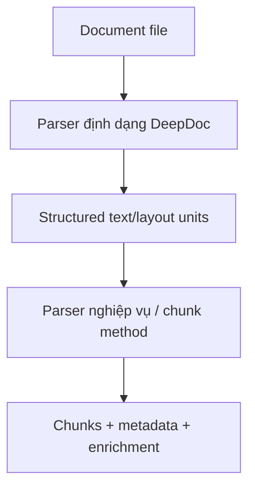

# 02 - Vai trò Parser và Phân loại Parser trong RAGFlow

## Mục tiêu phần này

- Phân biệt rõ hai lớp parser trong RAGFlow.
- Hiểu cách cấu hình parser ảnh hưởng trực tiếp tới chất lượng chunk.

## 1. Parser trong RAG không chỉ là "đọc chữ"

Parser trong hệ RAG phải giải quyết đồng thời:
- Trích xuất nội dung chữ (text extraction).
- Hiểu cấu trúc trình bày (layout understanding).
- Bảo toàn quan hệ ngữ nghĩa (semantic segmentation).

Khi parser làm tốt, chunk tạo ra phản ánh được đơn vị tri thức thật sự, không chỉ là đoạn text ngẫu nhiên.

## 2. Hai lớp parser trong RAGFlow

## 2.1 Lớp A: Parser nghiệp vụ/chunk method

Biểu diễn qua `parser_id` (hay `chunk_method`) như:
- `naive`
- `qa`
- `table`
- `manual`
- `knowledge_graph`

Cấu hình đi kèm qua `parser_config`:
- `chunk_token_num`
- `delimiter`
- `auto_keywords`
- `auto_questions`
- `layout_recognize`
- `raptor`, `graphrag`
- `filename_embd_weight`

Nguồn code:
- `api/utils/api_utils.py` (`get_parser_config`)
- `api/utils/validation_utils.py` (`ParserConfig`, validation dependency)

## 2.2 Lớp B: Parser định dạng tài liệu

Triển khai trong `deepdoc/parser/__init__.py`:
- `PdfParser`
- `DocxParser`
- `ExcelParser`
- `PptParser`
- `MarkdownParser`
- `HtmlParser`
- `TxtParser`
- `JsonParser`

Lớp này chịu trách nhiệm chuyển file thô thành cấu trúc text/layout có thể chunk đúng nghĩa.

## 3. Dependency validation quan trọng khi tạo dataset

Trong `CreateDatasetReq`:
- Nếu không truyền `parser_id` và cũng không dùng pipeline mode, mặc định rơi về `naive`.
- Nếu vào pipeline mode (`parse_type` + `pipeline_id`) thì không được trộn với `parser_id`.

Ý nghĩa kỹ thuật:
- Tránh cấu hình mơ hồ, giúp ingest path rõ ràng và có thể vận hành ổn định.

## 4. Mô hình tinh thần đề xuất cho người học

- Parser định dạng trả lời câu hỏi: "Đọc tài liệu này như thế nào?"
- Parser nghiệp vụ trả lời câu hỏi: "Cắt và enrich tri thức theo mục tiêu retrieval như thế nào?"

## 5. Kết luận phần

Hiểu đúng hai lớp parser là chìa khóa để debug ingest: lỗi parse format và lỗi chunk strategy là hai lớp vấn đề khác nhau, cần xử lý khác nhau.

## Phan tich chuyen sau bo sung

- [02-parser-role-and-taxonomy] Rule 1: Phan tich sau: xac dinh ro value cua thanh phan nay trong toan bo he thong RAG.
- [02-parser-role-and-taxonomy] Check 1: ghi ro input, output, metric, baseline, va rollback rule.
- [02-parser-role-and-taxonomy] Ops 1: moi thay doi can guardrail, alert, va runbook xu ly su co.
- [02-parser-role-and-taxonomy] Learn 1: tong ket bai hoc de team dung lai cho cac case tuong tu.
- [02-parser-role-and-taxonomy] Rule 2: Phan tich sau: lien ket thanh phan nay voi chat luong grounded answer va citation.
- [02-parser-role-and-taxonomy] Check 2: ghi ro input, output, metric, baseline, va rollback rule.
- [02-parser-role-and-taxonomy] Ops 2: moi thay doi can guardrail, alert, va runbook xu ly su co.
- [02-parser-role-and-taxonomy] Learn 2: tong ket bai hoc de team dung lai cho cac case tuong tu.
- [02-parser-role-and-taxonomy] Rule 3: Phan tich sau: xac dinh metric nao thay doi truoc khi ket luan toi uu thanh cong.
- [02-parser-role-and-taxonomy] Check 3: ghi ro input, output, metric, baseline, va rollback rule.
- [02-parser-role-and-taxonomy] Ops 3: moi thay doi can guardrail, alert, va runbook xu ly su co.
- [02-parser-role-and-taxonomy] Learn 3: tong ket bai hoc de team dung lai cho cac case tuong tu.
- [02-parser-role-and-taxonomy] Rule 4: Phan tich sau: danh gia trade-off giua do tre, chi phi, va do chinh xac retrieval.
- [02-parser-role-and-taxonomy] Check 4: ghi ro input, output, metric, baseline, va rollback rule.
- [02-parser-role-and-taxonomy] Ops 4: moi thay doi can guardrail, alert, va runbook xu ly su co.
- [02-parser-role-and-taxonomy] Learn 4: tong ket bai hoc de team dung lai cho cac case tuong tu.
- [02-parser-role-and-taxonomy] Rule 5: Phan tich sau: lap baseline va rollback rule truoc khi thay doi trong production.
- [02-parser-role-and-taxonomy] Check 5: ghi ro input, output, metric, baseline, va rollback rule.
- [02-parser-role-and-taxonomy] Ops 5: moi thay doi can guardrail, alert, va runbook xu ly su co.
- [02-parser-role-and-taxonomy] Learn 5: tong ket bai hoc de team dung lai cho cac case tuong tu.
- [02-parser-role-and-taxonomy] Rule 6: Phan tich sau: tim failure mode, cach phat hien som, va cach khoanh vung nguyen nhan.
- [02-parser-role-and-taxonomy] Check 6: ghi ro input, output, metric, baseline, va rollback rule.
- [02-parser-role-and-taxonomy] Ops 6: moi thay doi can guardrail, alert, va runbook xu ly su co.
- [02-parser-role-and-taxonomy] Learn 6: tong ket bai hoc de team dung lai cho cac case tuong tu.
- [02-parser-role-and-taxonomy] Rule 7: Phan tich sau: toi uu upstream neu muon giam noise cho downstream generation.
- [02-parser-role-and-taxonomy] Check 7: ghi ro input, output, metric, baseline, va rollback rule.
- [02-parser-role-and-taxonomy] Ops 7: moi thay doi can guardrail, alert, va runbook xu ly su co.
- [02-parser-role-and-taxonomy] Learn 7: tong ket bai hoc de team dung lai cho cac case tuong tu.
- [02-parser-role-and-taxonomy] Rule 8: Phan tich sau: doi chieu ket qua ky thuat voi muc tieu business va SLA.
- [02-parser-role-and-taxonomy] Check 8: ghi ro input, output, metric, baseline, va rollback rule.
- [02-parser-role-and-taxonomy] Ops 8: moi thay doi can guardrail, alert, va runbook xu ly su co.
- [02-parser-role-and-taxonomy] Learn 8: tong ket bai hoc de team dung lai cho cac case tuong tu.
- [02-parser-role-and-taxonomy] Rule 9: Phan tich sau: bo sung checklist test de dam bao ket qua co the tai lap.
- [02-parser-role-and-taxonomy] Check 9: ghi ro input, output, metric, baseline, va rollback rule.
- [02-parser-role-and-taxonomy] Ops 9: moi thay doi can guardrail, alert, va runbook xu ly su co.
- [02-parser-role-and-taxonomy] Learn 9: tong ket bai hoc de team dung lai cho cac case tuong tu.
- [02-parser-role-and-taxonomy] Rule 10: Phan tich sau: lap vong lap do luong -> cai tien -> kiem chung -> chuan hoa.
- [02-parser-role-and-taxonomy] Check 10: ghi ro input, output, metric, baseline, va rollback rule.
- [02-parser-role-and-taxonomy] Ops 10: moi thay doi can guardrail, alert, va runbook xu ly su co.
- [02-parser-role-and-taxonomy] Learn 10: tong ket bai hoc de team dung lai cho cac case tuong tu.
- [02-parser-role-and-taxonomy] Rule 11: Phan tich sau: xac dinh ro value cua thanh phan nay trong toan bo he thong RAG.
- [02-parser-role-and-taxonomy] Check 11: ghi ro input, output, metric, baseline, va rollback rule.
- [02-parser-role-and-taxonomy] Ops 11: moi thay doi can guardrail, alert, va runbook xu ly su co.
- [02-parser-role-and-taxonomy] Learn 11: tong ket bai hoc de team dung lai cho cac case tuong tu.
- [02-parser-role-and-taxonomy] Rule 12: Phan tich sau: lien ket thanh phan nay voi chat luong grounded answer va citation.
- [02-parser-role-and-taxonomy] Check 12: ghi ro input, output, metric, baseline, va rollback rule.
- [02-parser-role-and-taxonomy] Ops 12: moi thay doi can guardrail, alert, va runbook xu ly su co.
- [02-parser-role-and-taxonomy] Learn 12: tong ket bai hoc de team dung lai cho cac case tuong tu.
- [02-parser-role-and-taxonomy] Rule 13: Phan tich sau: xac dinh metric nao thay doi truoc khi ket luan toi uu thanh cong.
- [02-parser-role-and-taxonomy] Check 13: ghi ro input, output, metric, baseline, va rollback rule.
- [02-parser-role-and-taxonomy] Ops 13: moi thay doi can guardrail, alert, va runbook xu ly su co.
- [02-parser-role-and-taxonomy] Learn 13: tong ket bai hoc de team dung lai cho cac case tuong tu.
- [02-parser-role-and-taxonomy] Rule 14: Phan tich sau: danh gia trade-off giua do tre, chi phi, va do chinh xac retrieval.
- [02-parser-role-and-taxonomy] Check 14: ghi ro input, output, metric, baseline, va rollback rule.
- [02-parser-role-and-taxonomy] Ops 14: moi thay doi can guardrail, alert, va runbook xu ly su co.
- [02-parser-role-and-taxonomy] Learn 14: tong ket bai hoc de team dung lai cho cac case tuong tu.
- [02-parser-role-and-taxonomy] Rule 15: Phan tich sau: lap baseline va rollback rule truoc khi thay doi trong production.
- [02-parser-role-and-taxonomy] Check 15: ghi ro input, output, metric, baseline, va rollback rule.
- [02-parser-role-and-taxonomy] Ops 15: moi thay doi can guardrail, alert, va runbook xu ly su co.
- [02-parser-role-and-taxonomy] Learn 15: tong ket bai hoc de team dung lai cho cac case tuong tu.
- [02-parser-role-and-taxonomy] Rule 16: Phan tich sau: tim failure mode, cach phat hien som, va cach khoanh vung nguyen nhan.
- [02-parser-role-and-taxonomy] Check 16: ghi ro input, output, metric, baseline, va rollback rule.
- [02-parser-role-and-taxonomy] Ops 16: moi thay doi can guardrail, alert, va runbook xu ly su co.
- [02-parser-role-and-taxonomy] Learn 16: tong ket bai hoc de team dung lai cho cac case tuong tu.
- [02-parser-role-and-taxonomy] Rule 17: Phan tich sau: toi uu upstream neu muon giam noise cho downstream generation.
- [02-parser-role-and-taxonomy] Check 17: ghi ro input, output, metric, baseline, va rollback rule.
- [02-parser-role-and-taxonomy] Ops 17: moi thay doi can guardrail, alert, va runbook xu ly su co.
- [02-parser-role-and-taxonomy] Learn 17: tong ket bai hoc de team dung lai cho cac case tuong tu.
- [02-parser-role-and-taxonomy] Rule 18: Phan tich sau: doi chieu ket qua ky thuat voi muc tieu business va SLA.
- [02-parser-role-and-taxonomy] Check 18: ghi ro input, output, metric, baseline, va rollback rule.
- [02-parser-role-and-taxonomy] Ops 18: moi thay doi can guardrail, alert, va runbook xu ly su co.
- [02-parser-role-and-taxonomy] Learn 18: tong ket bai hoc de team dung lai cho cac case tuong tu.
- [02-parser-role-and-taxonomy] Rule 19: Phan tich sau: bo sung checklist test de dam bao ket qua co the tai lap.
- [02-parser-role-and-taxonomy] Check 19: ghi ro input, output, metric, baseline, va rollback rule.
- [02-parser-role-and-taxonomy] Ops 19: moi thay doi can guardrail, alert, va runbook xu ly su co.
- [02-parser-role-and-taxonomy] Learn 19: tong ket bai hoc de team dung lai cho cac case tuong tu.
- [02-parser-role-and-taxonomy] Rule 20: Phan tich sau: lap vong lap do luong -> cai tien -> kiem chung -> chuan hoa.
- [02-parser-role-and-taxonomy] Check 20: ghi ro input, output, metric, baseline, va rollback rule.
- [02-parser-role-and-taxonomy] Ops 20: moi thay doi can guardrail, alert, va runbook xu ly su co.
- [02-parser-role-and-taxonomy] Learn 20: tong ket bai hoc de team dung lai cho cac case tuong tu.
- [02-parser-role-and-taxonomy] Rule 21: Phan tich sau: xac dinh ro value cua thanh phan nay trong toan bo he thong RAG.
- [02-parser-role-and-taxonomy] Check 21: ghi ro input, output, metric, baseline, va rollback rule.
- [02-parser-role-and-taxonomy] Ops 21: moi thay doi can guardrail, alert, va runbook xu ly su co.
- [02-parser-role-and-taxonomy] Learn 21: tong ket bai hoc de team dung lai cho cac case tuong tu.
- [02-parser-role-and-taxonomy] Rule 22: Phan tich sau: lien ket thanh phan nay voi chat luong grounded answer va citation.
- [02-parser-role-and-taxonomy] Check 22: ghi ro input, output, metric, baseline, va rollback rule.
- [02-parser-role-and-taxonomy] Ops 22: moi thay doi can guardrail, alert, va runbook xu ly su co.
- [02-parser-role-and-taxonomy] Learn 22: tong ket bai hoc de team dung lai cho cac case tuong tu.
- [02-parser-role-and-taxonomy] Rule 23: Phan tich sau: xac dinh metric nao thay doi truoc khi ket luan toi uu thanh cong.
- [02-parser-role-and-taxonomy] Check 23: ghi ro input, output, metric, baseline, va rollback rule.
- [02-parser-role-and-taxonomy] Ops 23: moi thay doi can guardrail, alert, va runbook xu ly su co.
- [02-parser-role-and-taxonomy] Learn 23: tong ket bai hoc de team dung lai cho cac case tuong tu.
- [02-parser-role-and-taxonomy] Rule 24: Phan tich sau: danh gia trade-off giua do tre, chi phi, va do chinh xac retrieval.
- [02-parser-role-and-taxonomy] Check 24: ghi ro input, output, metric, baseline, va rollback rule.
- [02-parser-role-and-taxonomy] Ops 24: moi thay doi can guardrail, alert, va runbook xu ly su co.
- [02-parser-role-and-taxonomy] Learn 24: tong ket bai hoc de team dung lai cho cac case tuong tu.
- [02-parser-role-and-taxonomy] Rule 25: Phan tich sau: lap baseline va rollback rule truoc khi thay doi trong production.
- [02-parser-role-and-taxonomy] Check 25: ghi ro input, output, metric, baseline, va rollback rule.
- [02-parser-role-and-taxonomy] Ops 25: moi thay doi can guardrail, alert, va runbook xu ly su co.
- [02-parser-role-and-taxonomy] Learn 25: tong ket bai hoc de team dung lai cho cac case tuong tu.
- [02-parser-role-and-taxonomy] Rule 26: Phan tich sau: tim failure mode, cach phat hien som, va cach khoanh vung nguyen nhan.
- [02-parser-role-and-taxonomy] Check 26: ghi ro input, output, metric, baseline, va rollback rule.
- [02-parser-role-and-taxonomy] Ops 26: moi thay doi can guardrail, alert, va runbook xu ly su co.
- [02-parser-role-and-taxonomy] Learn 26: tong ket bai hoc de team dung lai cho cac case tuong tu.
- [02-parser-role-and-taxonomy] Rule 27: Phan tich sau: toi uu upstream neu muon giam noise cho downstream generation.
- [02-parser-role-and-taxonomy] Check 27: ghi ro input, output, metric, baseline, va rollback rule.
- [02-parser-role-and-taxonomy] Ops 27: moi thay doi can guardrail, alert, va runbook xu ly su co.
- [02-parser-role-and-taxonomy] Learn 27: tong ket bai hoc de team dung lai cho cac case tuong tu.
- [02-parser-role-and-taxonomy] Rule 28: Phan tich sau: doi chieu ket qua ky thuat voi muc tieu business va SLA.
- [02-parser-role-and-taxonomy] Check 28: ghi ro input, output, metric, baseline, va rollback rule.
- [02-parser-role-and-taxonomy] Ops 28: moi thay doi can guardrail, alert, va runbook xu ly su co.
- [02-parser-role-and-taxonomy] Learn 28: tong ket bai hoc de team dung lai cho cac case tuong tu.
- [02-parser-role-and-taxonomy] Rule 29: Phan tich sau: bo sung checklist test de dam bao ket qua co the tai lap.
- [02-parser-role-and-taxonomy] Check 29: ghi ro input, output, metric, baseline, va rollback rule.
- [02-parser-role-and-taxonomy] Ops 29: moi thay doi can guardrail, alert, va runbook xu ly su co.
- [02-parser-role-and-taxonomy] Learn 29: tong ket bai hoc de team dung lai cho cac case tuong tu.
- [02-parser-role-and-taxonomy] Rule 30: Phan tich sau: lap vong lap do luong -> cai tien -> kiem chung -> chuan hoa.
- [02-parser-role-and-taxonomy] Check 30: ghi ro input, output, metric, baseline, va rollback rule.
- [02-parser-role-and-taxonomy] Ops 30: moi thay doi can guardrail, alert, va runbook xu ly su co.
- [02-parser-role-and-taxonomy] Learn 30: tong ket bai hoc de team dung lai cho cac case tuong tu.
- [02-parser-role-and-taxonomy] Rule 31: Phan tich sau: xac dinh ro value cua thanh phan nay trong toan bo he thong RAG.
- [02-parser-role-and-taxonomy] Check 31: ghi ro input, output, metric, baseline, va rollback rule.
- [02-parser-role-and-taxonomy] Ops 31: moi thay doi can guardrail, alert, va runbook xu ly su co.
- [02-parser-role-and-taxonomy] Learn 31: tong ket bai hoc de team dung lai cho cac case tuong tu.
- [02-parser-role-and-taxonomy] Rule 32: Phan tich sau: lien ket thanh phan nay voi chat luong grounded answer va citation.
- [02-parser-role-and-taxonomy] Check 32: ghi ro input, output, metric, baseline, va rollback rule.
- [02-parser-role-and-taxonomy] Ops 32: moi thay doi can guardrail, alert, va runbook xu ly su co.
- [02-parser-role-and-taxonomy] Learn 32: tong ket bai hoc de team dung lai cho cac case tuong tu.
- [02-parser-role-and-taxonomy] Rule 33: Phan tich sau: xac dinh metric nao thay doi truoc khi ket luan toi uu thanh cong.
- [02-parser-role-and-taxonomy] Check 33: ghi ro input, output, metric, baseline, va rollback rule.
- [02-parser-role-and-taxonomy] Ops 33: moi thay doi can guardrail, alert, va runbook xu ly su co.
- [02-parser-role-and-taxonomy] Learn 33: tong ket bai hoc de team dung lai cho cac case tuong tu.
- [02-parser-role-and-taxonomy] Rule 34: Phan tich sau: danh gia trade-off giua do tre, chi phi, va do chinh xac retrieval.
- [02-parser-role-and-taxonomy] Check 34: ghi ro input, output, metric, baseline, va rollback rule.
- [02-parser-role-and-taxonomy] Ops 34: moi thay doi can guardrail, alert, va runbook xu ly su co.
- [02-parser-role-and-taxonomy] Learn 34: tong ket bai hoc de team dung lai cho cac case tuong tu.
- [02-parser-role-and-taxonomy] Rule 35: Phan tich sau: lap baseline va rollback rule truoc khi thay doi trong production.
- [02-parser-role-and-taxonomy] Check 35: ghi ro input, output, metric, baseline, va rollback rule.
- [02-parser-role-and-taxonomy] Ops 35: moi thay doi can guardrail, alert, va runbook xu ly su co.
- [02-parser-role-and-taxonomy] Learn 35: tong ket bai hoc de team dung lai cho cac case tuong tu.
