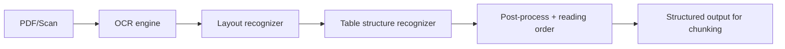

# 03 - Cơ chế DeepDoc Parser: OCR, Layout, TSR

## Mục tiêu phần này

- Nắm cơ chế cốt lõi của DeepDoc parser trong RAGFlow.
- Hiểu vì sao DeepDoc phù hợp dữ liệu enterprise phức tạp hơn parser text-only.

## 1. DeepDoc giải bài toán gì

Tài liệu thực tế thường có:
- Nhiều cột, header/footer, chú thích.
- Bảng biểu phức tạp, ảnh, công thức.
- PDF scan chất lượng không đồng đều.

DeepDoc được thiết kế để chuyển các tín hiệu đa phương thức đó về biểu diễn văn bản có cấu trúc phục vụ retrieval.

Nguồn tham chiếu:
- `deepdoc/README.md`
- `deepdoc/parser/pdf_parser.py`

## 2. Pipeline nội bộ của PDF parser

Các bước chính:
1. OCR: nhận diện text từ ảnh/PDF scan.
2. Layout recognition: phân loại vùng (text/title/table/figure/caption/header/footer...).
3. Table Structure Recognition (TSR): tái dựng cấu trúc bảng.
4. Hậu xử lý: ghép thứ tự đọc, gắn vị trí, chuẩn hóa nội dung xuất ra.

## 3. Table auto-rotation

Một điểm rất thực tế của DeepDoc:
- Bảng bị xoay 90/180/270 độ là vấn đề thường gặp ở scan.
- Parser đánh giá nhiều góc xoay bằng tín hiệu OCR confidence.
- Chọn orientation tốt nhất trước khi chạy TSR/ocr lại.

Giá trị:
- Tăng độ chính xác text trong bảng.
- Giảm lỗi sai cột/hàng khi trích xuất tri thức từ table.

## 4. Cơ chế layout và ảnh hưởng đến retrieval

Nếu layout sai:
- Có thể trộn header/footer vào body.
- Mất liên kết caption-figure/table.
- Chia chunk sai logic tài liệu.

Nếu layout đúng:
- Chunk giữ được đơn vị ngữ nghĩa tốt hơn.
- Citation bám vị trí tài liệu rõ ràng hơn.

## 5. Điểm mạnh và hạn chế

Điểm mạnh:
- Tốt cho tài liệu enterprise nhiều bảng/biểu đồ.
- Bảo toàn nhiều tín hiệu cấu trúc hơn parser đơn giản.
- Hỗ trợ tốt hơn cho grounded citation.

Hạn chế:
- Chi phí compute cao hơn.
- Độ ổn định phụ thuộc chất lượng ảnh scan.
- Cần theo dõi và tune theo domain tài liệu.

## 6. Kết luận phần

DeepDoc là nền tảng để RAGFlow xử lý tài liệu khó. Với dữ liệu doanh nghiệp, đầu tư vào parser chất lượng cao thường mang lại lợi tức lớn hơn nhiều so với chỉ tăng model LLM.

## Phan tich chuyen sau bo sung

- [03-deepdoc-mechanism] Rule 1: Phan tich sau: xac dinh ro value cua thanh phan nay trong toan bo he thong RAG.
- [03-deepdoc-mechanism] Check 1: ghi ro input, output, metric, baseline, va rollback rule.
- [03-deepdoc-mechanism] Ops 1: moi thay doi can guardrail, alert, va runbook xu ly su co.
- [03-deepdoc-mechanism] Learn 1: tong ket bai hoc de team dung lai cho cac case tuong tu.
- [03-deepdoc-mechanism] Rule 2: Phan tich sau: lien ket thanh phan nay voi chat luong grounded answer va citation.
- [03-deepdoc-mechanism] Check 2: ghi ro input, output, metric, baseline, va rollback rule.
- [03-deepdoc-mechanism] Ops 2: moi thay doi can guardrail, alert, va runbook xu ly su co.
- [03-deepdoc-mechanism] Learn 2: tong ket bai hoc de team dung lai cho cac case tuong tu.
- [03-deepdoc-mechanism] Rule 3: Phan tich sau: xac dinh metric nao thay doi truoc khi ket luan toi uu thanh cong.
- [03-deepdoc-mechanism] Check 3: ghi ro input, output, metric, baseline, va rollback rule.
- [03-deepdoc-mechanism] Ops 3: moi thay doi can guardrail, alert, va runbook xu ly su co.
- [03-deepdoc-mechanism] Learn 3: tong ket bai hoc de team dung lai cho cac case tuong tu.
- [03-deepdoc-mechanism] Rule 4: Phan tich sau: danh gia trade-off giua do tre, chi phi, va do chinh xac retrieval.
- [03-deepdoc-mechanism] Check 4: ghi ro input, output, metric, baseline, va rollback rule.
- [03-deepdoc-mechanism] Ops 4: moi thay doi can guardrail, alert, va runbook xu ly su co.
- [03-deepdoc-mechanism] Learn 4: tong ket bai hoc de team dung lai cho cac case tuong tu.
- [03-deepdoc-mechanism] Rule 5: Phan tich sau: lap baseline va rollback rule truoc khi thay doi trong production.
- [03-deepdoc-mechanism] Check 5: ghi ro input, output, metric, baseline, va rollback rule.
- [03-deepdoc-mechanism] Ops 5: moi thay doi can guardrail, alert, va runbook xu ly su co.
- [03-deepdoc-mechanism] Learn 5: tong ket bai hoc de team dung lai cho cac case tuong tu.
- [03-deepdoc-mechanism] Rule 6: Phan tich sau: tim failure mode, cach phat hien som, va cach khoanh vung nguyen nhan.
- [03-deepdoc-mechanism] Check 6: ghi ro input, output, metric, baseline, va rollback rule.
- [03-deepdoc-mechanism] Ops 6: moi thay doi can guardrail, alert, va runbook xu ly su co.
- [03-deepdoc-mechanism] Learn 6: tong ket bai hoc de team dung lai cho cac case tuong tu.
- [03-deepdoc-mechanism] Rule 7: Phan tich sau: toi uu upstream neu muon giam noise cho downstream generation.
- [03-deepdoc-mechanism] Check 7: ghi ro input, output, metric, baseline, va rollback rule.
- [03-deepdoc-mechanism] Ops 7: moi thay doi can guardrail, alert, va runbook xu ly su co.
- [03-deepdoc-mechanism] Learn 7: tong ket bai hoc de team dung lai cho cac case tuong tu.
- [03-deepdoc-mechanism] Rule 8: Phan tich sau: doi chieu ket qua ky thuat voi muc tieu business va SLA.
- [03-deepdoc-mechanism] Check 8: ghi ro input, output, metric, baseline, va rollback rule.
- [03-deepdoc-mechanism] Ops 8: moi thay doi can guardrail, alert, va runbook xu ly su co.
- [03-deepdoc-mechanism] Learn 8: tong ket bai hoc de team dung lai cho cac case tuong tu.
- [03-deepdoc-mechanism] Rule 9: Phan tich sau: bo sung checklist test de dam bao ket qua co the tai lap.
- [03-deepdoc-mechanism] Check 9: ghi ro input, output, metric, baseline, va rollback rule.
- [03-deepdoc-mechanism] Ops 9: moi thay doi can guardrail, alert, va runbook xu ly su co.
- [03-deepdoc-mechanism] Learn 9: tong ket bai hoc de team dung lai cho cac case tuong tu.
- [03-deepdoc-mechanism] Rule 10: Phan tich sau: lap vong lap do luong -> cai tien -> kiem chung -> chuan hoa.
- [03-deepdoc-mechanism] Check 10: ghi ro input, output, metric, baseline, va rollback rule.
- [03-deepdoc-mechanism] Ops 10: moi thay doi can guardrail, alert, va runbook xu ly su co.
- [03-deepdoc-mechanism] Learn 10: tong ket bai hoc de team dung lai cho cac case tuong tu.
- [03-deepdoc-mechanism] Rule 11: Phan tich sau: xac dinh ro value cua thanh phan nay trong toan bo he thong RAG.
- [03-deepdoc-mechanism] Check 11: ghi ro input, output, metric, baseline, va rollback rule.
- [03-deepdoc-mechanism] Ops 11: moi thay doi can guardrail, alert, va runbook xu ly su co.
- [03-deepdoc-mechanism] Learn 11: tong ket bai hoc de team dung lai cho cac case tuong tu.
- [03-deepdoc-mechanism] Rule 12: Phan tich sau: lien ket thanh phan nay voi chat luong grounded answer va citation.
- [03-deepdoc-mechanism] Check 12: ghi ro input, output, metric, baseline, va rollback rule.
- [03-deepdoc-mechanism] Ops 12: moi thay doi can guardrail, alert, va runbook xu ly su co.
- [03-deepdoc-mechanism] Learn 12: tong ket bai hoc de team dung lai cho cac case tuong tu.
- [03-deepdoc-mechanism] Rule 13: Phan tich sau: xac dinh metric nao thay doi truoc khi ket luan toi uu thanh cong.
- [03-deepdoc-mechanism] Check 13: ghi ro input, output, metric, baseline, va rollback rule.
- [03-deepdoc-mechanism] Ops 13: moi thay doi can guardrail, alert, va runbook xu ly su co.
- [03-deepdoc-mechanism] Learn 13: tong ket bai hoc de team dung lai cho cac case tuong tu.
- [03-deepdoc-mechanism] Rule 14: Phan tich sau: danh gia trade-off giua do tre, chi phi, va do chinh xac retrieval.
- [03-deepdoc-mechanism] Check 14: ghi ro input, output, metric, baseline, va rollback rule.
- [03-deepdoc-mechanism] Ops 14: moi thay doi can guardrail, alert, va runbook xu ly su co.
- [03-deepdoc-mechanism] Learn 14: tong ket bai hoc de team dung lai cho cac case tuong tu.
- [03-deepdoc-mechanism] Rule 15: Phan tich sau: lap baseline va rollback rule truoc khi thay doi trong production.
- [03-deepdoc-mechanism] Check 15: ghi ro input, output, metric, baseline, va rollback rule.
- [03-deepdoc-mechanism] Ops 15: moi thay doi can guardrail, alert, va runbook xu ly su co.
- [03-deepdoc-mechanism] Learn 15: tong ket bai hoc de team dung lai cho cac case tuong tu.
- [03-deepdoc-mechanism] Rule 16: Phan tich sau: tim failure mode, cach phat hien som, va cach khoanh vung nguyen nhan.
- [03-deepdoc-mechanism] Check 16: ghi ro input, output, metric, baseline, va rollback rule.
- [03-deepdoc-mechanism] Ops 16: moi thay doi can guardrail, alert, va runbook xu ly su co.
- [03-deepdoc-mechanism] Learn 16: tong ket bai hoc de team dung lai cho cac case tuong tu.
- [03-deepdoc-mechanism] Rule 17: Phan tich sau: toi uu upstream neu muon giam noise cho downstream generation.
- [03-deepdoc-mechanism] Check 17: ghi ro input, output, metric, baseline, va rollback rule.
- [03-deepdoc-mechanism] Ops 17: moi thay doi can guardrail, alert, va runbook xu ly su co.
- [03-deepdoc-mechanism] Learn 17: tong ket bai hoc de team dung lai cho cac case tuong tu.
- [03-deepdoc-mechanism] Rule 18: Phan tich sau: doi chieu ket qua ky thuat voi muc tieu business va SLA.
- [03-deepdoc-mechanism] Check 18: ghi ro input, output, metric, baseline, va rollback rule.
- [03-deepdoc-mechanism] Ops 18: moi thay doi can guardrail, alert, va runbook xu ly su co.
- [03-deepdoc-mechanism] Learn 18: tong ket bai hoc de team dung lai cho cac case tuong tu.
- [03-deepdoc-mechanism] Rule 19: Phan tich sau: bo sung checklist test de dam bao ket qua co the tai lap.
- [03-deepdoc-mechanism] Check 19: ghi ro input, output, metric, baseline, va rollback rule.
- [03-deepdoc-mechanism] Ops 19: moi thay doi can guardrail, alert, va runbook xu ly su co.
- [03-deepdoc-mechanism] Learn 19: tong ket bai hoc de team dung lai cho cac case tuong tu.
- [03-deepdoc-mechanism] Rule 20: Phan tich sau: lap vong lap do luong -> cai tien -> kiem chung -> chuan hoa.
- [03-deepdoc-mechanism] Check 20: ghi ro input, output, metric, baseline, va rollback rule.
- [03-deepdoc-mechanism] Ops 20: moi thay doi can guardrail, alert, va runbook xu ly su co.
- [03-deepdoc-mechanism] Learn 20: tong ket bai hoc de team dung lai cho cac case tuong tu.
- [03-deepdoc-mechanism] Rule 21: Phan tich sau: xac dinh ro value cua thanh phan nay trong toan bo he thong RAG.
- [03-deepdoc-mechanism] Check 21: ghi ro input, output, metric, baseline, va rollback rule.
- [03-deepdoc-mechanism] Ops 21: moi thay doi can guardrail, alert, va runbook xu ly su co.
- [03-deepdoc-mechanism] Learn 21: tong ket bai hoc de team dung lai cho cac case tuong tu.
- [03-deepdoc-mechanism] Rule 22: Phan tich sau: lien ket thanh phan nay voi chat luong grounded answer va citation.
- [03-deepdoc-mechanism] Check 22: ghi ro input, output, metric, baseline, va rollback rule.
- [03-deepdoc-mechanism] Ops 22: moi thay doi can guardrail, alert, va runbook xu ly su co.
- [03-deepdoc-mechanism] Learn 22: tong ket bai hoc de team dung lai cho cac case tuong tu.
- [03-deepdoc-mechanism] Rule 23: Phan tich sau: xac dinh metric nao thay doi truoc khi ket luan toi uu thanh cong.
- [03-deepdoc-mechanism] Check 23: ghi ro input, output, metric, baseline, va rollback rule.
- [03-deepdoc-mechanism] Ops 23: moi thay doi can guardrail, alert, va runbook xu ly su co.
- [03-deepdoc-mechanism] Learn 23: tong ket bai hoc de team dung lai cho cac case tuong tu.
- [03-deepdoc-mechanism] Rule 24: Phan tich sau: danh gia trade-off giua do tre, chi phi, va do chinh xac retrieval.
- [03-deepdoc-mechanism] Check 24: ghi ro input, output, metric, baseline, va rollback rule.
- [03-deepdoc-mechanism] Ops 24: moi thay doi can guardrail, alert, va runbook xu ly su co.
- [03-deepdoc-mechanism] Learn 24: tong ket bai hoc de team dung lai cho cac case tuong tu.
- [03-deepdoc-mechanism] Rule 25: Phan tich sau: lap baseline va rollback rule truoc khi thay doi trong production.
- [03-deepdoc-mechanism] Check 25: ghi ro input, output, metric, baseline, va rollback rule.
- [03-deepdoc-mechanism] Ops 25: moi thay doi can guardrail, alert, va runbook xu ly su co.
- [03-deepdoc-mechanism] Learn 25: tong ket bai hoc de team dung lai cho cac case tuong tu.
- [03-deepdoc-mechanism] Rule 26: Phan tich sau: tim failure mode, cach phat hien som, va cach khoanh vung nguyen nhan.
- [03-deepdoc-mechanism] Check 26: ghi ro input, output, metric, baseline, va rollback rule.
- [03-deepdoc-mechanism] Ops 26: moi thay doi can guardrail, alert, va runbook xu ly su co.
- [03-deepdoc-mechanism] Learn 26: tong ket bai hoc de team dung lai cho cac case tuong tu.
- [03-deepdoc-mechanism] Rule 27: Phan tich sau: toi uu upstream neu muon giam noise cho downstream generation.
- [03-deepdoc-mechanism] Check 27: ghi ro input, output, metric, baseline, va rollback rule.
- [03-deepdoc-mechanism] Ops 27: moi thay doi can guardrail, alert, va runbook xu ly su co.
- [03-deepdoc-mechanism] Learn 27: tong ket bai hoc de team dung lai cho cac case tuong tu.
- [03-deepdoc-mechanism] Rule 28: Phan tich sau: doi chieu ket qua ky thuat voi muc tieu business va SLA.
- [03-deepdoc-mechanism] Check 28: ghi ro input, output, metric, baseline, va rollback rule.
- [03-deepdoc-mechanism] Ops 28: moi thay doi can guardrail, alert, va runbook xu ly su co.
- [03-deepdoc-mechanism] Learn 28: tong ket bai hoc de team dung lai cho cac case tuong tu.
- [03-deepdoc-mechanism] Rule 29: Phan tich sau: bo sung checklist test de dam bao ket qua co the tai lap.
- [03-deepdoc-mechanism] Check 29: ghi ro input, output, metric, baseline, va rollback rule.
- [03-deepdoc-mechanism] Ops 29: moi thay doi can guardrail, alert, va runbook xu ly su co.
- [03-deepdoc-mechanism] Learn 29: tong ket bai hoc de team dung lai cho cac case tuong tu.
- [03-deepdoc-mechanism] Rule 30: Phan tich sau: lap vong lap do luong -> cai tien -> kiem chung -> chuan hoa.
- [03-deepdoc-mechanism] Check 30: ghi ro input, output, metric, baseline, va rollback rule.
- [03-deepdoc-mechanism] Ops 30: moi thay doi can guardrail, alert, va runbook xu ly su co.
- [03-deepdoc-mechanism] Learn 30: tong ket bai hoc de team dung lai cho cac case tuong tu.
- [03-deepdoc-mechanism] Rule 31: Phan tich sau: xac dinh ro value cua thanh phan nay trong toan bo he thong RAG.
- [03-deepdoc-mechanism] Check 31: ghi ro input, output, metric, baseline, va rollback rule.
- [03-deepdoc-mechanism] Ops 31: moi thay doi can guardrail, alert, va runbook xu ly su co.
- [03-deepdoc-mechanism] Learn 31: tong ket bai hoc de team dung lai cho cac case tuong tu.
- [03-deepdoc-mechanism] Rule 32: Phan tich sau: lien ket thanh phan nay voi chat luong grounded answer va citation.
- [03-deepdoc-mechanism] Check 32: ghi ro input, output, metric, baseline, va rollback rule.
- [03-deepdoc-mechanism] Ops 32: moi thay doi can guardrail, alert, va runbook xu ly su co.
- [03-deepdoc-mechanism] Learn 32: tong ket bai hoc de team dung lai cho cac case tuong tu.
- [03-deepdoc-mechanism] Rule 33: Phan tich sau: xac dinh metric nao thay doi truoc khi ket luan toi uu thanh cong.
- [03-deepdoc-mechanism] Check 33: ghi ro input, output, metric, baseline, va rollback rule.
- [03-deepdoc-mechanism] Ops 33: moi thay doi can guardrail, alert, va runbook xu ly su co.
- [03-deepdoc-mechanism] Learn 33: tong ket bai hoc de team dung lai cho cac case tuong tu.
- [03-deepdoc-mechanism] Rule 34: Phan tich sau: danh gia trade-off giua do tre, chi phi, va do chinh xac retrieval.
- [03-deepdoc-mechanism] Check 34: ghi ro input, output, metric, baseline, va rollback rule.
- [03-deepdoc-mechanism] Ops 34: moi thay doi can guardrail, alert, va runbook xu ly su co.
- [03-deepdoc-mechanism] Learn 34: tong ket bai hoc de team dung lai cho cac case tuong tu.
- [03-deepdoc-mechanism] Rule 35: Phan tich sau: lap baseline va rollback rule truoc khi thay doi trong production.
- [03-deepdoc-mechanism] Check 35: ghi ro input, output, metric, baseline, va rollback rule.
- [03-deepdoc-mechanism] Ops 35: moi thay doi can guardrail, alert, va runbook xu ly su co.
- [03-deepdoc-mechanism] Learn 35: tong ket bai hoc de team dung lai cho cac case tuong tu.
- [03-deepdoc-mechanism] Rule 36: Phan tich sau: tim failure mode, cach phat hien som, va cach khoanh vung nguyen nhan.
- [03-deepdoc-mechanism] Check 36: ghi ro input, output, metric, baseline, va rollback rule.
- [03-deepdoc-mechanism] Ops 36: moi thay doi can guardrail, alert, va runbook xu ly su co.
- [03-deepdoc-mechanism] Learn 36: tong ket bai hoc de team dung lai cho cac case tuong tu.
