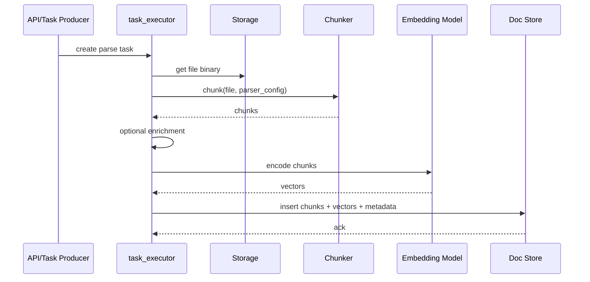

# 04 - Ingest Code Path trong RAGFlow (Bám sát mã nguồn)

## Mục tiêu phần này

- Đọc được luồng ingest thực thi trong RAGFlow theo hàm và trách nhiệm.
- Biết điểm chèn để quan sát/log/tối ưu.

## 1. Luồng chính trong `rag/svr/task_executor.py`

Các điểm neo quan trọng:
- `build_chunks(task, progress_callback)`
- `embedding(docs, mdl, parser_config=None, callback=None)`
- `insert_chunks(...)`
- `run_dataflow(task)` cho pipeline mode

## 2. Bước 1 - Build chunks

Trong `build_chunks(...)`:
- Kiểm tra kích thước file so với `DOC_MAXIMUM_SIZE`.
- Lấy binary từ storage thông qua `File2DocumentService.get_storage_address`.
- Chọn `chunker` theo `task["parser_id"]` và gọi `chunker.chunk(...)`.
- Chuẩn hóa document fields, tạo `id`, xử lý image/table asset.

Ý nghĩa:
- Đây là nơi parser định dạng + parser nghiệp vụ gặp nhau.
- Lỗi tại bước này thường là lỗi chất lượng đầu vào lớn nhất.

## 3. Bước 2 - Enrichment (tùy chọn)

Nếu `parser_config` bật:
- `auto_keywords`: tạo `important_kwd` cho chunk.
- `auto_questions`: tạo câu hỏi đại diện cho chunk.

Tác động:
- Tăng khả năng retrieve theo truy vấn biến thể.
- Đổi lại tốn thêm thời gian/chí phí model.

## 4. Bước 3 - Embedding

Trong `embedding(...)`:
- Chuẩn hóa text đưa vào encode.
- Encode theo batch để kiểm soát thông lượng.
- Có thể trộn vector tiêu đề/tên file với vector nội dung qua `filename_embd_weight`.
- Ghi vector vào field dạng `q_<dim>_vec`.

Ý nghĩa:
- Thiết kế field vector theo dimension cho phép index linh hoạt theo model.

## 5. Bước 4 - Insert index

Sau embedding:
- Chunk được thêm metadata cần thiết: `doc_id`, `kb_id`, `docnm_kwd`, timestamp, token fields...
- Gọi `insert_chunks(...)` để ghi vào doc store.
- Trạng thái và tiến độ task được cập nhật xuyên suốt.

## 6. Pipeline mode qua `rag/flow/pipeline.py`

Khi chạy dataflow:
- `Pipeline` (kế thừa `Graph`) cho phép orchestrate ingest theo DSL.
- `run_dataflow(task)` nhận kết quả từ pipeline, embedding/index nếu cần.

Giá trị:
- Cho phép ingestion linh hoạt theo use case thay vì một flow cứng.

## 7. Điểm quan sát để debug production

- Tốc độ từng chặng: load file, chunking, embedding, indexing.
- Số chunk sinh ra/tài liệu có bất thường không.
- Tỉ lệ chunk có `content_with_weight` rỗng.
- Tương quan giữa lỗi query và lỗi parse/chunk upstream.

## 8. Kết luận phần

Nắm code path ingest giúp đội phát triển không chỉ "dùng" RAGFlow mà còn biết can thiệp đúng chỗ khi cần tối ưu hiệu năng và chất lượng.

## Phan tich chuyen sau bo sung

- [04-ragflow-ingest-codepath] Rule 1: Phan tich sau: xac dinh ro value cua thanh phan nay trong toan bo he thong RAG.
- [04-ragflow-ingest-codepath] Check 1: ghi ro input, output, metric, baseline, va rollback rule.
- [04-ragflow-ingest-codepath] Ops 1: moi thay doi can guardrail, alert, va runbook xu ly su co.
- [04-ragflow-ingest-codepath] Learn 1: tong ket bai hoc de team dung lai cho cac case tuong tu.
- [04-ragflow-ingest-codepath] Rule 2: Phan tich sau: lien ket thanh phan nay voi chat luong grounded answer va citation.
- [04-ragflow-ingest-codepath] Check 2: ghi ro input, output, metric, baseline, va rollback rule.
- [04-ragflow-ingest-codepath] Ops 2: moi thay doi can guardrail, alert, va runbook xu ly su co.
- [04-ragflow-ingest-codepath] Learn 2: tong ket bai hoc de team dung lai cho cac case tuong tu.
- [04-ragflow-ingest-codepath] Rule 3: Phan tich sau: xac dinh metric nao thay doi truoc khi ket luan toi uu thanh cong.
- [04-ragflow-ingest-codepath] Check 3: ghi ro input, output, metric, baseline, va rollback rule.
- [04-ragflow-ingest-codepath] Ops 3: moi thay doi can guardrail, alert, va runbook xu ly su co.
- [04-ragflow-ingest-codepath] Learn 3: tong ket bai hoc de team dung lai cho cac case tuong tu.
- [04-ragflow-ingest-codepath] Rule 4: Phan tich sau: danh gia trade-off giua do tre, chi phi, va do chinh xac retrieval.
- [04-ragflow-ingest-codepath] Check 4: ghi ro input, output, metric, baseline, va rollback rule.
- [04-ragflow-ingest-codepath] Ops 4: moi thay doi can guardrail, alert, va runbook xu ly su co.
- [04-ragflow-ingest-codepath] Learn 4: tong ket bai hoc de team dung lai cho cac case tuong tu.
- [04-ragflow-ingest-codepath] Rule 5: Phan tich sau: lap baseline va rollback rule truoc khi thay doi trong production.
- [04-ragflow-ingest-codepath] Check 5: ghi ro input, output, metric, baseline, va rollback rule.
- [04-ragflow-ingest-codepath] Ops 5: moi thay doi can guardrail, alert, va runbook xu ly su co.
- [04-ragflow-ingest-codepath] Learn 5: tong ket bai hoc de team dung lai cho cac case tuong tu.
- [04-ragflow-ingest-codepath] Rule 6: Phan tich sau: tim failure mode, cach phat hien som, va cach khoanh vung nguyen nhan.
- [04-ragflow-ingest-codepath] Check 6: ghi ro input, output, metric, baseline, va rollback rule.
- [04-ragflow-ingest-codepath] Ops 6: moi thay doi can guardrail, alert, va runbook xu ly su co.
- [04-ragflow-ingest-codepath] Learn 6: tong ket bai hoc de team dung lai cho cac case tuong tu.
- [04-ragflow-ingest-codepath] Rule 7: Phan tich sau: toi uu upstream neu muon giam noise cho downstream generation.
- [04-ragflow-ingest-codepath] Check 7: ghi ro input, output, metric, baseline, va rollback rule.
- [04-ragflow-ingest-codepath] Ops 7: moi thay doi can guardrail, alert, va runbook xu ly su co.
- [04-ragflow-ingest-codepath] Learn 7: tong ket bai hoc de team dung lai cho cac case tuong tu.
- [04-ragflow-ingest-codepath] Rule 8: Phan tich sau: doi chieu ket qua ky thuat voi muc tieu business va SLA.
- [04-ragflow-ingest-codepath] Check 8: ghi ro input, output, metric, baseline, va rollback rule.
- [04-ragflow-ingest-codepath] Ops 8: moi thay doi can guardrail, alert, va runbook xu ly su co.
- [04-ragflow-ingest-codepath] Learn 8: tong ket bai hoc de team dung lai cho cac case tuong tu.
- [04-ragflow-ingest-codepath] Rule 9: Phan tich sau: bo sung checklist test de dam bao ket qua co the tai lap.
- [04-ragflow-ingest-codepath] Check 9: ghi ro input, output, metric, baseline, va rollback rule.
- [04-ragflow-ingest-codepath] Ops 9: moi thay doi can guardrail, alert, va runbook xu ly su co.
- [04-ragflow-ingest-codepath] Learn 9: tong ket bai hoc de team dung lai cho cac case tuong tu.
- [04-ragflow-ingest-codepath] Rule 10: Phan tich sau: lap vong lap do luong -> cai tien -> kiem chung -> chuan hoa.
- [04-ragflow-ingest-codepath] Check 10: ghi ro input, output, metric, baseline, va rollback rule.
- [04-ragflow-ingest-codepath] Ops 10: moi thay doi can guardrail, alert, va runbook xu ly su co.
- [04-ragflow-ingest-codepath] Learn 10: tong ket bai hoc de team dung lai cho cac case tuong tu.
- [04-ragflow-ingest-codepath] Rule 11: Phan tich sau: xac dinh ro value cua thanh phan nay trong toan bo he thong RAG.
- [04-ragflow-ingest-codepath] Check 11: ghi ro input, output, metric, baseline, va rollback rule.
- [04-ragflow-ingest-codepath] Ops 11: moi thay doi can guardrail, alert, va runbook xu ly su co.
- [04-ragflow-ingest-codepath] Learn 11: tong ket bai hoc de team dung lai cho cac case tuong tu.
- [04-ragflow-ingest-codepath] Rule 12: Phan tich sau: lien ket thanh phan nay voi chat luong grounded answer va citation.
- [04-ragflow-ingest-codepath] Check 12: ghi ro input, output, metric, baseline, va rollback rule.
- [04-ragflow-ingest-codepath] Ops 12: moi thay doi can guardrail, alert, va runbook xu ly su co.
- [04-ragflow-ingest-codepath] Learn 12: tong ket bai hoc de team dung lai cho cac case tuong tu.
- [04-ragflow-ingest-codepath] Rule 13: Phan tich sau: xac dinh metric nao thay doi truoc khi ket luan toi uu thanh cong.
- [04-ragflow-ingest-codepath] Check 13: ghi ro input, output, metric, baseline, va rollback rule.
- [04-ragflow-ingest-codepath] Ops 13: moi thay doi can guardrail, alert, va runbook xu ly su co.
- [04-ragflow-ingest-codepath] Learn 13: tong ket bai hoc de team dung lai cho cac case tuong tu.
- [04-ragflow-ingest-codepath] Rule 14: Phan tich sau: danh gia trade-off giua do tre, chi phi, va do chinh xac retrieval.
- [04-ragflow-ingest-codepath] Check 14: ghi ro input, output, metric, baseline, va rollback rule.
- [04-ragflow-ingest-codepath] Ops 14: moi thay doi can guardrail, alert, va runbook xu ly su co.
- [04-ragflow-ingest-codepath] Learn 14: tong ket bai hoc de team dung lai cho cac case tuong tu.
- [04-ragflow-ingest-codepath] Rule 15: Phan tich sau: lap baseline va rollback rule truoc khi thay doi trong production.
- [04-ragflow-ingest-codepath] Check 15: ghi ro input, output, metric, baseline, va rollback rule.
- [04-ragflow-ingest-codepath] Ops 15: moi thay doi can guardrail, alert, va runbook xu ly su co.
- [04-ragflow-ingest-codepath] Learn 15: tong ket bai hoc de team dung lai cho cac case tuong tu.
- [04-ragflow-ingest-codepath] Rule 16: Phan tich sau: tim failure mode, cach phat hien som, va cach khoanh vung nguyen nhan.
- [04-ragflow-ingest-codepath] Check 16: ghi ro input, output, metric, baseline, va rollback rule.
- [04-ragflow-ingest-codepath] Ops 16: moi thay doi can guardrail, alert, va runbook xu ly su co.
- [04-ragflow-ingest-codepath] Learn 16: tong ket bai hoc de team dung lai cho cac case tuong tu.
- [04-ragflow-ingest-codepath] Rule 17: Phan tich sau: toi uu upstream neu muon giam noise cho downstream generation.
- [04-ragflow-ingest-codepath] Check 17: ghi ro input, output, metric, baseline, va rollback rule.
- [04-ragflow-ingest-codepath] Ops 17: moi thay doi can guardrail, alert, va runbook xu ly su co.
- [04-ragflow-ingest-codepath] Learn 17: tong ket bai hoc de team dung lai cho cac case tuong tu.
- [04-ragflow-ingest-codepath] Rule 18: Phan tich sau: doi chieu ket qua ky thuat voi muc tieu business va SLA.
- [04-ragflow-ingest-codepath] Check 18: ghi ro input, output, metric, baseline, va rollback rule.
- [04-ragflow-ingest-codepath] Ops 18: moi thay doi can guardrail, alert, va runbook xu ly su co.
- [04-ragflow-ingest-codepath] Learn 18: tong ket bai hoc de team dung lai cho cac case tuong tu.
- [04-ragflow-ingest-codepath] Rule 19: Phan tich sau: bo sung checklist test de dam bao ket qua co the tai lap.
- [04-ragflow-ingest-codepath] Check 19: ghi ro input, output, metric, baseline, va rollback rule.
- [04-ragflow-ingest-codepath] Ops 19: moi thay doi can guardrail, alert, va runbook xu ly su co.
- [04-ragflow-ingest-codepath] Learn 19: tong ket bai hoc de team dung lai cho cac case tuong tu.
- [04-ragflow-ingest-codepath] Rule 20: Phan tich sau: lap vong lap do luong -> cai tien -> kiem chung -> chuan hoa.
- [04-ragflow-ingest-codepath] Check 20: ghi ro input, output, metric, baseline, va rollback rule.
- [04-ragflow-ingest-codepath] Ops 20: moi thay doi can guardrail, alert, va runbook xu ly su co.
- [04-ragflow-ingest-codepath] Learn 20: tong ket bai hoc de team dung lai cho cac case tuong tu.
- [04-ragflow-ingest-codepath] Rule 21: Phan tich sau: xac dinh ro value cua thanh phan nay trong toan bo he thong RAG.
- [04-ragflow-ingest-codepath] Check 21: ghi ro input, output, metric, baseline, va rollback rule.
- [04-ragflow-ingest-codepath] Ops 21: moi thay doi can guardrail, alert, va runbook xu ly su co.
- [04-ragflow-ingest-codepath] Learn 21: tong ket bai hoc de team dung lai cho cac case tuong tu.
- [04-ragflow-ingest-codepath] Rule 22: Phan tich sau: lien ket thanh phan nay voi chat luong grounded answer va citation.
- [04-ragflow-ingest-codepath] Check 22: ghi ro input, output, metric, baseline, va rollback rule.
- [04-ragflow-ingest-codepath] Ops 22: moi thay doi can guardrail, alert, va runbook xu ly su co.
- [04-ragflow-ingest-codepath] Learn 22: tong ket bai hoc de team dung lai cho cac case tuong tu.
- [04-ragflow-ingest-codepath] Rule 23: Phan tich sau: xac dinh metric nao thay doi truoc khi ket luan toi uu thanh cong.
- [04-ragflow-ingest-codepath] Check 23: ghi ro input, output, metric, baseline, va rollback rule.
- [04-ragflow-ingest-codepath] Ops 23: moi thay doi can guardrail, alert, va runbook xu ly su co.
- [04-ragflow-ingest-codepath] Learn 23: tong ket bai hoc de team dung lai cho cac case tuong tu.
- [04-ragflow-ingest-codepath] Rule 24: Phan tich sau: danh gia trade-off giua do tre, chi phi, va do chinh xac retrieval.
- [04-ragflow-ingest-codepath] Check 24: ghi ro input, output, metric, baseline, va rollback rule.
- [04-ragflow-ingest-codepath] Ops 24: moi thay doi can guardrail, alert, va runbook xu ly su co.
- [04-ragflow-ingest-codepath] Learn 24: tong ket bai hoc de team dung lai cho cac case tuong tu.
- [04-ragflow-ingest-codepath] Rule 25: Phan tich sau: lap baseline va rollback rule truoc khi thay doi trong production.
- [04-ragflow-ingest-codepath] Check 25: ghi ro input, output, metric, baseline, va rollback rule.
- [04-ragflow-ingest-codepath] Ops 25: moi thay doi can guardrail, alert, va runbook xu ly su co.
- [04-ragflow-ingest-codepath] Learn 25: tong ket bai hoc de team dung lai cho cac case tuong tu.
- [04-ragflow-ingest-codepath] Rule 26: Phan tich sau: tim failure mode, cach phat hien som, va cach khoanh vung nguyen nhan.
- [04-ragflow-ingest-codepath] Check 26: ghi ro input, output, metric, baseline, va rollback rule.
- [04-ragflow-ingest-codepath] Ops 26: moi thay doi can guardrail, alert, va runbook xu ly su co.
- [04-ragflow-ingest-codepath] Learn 26: tong ket bai hoc de team dung lai cho cac case tuong tu.
- [04-ragflow-ingest-codepath] Rule 27: Phan tich sau: toi uu upstream neu muon giam noise cho downstream generation.
- [04-ragflow-ingest-codepath] Check 27: ghi ro input, output, metric, baseline, va rollback rule.
- [04-ragflow-ingest-codepath] Ops 27: moi thay doi can guardrail, alert, va runbook xu ly su co.
- [04-ragflow-ingest-codepath] Learn 27: tong ket bai hoc de team dung lai cho cac case tuong tu.
- [04-ragflow-ingest-codepath] Rule 28: Phan tich sau: doi chieu ket qua ky thuat voi muc tieu business va SLA.
- [04-ragflow-ingest-codepath] Check 28: ghi ro input, output, metric, baseline, va rollback rule.
- [04-ragflow-ingest-codepath] Ops 28: moi thay doi can guardrail, alert, va runbook xu ly su co.
- [04-ragflow-ingest-codepath] Learn 28: tong ket bai hoc de team dung lai cho cac case tuong tu.
- [04-ragflow-ingest-codepath] Rule 29: Phan tich sau: bo sung checklist test de dam bao ket qua co the tai lap.
- [04-ragflow-ingest-codepath] Check 29: ghi ro input, output, metric, baseline, va rollback rule.
- [04-ragflow-ingest-codepath] Ops 29: moi thay doi can guardrail, alert, va runbook xu ly su co.
- [04-ragflow-ingest-codepath] Learn 29: tong ket bai hoc de team dung lai cho cac case tuong tu.
- [04-ragflow-ingest-codepath] Rule 30: Phan tich sau: lap vong lap do luong -> cai tien -> kiem chung -> chuan hoa.
- [04-ragflow-ingest-codepath] Check 30: ghi ro input, output, metric, baseline, va rollback rule.
- [04-ragflow-ingest-codepath] Ops 30: moi thay doi can guardrail, alert, va runbook xu ly su co.
- [04-ragflow-ingest-codepath] Learn 30: tong ket bai hoc de team dung lai cho cac case tuong tu.
- [04-ragflow-ingest-codepath] Rule 31: Phan tich sau: xac dinh ro value cua thanh phan nay trong toan bo he thong RAG.
- [04-ragflow-ingest-codepath] Check 31: ghi ro input, output, metric, baseline, va rollback rule.
- [04-ragflow-ingest-codepath] Ops 31: moi thay doi can guardrail, alert, va runbook xu ly su co.
- [04-ragflow-ingest-codepath] Learn 31: tong ket bai hoc de team dung lai cho cac case tuong tu.
