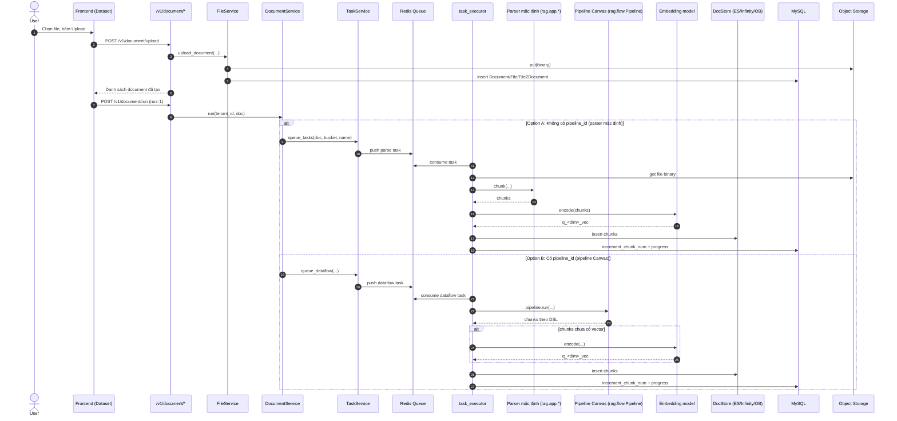

# Luồng upload file trong RAGFlow (Dataset/Knowledge Base)

Tài liệu này tập trung vào luồng upload trong Dataset/Knowledge Base, từ Frontend đến Web API, sau đó đi vào service, parser, chunking, embedding và lưu index.

Điểm quan trọng theo yêu cầu:
- Có trích đoạn mã nguồn thật ở từng bước.
- Tách rõ hai nhánh xử lý sau upload:
1. Nhánh parser mặc định của Dataset (không dùng pipeline Canvas).
2. Nhánh parser theo pipeline thiết kế trong Agent Canvas (Dataflow pipeline).

## 1) Bức tranh tổng thể

Luồng ingestion chuẩn của Dataset gồm 2 API tách biệt:
- Upload vật lý file + tạo bản ghi document: POST /v1/document/upload
- Kích hoạt parse/index: POST /v1/document/run với run=1

Không có chuyện upload xong là parse ngay nếu FE không gọi bước run.

## 1.1) Upload xong nhưng chưa nhấn parse: hệ thống đang ở trạng thái nào?

Đây là điểm rất quan trọng khi vận hành:

- Nếu user mới upload file (POST /v1/document/upload) mà chưa gọi run (POST /v1/document/run với run=1), thì pipeline parse/chunk/embedding/index chưa được thực thi.
- Nói cách khác: file đã vào kho lưu trữ và đã có metadata trong DB, nhưng chưa có chunk trong DocStore (Elasticsearch/Infinity/OB).

Trích đoạn mã nguồn thể hiện upload chỉ lưu file + tạo document:

```python
# api/apps/document_app.py
err, files = await thread_pool_exec(FileService.upload_document, kb, file_objs, current_user.id)
```

```python
# api/db/services/file_service.py
settings.STORAGE_IMPL.put(kb.id, location, blob)
...
DocumentService.insert(doc)
FileService.add_file_from_kb(doc, kb_folder["id"], kb.tenant_id)
```

Trích đoạn mã nguồn thể hiện chỉ khi run mới tạo task parse:

```python
# api/apps/document_app.py
if str(req["run"]) == TaskStatus.RUNNING.value:
    doc_dict = doc.to_dict()
    DocumentService.run(tenant_id, doc_dict, kb_table_num_map)
```

```python
# api/db/services/document_service.py
if doc.get("pipeline_id", ""):
    queue_dataflow(...)
else:
    queue_tasks(doc, bucket, name, 0)
```

### Bảng so sánh nhanh: trước run và sau run

| Mốc | Đã có gì | Chưa có gì |
|---|---|---|
| Sau upload, chưa run | Binary file trong Object Storage; bản ghi Document/File/File2Document trong MySQL; parser_id/pipeline_id/parser_config được gán ban đầu | Chưa có Task parse trong queue; chưa parse; chưa chunk; chưa embedding; chưa insert vào DocStore; token_num/chunk_num chưa tăng |
| Sau run (run=1) và worker xử lý xong | Có task trong Redis + Task table; đã parse/chunk; đã embedding; đã insert chunks vào DocStore; đã cập nhật token_num/chunk_num | Không còn trạng thái "chưa sẵn sàng retrieval" |

### Trả lời trực tiếp câu hỏi vận hành

- Khi chưa nhấn parse: pipeline parse/chunk/token rồi lưu vào Elasticsearch chưa chạy.
- Lúc này đã lưu: file vật lý + metadata document/file trong DB.
- LLM chat có đọc được context file này để trả lời không: chưa, vì retrieval dựa trên chunks đã index; mà chunks chưa được tạo/index khi chưa run.

---

## 2) Chi tiết từng bước, kèm trích đoạn mã

## Bước 0 - FE upload file và (tùy chọn) chạy parse ngay

File tham gia:
- web/src/pages/dataset/dataset/use-upload-document.ts
- web/src/hooks/use-document-request.ts
- web/src/services/knowledge-service.ts
- web/src/utils/api.ts

Trích đoạn chính (FE gọi upload, sau đó run nếu parseOnCreation=true):

```ts
// web/src/pages/dataset/dataset/use-upload-document.ts
const ret = await uploadDocument(fileList);

if (ret.code === 0 && parseOnCreation) {
  runDocumentByIds({
    documentIds: ret.data.map((x) => x.id),
    run: 1,
    shouldDelete: false,
  });
}
```

```ts
// web/src/hooks/use-document-request.ts
const ret = await kbService.document_upload(formData);
...
const ret = await kbService.document_run({
  doc_ids: documentIds,
  run,
  ...(option || {}),
});
```

```ts
// web/src/utils/api.ts
document_upload: `${api_host}/document/upload`,
document_run: `${api_host}/document/run`,
```

Ý nghĩa:
- Upload và parse là 2 lệnh độc lập.
- parseOnCreation chỉ là logic FE gọi thêm document_run.

## Bước 1 - API nhận upload và gọi service lưu file

File tham gia:
- api/apps/document_app.py

Trích đoạn chính:

```python
@manager.route("/upload", methods=["POST"])
@login_required
@validate_request("kb_id")
async def upload():
    ...
    err, files = await thread_pool_exec(FileService.upload_document, kb, file_objs, current_user.id)
    ...
    return get_json_result(data=files)
```

Ý nghĩa:
- API chỉ làm validate + phân quyền + điều phối.
- Logic lưu storage và tạo document nằm ở FileService.upload_document.

## Bước 2 - Service lưu object, chọn parser ban đầu, tạo bản ghi DB

File tham gia:
- api/db/services/file_service.py
- api/db/services/document_service.py

Trích đoạn chính trong upload_document:

```python
blob = file.read()
settings.STORAGE_IMPL.put(kb.id, location, blob)

doc = {
    "id": doc_id,
    "kb_id": kb.id,
    "parser_id": self.get_parser(filetype, filename, kb.parser_id),
    "pipeline_id": kb.pipeline_id,
    "parser_config": kb.parser_config,
    ...
}
DocumentService.insert(doc)
FileService.add_file_from_kb(doc, kb_folder["id"], kb.tenant_id)
```

Trích đoạn chọn parser theo loại file:

```python
@staticmethod
def get_parser(doc_type, filename, default):
    if doc_type == FileType.VISUAL:
        return ParserType.PICTURE.value
    if doc_type == FileType.AURAL:
        return ParserType.AUDIO.value
    if re.search(r"\.(ppt|pptx|pages)$", filename):
        return ParserType.PRESENTATION.value
    if re.search(r"\.(msg|eml)$", filename):
        return ParserType.EMAIL.value
    return default
```

Ý nghĩa:
- File được lưu vào object storage trước.
- Document được tạo với parser_id ban đầu + pipeline_id của KB (nếu có).
- Chưa parse/chunk/embed ở bước này.

## Bước 3 - API run: kích hoạt xử lý ingestion

File tham gia:
- api/apps/document_app.py

Trích đoạn chính:

```python
@manager.route("/run", methods=["POST"])
@login_required
@validate_request("doc_ids", "run")
async def run():
    ...
    DocumentService.update_by_id(id, info)
    ...
    if str(req["run"]) == TaskStatus.RUNNING.value:
        doc_dict = doc.to_dict()
        DocumentService.run(tenant_id, doc_dict, kb_table_num_map)
```

Ý nghĩa:
- Chuyển document sang trạng thái RUNNING.
- Từ đây bắt đầu phân nhánh: parser mặc định hoặc pipeline Canvas.

---

## 3) Tách rõ 2 nhánh xử lý sau bước run

## Nhánh A - Parser mặc định của Dataset (không pipeline Canvas)

## A1. Tạo task parse thường

File tham gia:
- api/db/services/document_service.py
- api/db/services/task_service.py

Trích đoạn quyết định queue loại task:

```python
# api/db/services/document_service.py
if doc.get("pipeline_id", ""):
    queue_dataflow(...)
else:
    bucket, name = File2DocumentService.get_storage_address(doc_id=doc["id"])
    queue_tasks(doc, bucket, name, 0)
```

Với nhánh A, pipeline_id rỗng nên đi vào queue_tasks.

Trích đoạn queue_tasks (chia task và đẩy Redis):

```python
def queue_tasks(doc: dict, bucket: str, name: str, priority: int):
    ...
    bulk_insert_into_db(Task, parse_task_array, True)
    DocumentService.begin2parse(doc["id"])

    unfinished_task_array = [task for task in parse_task_array if task["progress"] < 1.0]
    for unfinished_task in unfinished_task_array:
        REDIS_CONN.queue_product(settings.get_svr_queue_name(priority), message=unfinished_task)
```

## A2. Worker consume task và xử lý parser/chunk/embed/index

Để dễ hiểu, phần này viết lại theo đúng một kịch bản cụ thể:

- Bạn đã upload xong 1 file PDF.
- Bạn bấm Parse (run=1).
- parser được chọn là DeepDOC.

Lưu ý rất quan trọng:
- DeepDOC không phải parser_id ở TaskService.FACTORY.
- DeepDOC là parser engine bên trong rag/app/naive.py, được chọn qua parser_config.layout_recognize.

### A2.0 Các file thực sự tham gia trong kịch bản PDF + DeepDOC

- Điều phối ingestion:
    - rag/svr/task_executor.py
- Parser module cấp 1 (theo parser_id):
    - rag/app/naive.py
- Parser engine cấp 2 (DeepDOC):
    - deepdoc/parser/pdf_parser.py
    - deepdoc/vision/*

---

### A2.1 Worker lấy task từ queue

File: rag/svr/task_executor.py

```python
redis_msg, task = await collect()
...
await do_handle_task(task)
```

Task chứa thông tin quan trọng:
- doc_id, kb_id, tenant_id
- parser_id (thường là naive cho PDF phổ thông)
- parser_config (chứa layout_recognize, chunk_token_num, delimiter...)
- from_page, to_page

---

### A2.2 Worker chuẩn bị embedding model và index

File: rag/svr/task_executor.py

```python
embedding_model = LLMBundle(task_tenant_id, embd_model_config, lang=task_language)
vts, _ = embedding_model.encode(["ok"])
vector_size = len(vts[0])
init_kb(task, vector_size)
```

Ý nghĩa:
- Chưa parse ngay, mà chuẩn bị model vector và index trước.
- Đảm bảo index của KB đã sẵn sàng để ghi chunk sau này.

---

### A2.3 Worker gọi build_chunks để bắt đầu Parse + Chunk

File: rag/svr/task_executor.py

```python
chunks = await build_chunks(task, progress_callback)
```

Đoạn này thực tế có nhiều bước trung gian trước khi nhảy sang rag/app/naive.py.

### A2.3.1 Kiểm tra điều kiện đầu vào của task

Worker kiểm tra kích thước file trước khi parse:

```python
if task["size"] > settings.DOC_MAXIMUM_SIZE:
    set_progress(task["id"], prog=-1, msg="File size exceeds...")
    return []
```

Nếu vượt ngưỡng, luồng dừng ngay tại đây (chưa parse gì).

### A2.3.2 Chọn module parser cấp 1 từ FACTORY

```python
chunker = FACTORY[task["parser_id"].lower()]
```

Ý nghĩa:
- parser_id trong task quyết định module parser cấp 1 (naive/paper/table/...).
- Với PDF phổ thông, thường parser_id là naive, nên chunker sẽ trỏ tới rag/app/naive.py.

### A2.3.3 Tìm địa chỉ file và tải binary từ object storage

```python
bucket, name = File2DocumentService.get_storage_address(doc_id=task["doc_id"])
binary = await get_storage_binary(bucket, name)
```

Đây là điểm nối quan trọng:
- task chỉ có doc_id, chưa có nội dung file.
- Worker phải resolve doc_id -> (bucket, object_name) rồi mới lấy binary để parse.

### A2.3.4 Gọi chunker.chunk(...) trong vùng giới hạn đồng thời

```python
async with chunk_limiter:
    cks = await thread_pool_exec(
        chunker.chunk,
        task["name"],
        binary=binary,
        from_page=task["from_page"],
        to_page=task["to_page"],
        lang=task["language"],
        callback=progress_callback,
        kb_id=task["kb_id"],
        parser_config=task["parser_config"],
        tenant_id=task["tenant_id"],
    )
```

Điểm cần chú ý:
- chunk_limiter giới hạn số parser chạy song song để tránh quá tải.
- thread_pool_exec giúp chạy parser CPU-bound/blocking mà không chặn event loop.
- parser_config được truyền nguyên vẹn xuống parser module (nên DeepDOC/PlainText/MinerU đều dùng cùng cơ chế này).

### A2.3.5 Kết quả của A2.3 là gì?

Kết quả trả về từ chunker.chunk là cks (danh sách chunk thô), chưa phải dữ liệu index cuối cùng.

Ngay sau đó, build_chunks sẽ:
- chuẩn hóa metadata chunk (id/doc_id/kb_id/timestamp),
- xử lý image chunk,
- và chỉ khi xong mới trả docs về do_handle_task để chạy embedding/index.

Vì vậy, phần A2.3 là “cửa vào parser”, còn phần A2.4 trở đi là “bên trong parser cụ thể (naive + deepdoc)”.

Tóm lại mạch nối A2.3 -> A2.4 là:
1. Worker chọn chunker theo parser_id.
2. Worker tải binary.
3. Worker gọi chunker.chunk(...).
4. Nếu chunker = naive và file là PDF thì naive.py rẽ nhánh PDF và chọn engine DeepDOC.

---

### A2.4 Đi vào rag/app/naive.py và rẽ nhánh PDF

File: rag/app/naive.py

```python
elif re.search(r"\.pdf$", filename, re.IGNORECASE):
        layout_recognizer, parser_model_name = normalize_layout_recognizer(
                parser_config.get("layout_recognize", "DeepDOC")
        )
        name = layout_recognizer.strip().lower()
        parser = PARSERS.get(name, by_plaintext)
        sections, tables, pdf_parser = parser(...)
```

Map parser engine trong naive.py:

```python
PARSERS = {
        "deepdoc": by_deepdoc,
        "mineru": by_mineru,
        "docling": by_docling,
        "tcadp parser": by_tcadp,
        "paddleocr": by_paddleocr,
        "doxa": by_doxa,
        "plaintext": by_plaintext,
}
```

Vì bạn giả sử chọn DeepDOC, parser sẽ gọi by_deepdoc(...).

Nếu chọn Doxa thì cùng điểm rẽ này sẽ gọi by_doxa(...).

Ví dụ cấu hình để rẽ sang Doxa:
- parser_config.layout_recognize = "DoXA"
- hoặc parser_config.layout_recognize = "<ten_model>@doxa" (được normalize về DoXA)

Trích đoạn normalize layout recognizer:

```python
if lowered.endswith("@doxa"):
    parser_model_name = layout_recognizer_raw.rsplit("@", 1)[0]
    layout_recognizer = "DoXA"
```

---

### A2.5 Luồng DeepDOC thực sự làm gì (đây là lõi Parse)

File: rag/app/naive.py -> by_deepdoc() -> class Pdf

```python
def by_deepdoc(...):
        pdf_parser = Pdf()
        sections, tables = pdf_parser(...)
        tables = vision_figure_parser_pdf_wrapper(...)
        return sections, tables, pdf_parser
```

File: rag/app/naive.py -> class Pdf(PdfParser)

```python
self.__images__(...)             # OCR + render ảnh trang
self._layouts_rec(...)          # nhận diện layout
self._table_transformer_job(...)# phân tích bảng
self._text_merge(...)           # ghép text box
tbls = self._extract_table_figure(...)
self._naive_vertical_merge()
self._concat_downward()
return [(b["text"], self._line_tag(...)) for b in self.boxes], tbls
```

Giải nghĩa ngắn gọn theo thứ tự Parse của DeepDOC:
1. OCR/trích text từ vùng ảnh PDF.
2. Nhận diện layout (text, bảng, vùng khác).
3. Trích cấu trúc bảng.
4. Ghép các text box theo thứ tự đọc.
5. Trả ra:
     - sections: các đoạn text đã parse
     - tables: các đối tượng bảng/hình để xử lý tiếp

File lõi bên dưới DeepDOC:
- deepdoc/parser/pdf_parser.py
- deepdoc/vision/*

### A2.5b Luồng Doxa parser (song song với DeepDOC)

Nhánh này đi cùng điểm rẽ ở A2.4, chỉ khác parser engine được gọi là by_doxa thay vì by_deepdoc.

File tham gia:
- rag/app/naive.py -> by_doxa(...)
- deepdoc/parser/doxa_parser.py

Trích đoạn gọi Doxa parser trong naive.py:

```python
def by_doxa(...):
    parser_config = kwargs.get("parser_config", {}) or {}
    doxa_parser = DoxaParser(
        token=parser_config.get("doxa_token"),
        doxa_url=parser_config.get("doxa_url"),
        ipaas_token=parser_config.get("doxa_ipaas_token"),
    )

    ok, err = doxa_parser.check_installation()
    if not ok:
        callback(-1, err)
        return None, None, doxa_parser

    sections, tables = doxa_parser.parse_pdf(...)
    return sections, tables, doxa_parser
```

Diễn giải luồng Doxa theo từng bước:
1. Đọc parser_config để lấy thông tin kết nối Doxa:
   - doxa_url
   - doxa_token
   - doxa_ipaas_token
2. check_installation() xác thực môi trường/cấu hình Doxa có hợp lệ không.
3. parse_pdf(...) gửi/điều phối parse qua Doxa parser và nhận về:
   - sections
   - tables
4. Trả kết quả về cùng format với DeepDOC để các bước phía sau dùng chung.

Điểm rất quan trọng:
- Dù là DeepDOC hay Doxa, output chuẩn hóa vẫn là sections/tables.
- Vì output format giống nhau, nên từ A2.6 trở xuống (Chunk -> Embedding -> Index) dùng chung toàn bộ pipeline worker.

So sánh nhanh DeepDOC vs Doxa ở mức parser engine:

| Bước | DeepDOC | Doxa |
|---|---|---|
| Chọn engine | by_deepdoc | by_doxa |
| Parser object | Pdf(PdfParser) | DoxaParser |
| Parse đầu vào | binary PDF + config | binary PDF + token/url config |
| Parse đầu ra | sections, tables | sections, tables |
| Bước sau parse | giống nhau | giống nhau |

---

### A2.6 Từ kết quả Parse sang Chunk (vẫn ở naive.py)

Sau khi có sections/tables, naive.py biến chúng thành chunks chuẩn RAG:

```python
res = tokenize_table(tables, doc, is_english)
...
chunks = naive_merge(sections, chunk_token_num, delimiter, overlapped_percent)
res.extend(tokenize_chunks(chunks, doc, is_english, pdf_parser, ...))
```

Điểm dễ nhầm:
- Parse là tạo sections/tables từ file thô.
- Chunk là cắt/ghép sections thành đơn vị truy hồi (content_with_weight + metadata token).

---

### A2.7 Worker chuẩn hóa chunk output từ parser

File: rag/svr/task_executor.py (build_chunks)

```python
d["id"] = xxhash.xxh64((chunk["content_with_weight"] + str(d["doc_id"])).encode("utf-8", "surrogatepass")).hexdigest()
d["create_time"] = ...
if d.get("image"):
        await image2id(...)
```

Ngoài ra còn các bước enrich tùy config:
- auto_keywords
- auto_questions
- metadata generation
- tagging

---

### A2.8 Embedding (sau Parse+Chunk, không phải Parse)

File: rag/svr/task_executor.py

```python
token_count, vector_size = await embedding(chunks, embedding_model, task_parser_config, progress_callback)
...
d["q_%d_vec" % len(v)] = v
```

Ý nghĩa:
- Mỗi chunk được encode thành vector q_<dim>_vec.
- Đây là bước chuẩn bị cho semantic search/retrieval.

---

### A2.9 Index và cập nhật thống kê DB

File: rag/svr/task_executor.py

```python
await thread_pool_exec(settings.docStoreConn.insert, chunks_batch, search.index_name(task_tenant_id), task_dataset_id)
```

File: api/db/services/document_service.py

```python
DocumentService.increment_chunk_num(task_doc_id, task_dataset_id, token_count, chunk_count, 0)
```

Kết quả cuối cùng của kịch bản PDF + DeepDOC:
1. Parse xong: sections/tables đã được trích từ PDF.
2. Chunk xong: có danh sách chunk chuẩn RAG.
3. Embedding xong: mỗi chunk có vector.
4. Index xong: chunk + vector vào DocStore.
5. DB cập nhật: token/chunk/progress cho document và KB.

Từ thời điểm này, retrieval mới thấy context của file để phục vụ chat.

## Nhánh B - Parser theo pipeline trong Agent Canvas (Dataflow)

## B1. Queue task kiểu dataflow

File tham gia:
- api/db/services/document_service.py
- api/db/services/task_service.py

Khi document có pipeline_id, hệ thống không đi queue_tasks mà đi queue_dataflow:

```python
# api/db/services/document_service.py
if doc.get("pipeline_id", ""):
    queue_dataflow(tenant_id, flow_id=doc["pipeline_id"], task_id=get_uuid(), doc_id=doc["id"])
```

```python
# api/db/services/task_service.py
task = dict(
    id=task_id,
    doc_id=doc_id,
    ...,
    task_type="dataflow",
)
...
REDIS_CONN.queue_product(settings.get_svr_queue_name(priority), message=task)
```

## B2. Worker nhận dataflow và chạy pipeline DSL

File tham gia:
- rag/svr/task_executor.py
- rag/flow/pipeline.py
- rag/flow/file.py
- rag/flow/parser/parser.py
- rag/flow/splitter/splitter.py
- rag/flow/tokenizer/tokenizer.py

Trích đoạn phân nhánh ở worker:

```python
if task_type[:len("dataflow")] == "dataflow":
    await run_dataflow(task)
    return
```

Trích đoạn run_dataflow:

```python
pipeline = Pipeline(dsl, tenant_id=task["tenant_id"], doc_id=doc_id, task_id=task_id, flow_id=dataflow_id)
chunks = await pipeline.run(...)
```

Nếu output pipeline chưa có vector, worker sẽ tự embedding rồi mới insert:

```python
if not any([re.match(r"q_[0-9]+_vec", k) for k in keys]):
    ...
    vts, c = await thread_pool_exec(batch_encode, texts[i: i + settings.EMBEDDING_BATCH_SIZE])
    ck["q_%d_vec" % len(v)] = v
```

Sau đó vẫn đi insert_chunks và cập nhật DocumentService.increment_chunk_num tương tự nhánh A.

### B2.0 Kịch bản cụ thể để theo dõi

Để mô tả rõ như nhánh A, ta dùng một kịch bản cụ thể:

- Document đã upload xong và có pipeline_id.
- Pipeline Canvas có chuỗi node: File -> Parser -> Splitter -> Tokenizer.
- File đầu vào là PDF.
- Ở node Parser, parse_method của PDF có thể là deepdoc hoặc doxa.

Lưu ý:
- Nhánh B không gọi rag/app/naive.py theo FACTORY parser_id như nhánh A.
- Nhánh B chạy theo DSL pipeline (Graph), mỗi node tự xử lý input/output theo schema của node đó.

### B2.1 Worker nạp DSL và khởi tạo Pipeline

File: rag/svr/task_executor.py

```python
if task["task_type"] == "dataflow":
    e, cvs = UserCanvasService.get_by_id(dataflow_id)
    dsl = cvs.dsl
...
pipeline = Pipeline(dsl, tenant_id=task["tenant_id"], doc_id=doc_id, task_id=task_id, flow_id=dataflow_id)
chunks = await pipeline.run(file=task["file"]) if task.get("file") else await pipeline.run()
```

Ý nghĩa:
1. Worker lấy DSL đã lưu theo pipeline_id.
2. Tạo Pipeline object với tenant_id/doc_id/task_id.
3. Chạy pipeline để lấy output cuối.

### B2.2 Pipeline chạy đồ thị node theo thứ tự downstream

File: rag/flow/pipeline.py

```python
if not self.path:
    self.path.append("File")
    cpn_obj = self.get_component_obj(self.path[0])
    await cpn_obj.invoke(**kwargs)
...
while idx < len(self.path) and not self.error:
    last_cpn = self.get_component_obj(self.path[idx - 1])
    cpn_obj = self.get_component_obj(self.path[idx])
    await cpn_obj.invoke(**last_cpn.output())
```

Ý nghĩa:
- Pipeline truyền output node trước vào node sau (theo DSL downstream).
- Do đó logic sinh chunk ở nhánh B phụ thuộc cấu trúc node Canvas, không bị cố định như luồng parser mặc định của Dataset.

### B2.3 Node File lấy name/file/blob cho pipeline

File: rag/flow/file.py

```python
if self._canvas._doc_id:
    e, doc = DocumentService.get_by_id(self._canvas._doc_id)
    self.set_output("name", doc.name)
else:
    file = kwargs.get("file")[0]
    self.set_output("name", file["name"])
    self.set_output("file", file)
```

Ý nghĩa:
- Với tác vụ ingestion từ document đã upload, node File lấy name từ DB theo doc_id.
- Blob thực tế sẽ được node Parser lấy tiếp thông qua File2DocumentService + STORAGE_IMPL.

### B2.4 Node Parser (nhánh B) parse PDF theo deepdoc hoặc doxa

File: rag/flow/parser/parser.py

Node Parser lấy blob và chọn parser theo cấu hình setups["pdf"]["parse_method"] trong DSL.

Trích đoạn chọn parse method:

```python
raw_parse_method = conf.get("parse_method", "")
...
if parse_method.lower() == "deepdoc":
    bboxes = RAGFlowPdfParser().parse_into_bboxes(blob, callback=self.callback)
...
elif parse_method.lower() == "doxa":
    texts = self._parse_with_doxa(name, blob, conf)
    bboxes = []
    for text in texts:
        bboxes.append({"text": text})
```

#### B2.4a Nhánh DeepDOC trong pipeline

- Engine gọi: RAGFlowPdfParser().parse_into_bboxes(...).
- Output chính: danh sách bboxes có text (và có thể thêm layout/image/position tùy parser).
- Nếu output_format=json, node Parser set_output("json", bboxes).

#### B2.4b Nhánh Doxa trong pipeline

Trích đoạn hàm parse Doxa:

```python
def _parse_with_doxa(self, name, blob, conf):
    doxa_parser = DoxaParser(
        token=conf.get("doxa_token"),
        doxa_url=conf.get("doxa_url"),
        ipaas_token=conf.get("doxa_ipaas_token"),
    )
    ok, err = doxa_parser.check_installation()
    if not ok:
        raise RuntimeError(err)
    lines, _ = doxa_parser.parse_pdf(...)
    return self._extract_doxa_texts(lines)
```

Luồng Doxa trong nhánh B:
1. Khởi tạo DoxaParser từ token/url trong cấu hình node Parser.
2. check_installation() xác thực môi trường.
3. parse_pdf(...) trả lines.
4. Chuẩn hóa lines -> texts -> bboxes dạng {"text": ...} để node sau dùng tiếp.

Điểm thống nhất DeepDOC và Doxa trong nhánh B:
- Cùng hội tụ về output Parser chuẩn (json/markdown/text) để đưa xuống Splitter/Tokenizer.

### B2.5 Node Splitter biến output parser thành chunks theo DSL

File: rag/flow/splitter/splitter.py

Trích đoạn chính:

```python
if from_upstream.output_format in ["markdown", "text", "html"]:
    cks = naive_merge(payload, self._param.chunk_token_size, deli, overlapped_percent)
    self.set_output("chunks", [{"text": c.strip()} for c in cks if c.strip()])
    return

# json path
chunks, images = naive_merge_with_images(...)
self.set_output("chunks", cks)
```

Ý nghĩa:
- Chunk của nhánh B được quyết định bởi tham số node Splitter trong DSL (chunk_token_size, delimiters, overlapped_percent, children_delimiters...), không còn phụ thuộc mặc định parser_config của KB như nhánh A.

### B2.6 Node Tokenizer bổ sung token field và có thể embed ngay trong pipeline

File: rag/flow/tokenizer/tokenizer.py

Trích đoạn cấu hình và nhánh embedding:

```python
self.search_method = ["full_text", "embedding"]
...
if "embedding" in self._param.search_method:
    chunks, token_count = await self._embedding(from_upstream.name, chunks)
    self.set_output("embedding_token_consumption", token_count)
```

Ý nghĩa:
- Nếu DSL để search_method có embedding, pipeline output đã mang sẵn q_<dim>_vec.
- Nếu DSL không embed, worker sẽ fallback embed ở bước B2.8.

### B2.7 Chuẩn hóa output pipeline về danh sách chunk

File: rag/svr/task_executor.py (run_dataflow)

```python
if chunks.get("chunks"):
    chunks = copy.deepcopy(chunks["chunks"])
elif chunks.get("json"):
    chunks = copy.deepcopy(chunks["json"])
elif chunks.get("markdown"):
    chunks = [{"text": [chunks["markdown"]]}]
elif chunks.get("text"):
    chunks = [{"text": [chunks["text"]]}]
```

Sau đó worker enrich metadata thống nhất trước khi index:
- doc_id, kb_id, docnm_kwd
- create_time/create_timestamp_flt
- content_with_weight
- token field cho question/keyword/summary nếu có

### B2.8 Fallback embedding tại worker (nếu pipeline chưa tạo vector)

File: rag/svr/task_executor.py

```python
keys = [k for o in chunks for k in list(o.keys())]
if not any([re.match(r"q_[0-9]+_vec", k) for k in keys]):
    ...
    vts, c = await thread_pool_exec(batch_encode, texts[i: i + settings.EMBEDDING_BATCH_SIZE])
    ck["q_%d_vec" % len(v)] = v
```

Ý nghĩa:
- Nếu DSL đã dùng Tokenizer với embedding, điều kiện này false và worker bỏ qua embed lại.
- Nếu DSL chưa embed, worker đảm bảo mỗi chunk vẫn có vector trước khi insert.

### B2.9 Insert + cập nhật DB giống nhánh A

File: rag/svr/task_executor.py

```python
e = await insert_chunks(task_id, task["tenant_id"], task["kb_id"], chunks, ...)
...
DocumentService.increment_chunk_num(doc_id, task_dataset_id, embedding_token_consumption, len(chunks), task_time_cost)
```

Kết quả chuẩn hóa cuối cùng vẫn giống nhánh A:
- Chunk + vector vào DocStore.
- token/chunk/progress cập nhật trong DB.

### B2.10 Ví dụ thực tế: parse 1 file PDF theo pipeline Canvas (deepdoc và doxa)

Giả sử DSL có chain: File -> Parser -> Splitter -> Tokenizer.

Ví dụ cấu hình Parser node (DeepDOC):

```json
"Parser:0": {
  "obj": {
    "component_name": "Parser",
    "params": {
      "setups": {
        "pdf": {
          "parse_method": "deepdoc",
          "lang": "Chinese",
          "suffix": ["pdf"],
          "output_format": "json"
        }
      }
    }
  }
}
```

Nếu muốn đổi sang Doxa trong chính pipeline này, chỉ cần thay:

```json
"parse_method": "doxa"
```

và bổ sung thông số Doxa trong config Parser (token/url/options) tương ứng.

Diễn biến end-to-end của ví dụ PDF theo pipeline:
1. Worker nhận task_type=dataflow và gọi run_dataflow.
2. Pipeline chạy node File để lấy name/file.
3. Parser parse PDF theo parse_method:
   - deepdoc -> RAGFlowPdfParser().parse_into_bboxes(...)
   - doxa -> DoxaParser.parse_pdf(...) rồi chuẩn hóa text list.
4. Splitter cắt bboxes/text thành chunks theo tham số chunk của DSL.
5. Tokenizer thêm token field và có thể embed luôn (tùy search_method).
6. Worker kiểm tra thiếu vector thì embed fallback.
7. Worker gọi insert_chunks để ghi DocStore.
8. Worker gọi DocumentService.increment_chunk_num để cập nhật DB.

Kết luận nhánh B (bản chi tiết):
- Chunk được sinh theo logic node/DSL của Canvas, không bó buộc parser mặc định của Dataset.
- PDF parser trong node Parser có thể đi sâu vào DeepDOC hoặc Doxa ngay trong pipeline.
- Dù đi DeepDOC hay Doxa, đích cuối vẫn thống nhất: chunk + vector trong DocStore, số liệu document trong DB.

---

## 4) Các file trọng yếu theo lớp

- Frontend:
  - web/src/pages/dataset/dataset/use-upload-document.ts
  - web/src/hooks/use-document-request.ts
  - web/src/services/knowledge-service.ts
  - web/src/utils/api.ts

- API và service:
  - api/apps/document_app.py
  - api/db/services/file_service.py
  - api/db/services/document_service.py
  - api/db/services/task_service.py
  - api/db/services/file2document_service.py

- Worker ingestion:
  - rag/svr/task_executor.py
  - rag/app/*.py (parser mặc định)
  - rag/flow/pipeline.py (pipeline dataflow)

- Doc store:
  - common/doc_store/doc_store_base.py
  - common/doc_store/es_conn_base.py
  - common/doc_store/infinity_conn_base.py
  - common/doc_store/ob_conn_base.py

---

## 5) Sơ đồ trình tự Mermaid (tách rõ 2 option parser)



---

## 6) Lưu ý để tránh nhầm luồng

- Endpoint upload_and_parse trong FE hiện map sang /v1/document/upload_info, phục vụ luồng đính kèm chat; không phải ingestion chuẩn của Dataset.
- Ingestion chuẩn Dataset luôn theo cặp:
  - /v1/document/upload
  - /v1/document/run

